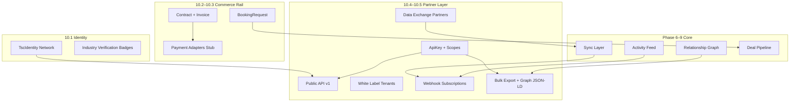

# Phase 10 — External Platform Infrastructure (FINAL)

**Status:** Complete across 5 sub-phases (10.1–10.5)  
**Date:** 2026-06-12

## Mission

Build the **external platform layer** so partners, agencies, festivals, and industry platforms can connect to the TSC ecosystem — identity, booking, payments, public APIs, white-label OS shells, and data exchange — without rebuilding Phase 6–9 participation and intelligence core.

---

## Sub-phase map

| Step | Pillars | Focus | Report |
|------|---------|-------|--------|
| **10.1** | 1 + 3 | TSC Identity Network + Industry Verification | [phase10-step1-report.md](./phase10-step1-report.md) |
| **10.2** | 4 + 5 | Booking + Contract infrastructure | [phase10-step2-report.md](./phase10-step2-report.md) |
| **10.3** | 6 | Payments rail (adapter stubs) | [phase10-step3-report.md](./phase10-step3-report.md) |
| **10.4** | 9 + 10 | Public API v1 + White Label ecosystem | [phase10-step4-report.md](./phase10-step4-report.md) |
| **10.5** | 8 | Industry Data Exchange / Music Data Network | [phase10-step5-report.md](./phase10-step5-report.md) |

---

## Architecture (external platform stack)

---

## Capability matrix

| Capability | Status | Entry point |
|------------|--------|-------------|
| Permanent TSC URLs (`artist.tsc/slug`) | ✅ 10.1 | `GET /identity/:namespace/:slug/public` |
| Industry verification badges | ✅ 10.1 | `POST /admin/identity/verify/:entityType/:entityId` |
| Booking inquiry → deal pipeline | ✅ 10.2 | `POST /booking/inquiries` |
| Contract + invoice stub | ✅ 10.2 | Deal → `agreement` status |
| Payment collect / mark-paid stubs | ✅ 10.3 | `POST /payments/invoices/:id/collect` |
| Escrow / payout / settlement stubs | ✅ 10.3 | `/payments/escrow`, `/payouts`, `/settlements` |
| Public read API (artists, events, …) | ✅ 10.4 | `GET /public/v1/*` + `X-TSC-Api-Key` |
| API key admin | ✅ 10.4 | `POST /admin/api-keys` |
| White label agency/community/festival OS | ✅ 10.4 | `GET /white-label/tenants/:slug/config` |
| Webhook subscriptions + delivery log | ✅ 10.5 | `POST /admin/webhooks` |
| Partner event webhooks (7 event types) | ✅ 10.5 | `WebhookEmitterService` hooks |
| Bulk artist export JSON/CSV | ✅ 10.5 | `GET /public/v1/export/artists` |
| Industry graph JSON-LD export | ✅ 10.5 | `GET /public/v1/graph/export/:type/:id` |
| Inbound partner ingest stub | ✅ 10.5 | `POST /exchange/partners/:slug/ingest` |

---

## Schema fragments (merge order)

| Fragment | Models |
|----------|--------|
| `phase10-step1.prisma` | `TscIdentity`, badges |
| `phase10-step2.prisma` | `BookingRequest`, `Contract`, `ContractTemplate` |
| `phase10-step3.prisma` | `Escrow`, `Payout`, `Settlement`, invoice upgrades |
| `phase10-step4.prisma` | `ApiKey`, `WhiteLabelTenant` |
| `phase10-step5.prisma` | `WebhookSubscription`, `WebhookDelivery`, `DataExchangePartner` |

Single migration path: merge all fragments → `npx prisma migrate dev --name phase10-complete`

---

## API surface summary

### Public (API key)

- `/public/v1/artists`, `/communities`, `/opportunities`, `/events`, `/venues`
- `/public/v1/analytics/summary`, `/identity/:namespace/:slug`
- `/public/v1/export/artists`, `/export/relationships`, `/export/analytics`
- `/public/v1/graph/export/:entityType/:entityId`

### Admin (stub auth)

- `/admin/api-keys`, `/admin/white-label/tenants`
- `/admin/webhooks`, `/admin/webhooks/deliveries`
- `/admin/identity/verify/:entityType/:entityId`

### Exchange

- `/exchange/partners/:slug/ingest`, `/exchange/partners/:slug/status`

### White label (public branding)

- `/white-label/tenants/:slug/config`, `/white-label/tenants/:slug/artists`

---

## Packages touched (Phase 10)

| Package | Key additions |
|---------|---------------|
| `@tsc/database` | `tsc-identity`, `booking`, `contract`, `payment`, `public-api`, `data-exchange` |
| `@tsc/types` | Matching payload types per sub-phase |
| `@tsc/contracts` | Zod schemas for all Phase 10 APIs |
| `@tsc/api` | Modules: tsc-identity, booking, contract, payment, public-api, white-label, data-exchange |
| CoreKnot | IdentityBadgeBar, WhiteLabelShell, booking/payment UI stubs |

---

## Phase 11 readiness — entry points

Phase 10 intentionally leaves these hooks for **Phase 11 Global Cultural Network**:

| Entry point | Location | Phase 11 use |
|-------------|----------|--------------|
| `WebhookEmitterService.emit` | `apps/api/src/modules/data-exchange/webhook-emitter.service.ts` | Retry queue, fan-out to cultural graph nodes |
| `SyncEmitter` / `SyncOutboundDispatcher` | `apps/api/src/modules/sync` | Cross-region sync, partner normalization |
| `POST /exchange/partners/:slug/ingest` | `ExchangePartnerService.ingest` | Full inbound schema mapping + conflict resolution |
| `GET /public/v1/graph/export/*` | `GraphExportService` | Federated graph merge with external cultural networks |
| `ApiKeyRateLimitService` | `apps/api/src/modules/public-api` | Redis sliding window + usage billing |
| `WhiteLabelTenant.customDomain` | schema field | TLS + DNS automation |
| `PaymentAdapter` interface | `apps/api/src/modules/payment/adapters` | Live Razorpay/Stripe webhooks → `deal.completed` |
| `RelationshipModule` subgraph | `buildEntitySubgraph` | Multi-hop cultural network traversal |

### Recommended Phase 11 first steps

1. **Webhook retry worker** — BullMQ/Render worker consuming failed `WebhookDelivery` rows
2. **Partner ingest pipeline** — replace sync stub with validated event bus → Relationship upserts
3. **Graph federation** — extend JSON-LD export with `@id` resolution across TSC + partner namespaces
4. **Cultural network UI** — CoreKnot Network View wired to `/public/v1/graph/export` for cross-entity discovery

---

## Explicitly out of Phase 10 scope

- Phase 11 Global Cultural Network
- Spotify / streaming distribution (Pillar 7 — separate track)
- Live payment provider keys and webhooks
- E-sign providers (DocuSign, etc.)
- Custom domain TLS for white label

---

## Merge checklist (full Phase 10 deploy)

1. Merge all `phase10-step*.prisma` fragments into `schema.prisma` (already merged in repo)
2. Run migration: `phase10-step5-data-exchange` (or combined `phase10-complete`)
3. Rebuild: `@tsc/database`, `@tsc/types`, `@tsc/contracts`, `@tsc/api`
4. CoreKnot proxy: `/api/public/v1/*`, `/api/admin/*`, `/api/white-label/*`, `/api/exchange/*`
5. Seed: API key with full scopes, white label tenant, webhook subscription, exchange partner
6. Smoke test: identity resolve → booking inquiry → deal paid → webhook delivery → export artists

**Phase 10 infrastructure layer complete. Ready for Phase 11.**
