# Phase 10.2 — Booking Infrastructure + Contract Infrastructure (Pillars 4 + 5)

**Status:** Complete (implementation)  
**Date:** 2026-06-12  
**Depends on:** Phase 10.1 (TSC Identity), Phase 7 Month 3 (Deal pipeline), Phase 5 (`booking_inquiry` automation + sync)

## Summary

Phase 10.2 replaces Instagram DM / WhatsApp / Excel booking with an in-platform flow:

```
BookingRequest → Negotiation → Contract → Invoice (stub) → Payment (Phase 10.3 stub)
```

Ships **BookingRequest** CRUD + status advancement + deal conversion, **ContractTemplate** seed + **Contract** generation/sign stub, sync-layer persistence for `booking.inquiry` events, and CoreKnot UI pages with API mocks.

**Out of scope:** Razorpay payments (10.3), public API platform (10.4), distribution (Pillar 7), e-sign providers, PDF generation.

---

## Booking → Deal → Contract flow

```mermaid
flowchart LR
  A[POST /booking/inquiries] --> B[booking_inquiry automation]
  B --> C[Opportunity created]
  C --> D[BookingRequest status: matched]
  D --> E[POST convert-to-deal]
  E --> F[Deal status: discussion]
  F --> G[Deal pipeline: negotiation]
  G --> H[Deal status: agreement]
  H --> I[Contract auto-created]
  I --> J[Invoice stub draft]
  J --> K[PATCH /contracts/:id/sign]
  K --> L[Payment tracking — Phase 10.3]
```



| Step | Trigger | Result |
|------|---------|--------|
| 1 | Fan/brand/venue creates inquiry | `BookingRequest` + automation run |
| 2 | Automation completes | Opportunity linked, status → `matched` |
| 3 | `POST …/convert-to-deal` | Deal created, status → `negotiating` |
| 4 | Deal advances to `agreement` | Contract draft + Invoice stub |
| 5 | `PATCH …/contracts/:id/sign` | Stub signature + document URL |

**Sync path:** CoreKnot `emitBookingInquiry` → `booking.inquiry` event → automation + `BookingRequest` persist (when artist + person resolved).

---

## Schema

Fragment: `packages/database/prisma/phase10-step2.prisma`  
Merged into `packages/database/prisma/schema.prisma`:

| Model / enum | Purpose |
|--------------|---------|
| `BookingRequest` | Inquiry entity with status pipeline + deal/opportunity links |
| `BookingRequestStatus` | inquiry → matched → negotiating → contracted → completed / cancelled |
| `ContractTemplate` | Reusable agreement templates by type |
| `ContractTemplateType` | brand_deal, performance, workshop, community |
| `Contract` | Generated agreement linked to deal and/or booking |
| `ContractStatus` | draft, sent, signed, cancelled |
| `Invoice` | **Stub only** — draft invoice row, no payment rail |

Default templates seeded on first `GET /contracts/templates` via upsert.

---

## Packages

| Package | Files |
|---------|-------|
| `@tsc/database` | `src/booking.ts`, `src/contract.ts` — statuses, includes, default templates |
| `@tsc/types` | `src/booking.ts`, `src/contract.ts` — API payloads |
| `@tsc/contracts` | `src/booking/index.ts`, `src/contract/index.ts` — Zod schemas |

---

## API — Booking (`apps/api/src/modules/booking`)

| Method | Route | Auth | Purpose |
|--------|-------|------|---------|
| POST | `/booking/inquiries` | Stub | Create inquiry + trigger `booking_inquiry` automation |
| GET | `/booking/inquiries` | Stub | List (filter artistId, status) |
| GET | `/booking/inquiries/:id` | Stub | Detail |
| PATCH | `/booking/inquiries/:id/status` | Stub | Advance or set status |
| POST | `/booking/inquiries/:id/convert-to-deal` | Stub | Link Phase 7 Deal |

---

## API — Contracts (`apps/api/src/modules/contract`)

| Method | Route | Auth | Purpose |
|--------|-------|------|---------|
| GET | `/contracts/templates` | Stub | List active templates (auto-seed) |
| POST | `/contracts` | Stub | Generate from template + deal/booking |
| GET | `/contracts/:id` | Stub | Detail |
| PATCH | `/contracts/:id/sign` | Stub | Stub e-sign + document URL |
| GET | `/artists/:id/contracts` | Stub | Artist contract list |
| GET | `/brands/:id/contracts` | Stub | Brand contract list |

**Deal hook:** `DealService.updateStatus` → when status becomes `agreement`, calls `ContractService.ensureForDeal` (idempotent).

---

## Sync integration

`SyncService.handleBookingInquiry` updated:

- Triggers existing `booking_inquiry` automation (Phase 5)
- Persists `BookingRequest` via `BookingService.upsertFromSync`
- Returns `bookingRequestId` in `tscEntityIds` + pipeline metadata

---

## CoreKnot UI

| File | Purpose |
|------|---------|
| `lib/bookingApi.js` | Inquiry CRUD + mocks |
| `lib/contractApi.js` | Templates, contracts, sign + mocks |
| `pages/booking/BookingInquiryPage.jsx` | Kanban-style inquiry board + create form |
| `pages/contract/ContractListPage.jsx` | Templates tab + signed contracts |
| `pages/booking/INTEGRATION.patch.md` | Routes + proxy |
| `pages/contract/INTEGRATION.patch.md` | Routes + proxy |

---

## Merge steps

1. Prisma migration:
   ```bash
   cd packages/database && npx prisma migrate dev --name phase10-step2-booking-contracts
   ```
2. Rebuild packages:
   ```bash
   npm run build -w @tsc/database -w @tsc/types -w @tsc/contracts
   npm run build -w @tsc/api
   ```
3. Proxy routes in CoreKnot dev server:
   - `/api/booking/inquiries/*`
   - `/api/contracts/*`
   - `/api/artists/:id/contracts`
   - `/api/brands/:id/contracts`
4. Merge `INTEGRATION.patch.md` routes into `App.jsx`
5. Restart API; open `/booking` and `/contracts`
6. Test flow:
   ```bash
   POST /api/booking/inquiries
   POST /api/booking/inquiries/{id}/convert-to-deal
   PATCH /api/deals/{dealId}/status  Body: { "advance": true }  # repeat to agreement
   GET  /api/contracts/templates
   PATCH /api/contracts/{id}/sign
   ```

---

## Verification checklist

- [ ] `prisma validate` passes
- [ ] POST inquiry creates row + automation opportunity
- [ ] Sync `booking.inquiry` persists BookingRequest
- [ ] convert-to-deal links Deal + sets negotiating
- [ ] Deal agreement auto-creates Contract + Invoice stub
- [ ] PATCH sign sets signedAt + documentUrl
- [ ] CoreKnot pages render with mocks when API unreachable

---

## Deferred to Phase 10.3+

| Item | Target |
|------|--------|
| Razorpay payment rail + payout | 10.3 |
| Invoice send/collect/paid lifecycle | 10.3 |
| Payment status on BookingRequest | 10.3 |
| Public booking API + webhooks | 10.4 |
| Real PDF generation + e-sign (DocuSign/DigiSign) | 10.3+ |
| Venue auto-provision + verified venue booking UI | 10.2+ polish |
| Marketplace listing → booking CTA | 10.2+ polish |
| Contract variable validation against template | Optional |

**Phase 10.2 complete. Ready for Phase 10.3 Payments.**
