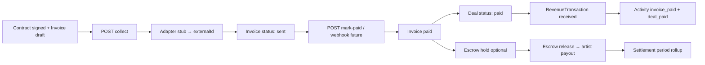

# Phase 10.3 — Payments Infrastructure (Pillar 6 — Revenue Rail)

**Status:** Complete (implementation)  
**Date:** 2026-06-12  
**Depends on:** Phase 10.2 (Booking + Contracts + Invoice stub), Phase 7 (RevenueTransaction)

## Summary

Phase 10.3 moves money tracking toward a payment rail with **adapter-pattern gateway stubs** (no live API keys). Ships Escrow, Payout, Settlement entities, upgraded Invoice lifecycle, payment API routes, Invoice-paid → Deal paid + RevenueTransaction wiring, and CoreKnot dashboard + pay button UI.

**Out of scope:** Live Razorpay/Stripe/Cashfree keys, webhooks, Public API (10.4), Data Exchange (10.5), distribution (Pillar 7), Phase 11.

---

## Payment flow



| Step | Trigger | Result |
|------|---------|--------|
| 1 | Deal agreement (10.2) | Invoice draft row |
| 2 | `POST …/invoices/:id/collect` | Adapter stub, invoice → `sent` |
| 3 | `POST …/invoices/:id/mark-paid` | Invoice → `paid`, deal → `paid`, revenue `received` |
| 4 | `POST …/escrow/:dealId/hold` | Escrow holding + adapter externalId |
| 5 | `POST …/escrow/:id/release` | Escrow released |
| 6 | `POST …/payouts` | Scheduled artist payout stub |
| 7 | `GET …/settlements` | Admin period rollup (auto-seeds current month) |
| 8 | `GET …/dashboard` | expected/received/pending + invoice/escrow/payout totals |

---

## Adapter design

Interface: `PaymentAdapter` (`apps/api/src/modules/payment/adapters/payment-adapter.interface.ts`)

| Method | Purpose |
|--------|---------|
| `createPaymentIntent` | Invoice collect — returns mock `externalId` + checkout URL |
| `holdEscrow` | Deal escrow hold |
| `releaseEscrow` | Release to artist |
| `schedulePayout` | Artist payout scheduling |

**Implementations (stub only, log + mock IDs):**

| Adapter | Env hook | Mock ID prefix |
|---------|----------|----------------|
| `RazorpayAdapter` | `RAZORPAY_KEY` | `rzp_stub_*` |
| `StripeAdapter` | `STRIPE_KEY` | `stripe_stub_*` |
| `CashfreeAdapter` | `CASHFREE_KEY` | `cf_stub_*` |
| `ManualAdapter` | — | `manual_stub_*` |

Factory: `PaymentAdapterFactory.get(provider)` — no live HTTP calls.

---

## Schema

Fragment: `packages/database/prisma/phase10-step3.prisma`  
Merged into `schema.prisma`:

| Model / enum | Purpose |
|--------------|---------|
| `PaymentProvider` | razorpay, stripe, cashfree, manual |
| `EscrowStatus` | pending, holding, released, cancelled |
| `PayoutStatus` | scheduled, processing, paid, failed, cancelled |
| `SettlementStatus` | draft, pending, settled, cancelled |
| `InvoiceStatus` | **+ overdue**; Invoice **+ paidAt, paymentProvider** |
| `Escrow` | Deal/contract fund hold |
| `Payout` | Artist/person payout scheduling |
| `Settlement` | Period rollup with `payoutIds` JSON |

---

## Packages

| Package | Files |
|---------|-------|
| `@tsc/database` | `src/payment.ts` — providers, statuses, includes |
| `@tsc/types` | `src/payment.ts` — API payloads |
| `@tsc/contracts` | `src/payment/index.ts` — Zod schemas |

Activity actions added: `invoice_paid`, `payment_collected`, `escrow_held`, `escrow_released`, `payout_scheduled`.

---

## API — Payments (`apps/api/src/modules/payment`)

| Method | Route | Auth | Purpose |
|--------|-------|------|---------|
| GET | `/payments/dashboard` | Stub | expected/received/pending revenue + counts |
| GET | `/payments/settlements` | Stub | Admin period rollup |
| GET | `/payments/payouts/artist/:id` | Stub | Artist payout list |
| POST | `/payments/payouts` | Stub | Schedule artist payout |
| POST | `/payments/invoices/:id/collect` | Stub | Initiate payment (adapter stub) |
| POST | `/payments/invoices/:id/mark-paid` | Stub | Manual mark paid + deal/revenue wire |
| POST | `/payments/escrow/:dealId/hold` | Stub | Hold funds stub |
| POST | `/payments/escrow/:id/release` | Stub | Release to artist |

**Deal hook:** `DealService.applyPaymentReceived` — idempotent deal → `paid`, records `RevenueTransaction` type `received`, emits `deal_paid` activity.

---

## CoreKnot UI

| File | Purpose |
|------|---------|
| `lib/paymentsApi.js` | Dashboard, collect, mark-paid, escrow, payouts + mocks |
| `pages/payments/PaymentsDashboardPage.jsx` | expected/received/pending metrics |
| `components/payments/InvoicePayButton.jsx` | Pay stub on contract/deal detail |
| `pages/payments/INTEGRATION.patch.md` | Routes + proxy |
| `pages/contract/ContractListPage.jsx` | InvoicePayButton on signed contracts |

---

## Merge steps

1. Prisma migration:
   ```bash
   cd packages/database && npx prisma migrate dev --name phase10-step3-payments
   ```
2. Rebuild packages:
   ```bash
   npm run build -w @tsc/database -w @tsc/types -w @tsc/contracts
   npm run build -w @tsc/api
   ```
3. Env placeholders (optional, stubs work without):
   ```
   RAZORPAY_KEY=
   STRIPE_KEY=
   CASHFREE_KEY=
   ```
4. Proxy routes in CoreKnot dev server: `/api/payments/*`
5. Merge `INTEGRATION.patch.md` routes into `App.jsx`
6. Restart API; open `/payments`
7. Test flow:
   ```bash
   # After deal agreement creates invoice (10.2)
   POST /api/payments/invoices/{invoiceId}/collect   Body: { "provider": "razorpay" }
   POST /api/payments/invoices/{invoiceId}/mark-paid   Body: { "provider": "manual" }
   GET  /api/payments/dashboard
   POST /api/payments/escrow/{dealId}/hold            Body: { "amount": 50000 }
   POST /api/payments/escrow/{escrowId}/release
   POST /api/payments/payouts                          Body: { "personId": "...", "amount": 45000 }
   GET  /api/payments/settlements
   ```

---

## Verification checklist

- [ ] `prisma validate` passes
- [ ] Adapter stubs log + return mock externalId (no live keys)
- [ ] collect → invoice `sent`
- [ ] mark-paid → invoice `paid`, deal `paid`, revenue `received`, activities
- [ ] escrow hold/release lifecycle
- [ ] payout schedule + artist list
- [ ] dashboard aggregates RevenueTransaction totals
- [ ] CoreKnot `/payments` renders with mocks when API unreachable
- [ ] InvoicePayButton on signed contracts

---

## Deferred to Phase 10.4+

| Item | Target |
|------|--------|
| Public payment API + webhooks | 10.4 |
| Live Razorpay/Stripe/Cashfree SDK integration | 10.4+ |
| Payment webhook → auto mark-paid | 10.4 |
| Invoice send/email + PDF | 10.4+ |
| BookingRequest payment status field | 10.3+ polish |
| Real escrow bank integration | 10.4+ |
| GST/tax line items | 10.4+ |
| Data exchange / distribution | 10.5 |

**Phase 10.3 complete. Ready for Phase 10.4 Public API.**
