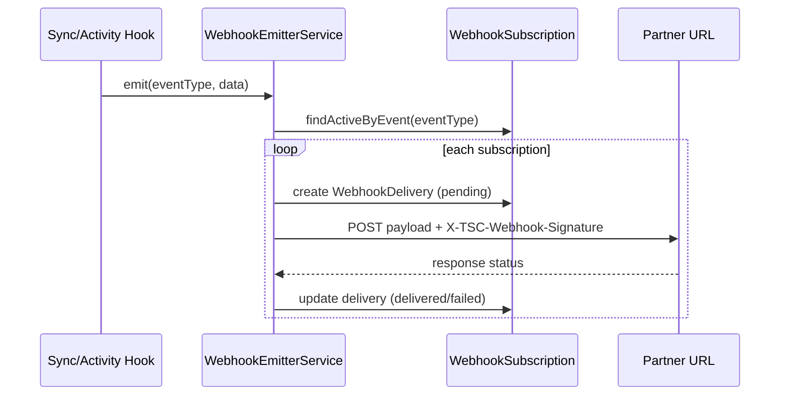

# Phase 10.5 — Industry Data Exchange / Music Data Network (Pillar 8 — FINAL Phase 10)

**Status:** Complete (implementation)  
**Date:** 2026-06-12  
**Depends on:** Phase 10.1–10.4 (Identity, Booking/Contracts, Payments, Public API + White Label)

## Summary

Phase 10.5 completes **Phase 10** by shipping partner **webhook subscriptions**, **bulk data export** (API-key scoped), **data exchange partners** (inbound ingest stub), and **industry graph JSON-LD export**. `WebhookEmitterService` wires into existing sync/activity hooks — HTTP POST delivery stub with timeout, signature header, delivery log (no retry queue).

**Out of scope:** Phase 11 Global Cultural Network, Spotify/distribution (Pillar 7), Redis rate limits, webhook retry queue, live partner TLS/DNS.

---

## Event catalog

| Event type | Trigger hook | Payload highlights |
|------------|--------------|-------------------|
| `artist.created` | `PassportSyncEmitter.emitArtistCreated` | `artistId`, `slug`, `displayName` |
| `opportunity.applied` | `OpportunitySyncEmitter.emit` (applied only) | `applicationId`, `opportunityId`, `artistId`, `personId` |
| `deal.completed` | `DealSyncEmitter.emit` when `status` is `paid` or `completed` | `dealId`, `artistId`, `brandId`, `value`, `currency` |
| `booking.inquiry` | `BookingService.create` | `bookingRequestId`, `artistId`, `requesterPersonId`, `status` |
| `membership.subscribed` | `MembershipService.subscribe` (new subscription) | `membershipId`, `personId`, `communityId`, `price` |
| `fan.purchase` | `CommerceService.completePurchase` | `fanPurchaseId`, `productType`, `amount`, `currency` |
| `identity.verified` | `TscIdentityNetworkService.setAdminVerificationBadge` | `entityType`, `entityId`, `badge`, `namespace`, `slug` |

Test-only: `webhook.test` — sent by `POST /admin/webhooks/:id/test`.

---

## Webhook flow



**Delivery stub:** `fetch` with 5s timeout (`WEBHOOK_DELIVERY_TIMEOUT_MS`). HMAC-SHA256 signature in `X-TSC-Webhook-Signature`. Failures logged; status `failed` — **no retry queue** (Phase 11+).

---

## Webhook API (admin)

| Method | Route | Auth | Purpose |
|--------|-------|------|---------|
| POST | `/admin/webhooks` | Stub admin | Create subscription (returns `secret` once) |
| GET | `/admin/webhooks` | Stub admin | List subscriptions |
| DELETE | `/admin/webhooks/:id` | Stub admin | Deactivate subscription |
| POST | `/admin/webhooks/:id/test` | Stub admin | Send test payload stub |
| GET | `/admin/webhooks/deliveries` | Stub admin | Recent deliveries (`?subscriptionId`, `?limit`) |

### Create body

```json
{
  "apiKeyId": "<api-key-id>",
  "url": "https://partner.example/webhooks/tsc",
  "events": ["artist.created", "deal.completed"]
}
```

---

## Entities

### WebhookSubscription

```javascript
{ id, apiKeyId, url, events[], secret, isActive, createdAt }
```

### WebhookDelivery

```javascript
{ id, subscriptionId, eventType, payload JSON, status, attempts, deliveredAt?, responseCode?, createdAt }
```

### DataExchangePartner

```javascript
{ id, name, slug, apiKeyId, allowedScopes[], syncDirection, config JSON, isActive }
```

**syncDirection:** `inbound`, `outbound`, `bidirectional`

---

## Bulk export API (public v1)

**Scopes:** `read:export`, `read:graph` (extend API key on create)

| Method | Route | Scope | Purpose |
|--------|-------|-------|---------|
| GET | `/public/v1/export/artists?format=json\|csv` | `read:export` | Paginated bulk artists |
| GET | `/public/v1/export/relationships?entityType=&entityId=` | `read:export` | Graph export stub (1-hop) |
| GET | `/public/v1/export/analytics?period=YYYY-MM` | `read:export` | Anonymized count rollup |
| GET | `/public/v1/graph/export/:entityType/:entityId?depth=2` | `read:graph` | JSON-LD subgraph stub |

---

## Data exchange partners

| Method | Route | Auth | Purpose |
|--------|-------|------|---------|
| POST | `/exchange/partners/:slug/ingest` | API key | Inbound webhook receiver — normalize to sync stub |
| GET | `/exchange/partners/:slug/status` | Public | Partner sync status |

### Ingest body

```json
{
  "eventType": "artist.updated",
  "externalId": "ext-123",
  "entityType": "Artist",
  "data": { "name": "Example" },
  "occurredAt": "2026-06-12T12:00:00.000Z"
}
```

Partners seeded via Prisma / direct DB insert (`DataExchangePartner` + linked `ApiKey`).

---

## Schema

Fragment: `packages/database/prisma/phase10-step5.prisma`  
Merged into `schema.prisma`:

| Model / enum | Purpose |
|--------------|---------|
| `WebhookSubscription` | Partner webhook endpoint config |
| `WebhookDelivery` | Delivery audit log |
| `WebhookDeliveryStatus` | pending, delivered, failed |
| `DataExchangePartner` | External platform partner registry |
| `DataExchangeSyncDirection` | inbound, outbound, bidirectional |

---

## Packages

| Package | Files |
|---------|-------|
| `@tsc/database` | `src/data-exchange.ts` — event catalog, CSV helper, JSON-LD context |
| `@tsc/types` | `src/data-exchange.ts` — webhook, export, partner payloads |
| `@tsc/contracts` | `src/data-exchange/index.ts` — Zod schemas |

**API scopes extended:** `read:export`, `read:graph` in `@tsc/database` + `@tsc/contracts` public-api.

---

## API module

| Module | Path |
|--------|------|
| Data Exchange | `apps/api/src/modules/data-exchange` |

Registered in `app.module.ts`. `WebhookEmitterService` exported; wired via `forwardRef` into Passport, Opportunity, Deal, Booking, Membership, Commerce, TscIdentity modules.

**OpenAPI:** export + graph paths appended to `apps/api/openapi/public-v1.yaml`.

---

## Merge steps

1. Prisma migration:
   ```bash
   cd packages/database && npx prisma migrate dev --name phase10-step5-data-exchange
   ```
2. Rebuild packages:
   ```bash
   npm run build -w @tsc/database -w @tsc/types -w @tsc/contracts
   npm run build -w @tsc/api
   ```
3. Proxy routes in CoreKnot dev server:
   - `/api/admin/webhooks/*`
   - `/api/public/v1/export/*`
   - `/api/public/v1/graph/*`
   - `/api/exchange/partners/*`
4. Restart API; test:
   ```bash
   # API key with export scopes
   POST /api/admin/api-keys
   Body: { "name": "Export Partner", "scopes": ["read:export", "read:graph", "read:artists"] }

   # Webhook subscription
   POST /api/admin/webhooks
   Body: {
     "apiKeyId": "<key-id>",
     "url": "https://webhook.site/<uuid>",
     "events": ["artist.created", "deal.completed"]
   }

   GET /api/public/v1/export/artists?format=json&page=1&limit=50
   Header: X-TSC-Api-Key: tsc_…

   GET /api/public/v1/graph/export/Artist/<artist-id>?depth=2
   Header: X-TSC-Api-Key: tsc_…

   POST /api/admin/webhooks/<sub-id>/test
   GET /api/admin/webhooks/deliveries?limit=20
   ```

5. Seed exchange partner (SQL/Prisma):
   ```javascript
   // DataExchangePartner linked to existing ApiKey
   { slug: "demo-partner", syncDirection: "bidirectional", allowedScopes: ["ingest:artists"] }
   ```

---

## Verification checklist

- [ ] `prisma validate` passes
- [ ] Webhook create returns `secret` once
- [ ] Test webhook POST creates delivery row
- [ ] `artist.created` fires on passport stub create
- [ ] `deal.completed` fires on deal paid
- [ ] Export artists JSON + CSV with `read:export` scope
- [ ] Graph JSON-LD export with `read:graph` scope
- [ ] Partner ingest accepts API key, logs sync stub
- [ ] Missing scope → 403 on export routes

---

## Deferred (Phase 11+)

| Item | Target |
|------|--------|
| Webhook retry queue / dead letter | Phase 11 |
| Redis-backed rate limits + usage analytics | Phase 11 |
| Global Cultural Network graph federation | Phase 11 |
| Live partner webhook verification (mTLS) | Phase 11 |
| White label custom domain TLS | Phase 11 |
| Spotify / distribution integration | Separate pillar |

**Phase 10.5 complete. Phase 10 FINISHED — see `phase10-final-report.md`.**
