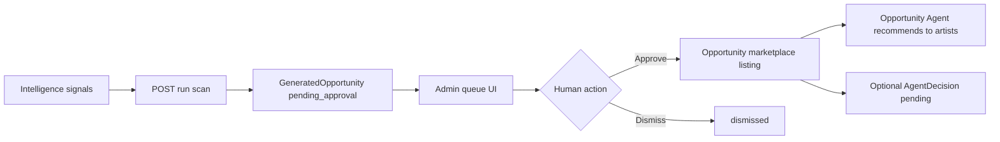

# Phase 14 Module 1 — Opportunity Generation Engine

**Status:** Complete (implementation)  
**Date:** 2026-06-12

## Summary

Phase 14 Module 1 ships the **Opportunity Generation Engine** — rule-based signal aggregation that reads existing intelligence (city scenes, community audience snapshots, talent discovery growth, event density, brand fund stubs) and creates **human-reviewable opportunity drafts**. Approved drafts publish to the existing `Opportunity` marketplace; the Phase 9 Opportunity Agent consumes published listings in artist runs.

**Out of scope:** Modules 2–10 (Team Formation, FundingPool, Venture Builder, Simulation, Reputation Consensus, Autonomous Marketplace match, dedicated agents expansion, Network Health Index, Command Center V7), new ML training.

---

## Schema

Fragment: `packages/database/prisma/phase14-module1.prisma`  
Merged into `packages/database/prisma/schema.prisma`:

| Model / enum | Purpose |
|--------------|---------|
| `GeneratedOpportunity` | Draft/published system suggestion with `signalSnapshot`, confidence, linked `opportunityId` |
| `OpportunityGenerationRun` | Audit row per scan (`triggeredBy`, `scope`, `signals`, `generatedCount`) |
| `GeneratedOpportunitySource` | `system`, `brand`, `community` |
| `GeneratedOpportunityStatus` | `draft`, `pending_approval`, `published`, `dismissed` |
| `GeneratedOpportunityType` | `showcase_event`, `collaboration_open_call`, `grant_opportunity` |
| `ActivityAction` +2 | `opportunity_generated`, `opportunity_generation_published` |

---

## Signal rules (rule-based, no ML)

| Rule ID | Inputs | Threshold | Output type |
|---------|--------|-----------|-------------|
| `city_genre_showcase_event` | City+genre communities, event density, activity velocity | Audience growth ≥ 30%, community activity ≥ 25% | `showcase_event` |
| `community_spike_collaboration` | `CommunityAudienceSnapshot`, artist cluster in city+genre | Member growth ≥ 20%, ≥ 3 artists | `collaboration_open_call` |
| `brand_fund_emerging_artist_grant` | Active brand budget stub + fast-growing artist | Artist growth ≥ 35%, brand budget tier set | `grant_opportunity` |

**Example:** Mumbai + Hip-Hop, audience +42%, community activity +31% → **Launch Hip-Hop Showcase Event — Mumbai** draft.

Rule helpers: `packages/database/src/opportunity-generation.ts`

---

## Packages

| Package | Files |
|---------|-------|
| `@tsc/database` | `src/opportunity-generation.ts` — thresholds, scoring, title builders |
| `@tsc/database` activity | `opportunity_generated`, `opportunity_generation_published` |
| `@tsc/types` | `src/opportunity-generation.ts` — run/draft/signal payloads |
| `@tsc/contracts` | `src/opportunity-generation/index.ts` — Zod input schemas |
| `@tsc/database` automation | Stub catalog rule `insight_opportunity_generation_stub_v1` |

---

## API (`apps/api/src/modules/agents`)

| Method | Route | Auth | Purpose |
|--------|-------|------|---------|
| POST | `/agents/opportunity-generation/run` | Admin | Scan signals → create pending drafts + `OpportunityGenerationRun` |
| GET | `/agents/opportunity-generation/drafts` | Admin | Pending approval queue |
| GET | `/agents/opportunity-generation/signals` | Admin | Hot signals feed |
| POST | `/agents/opportunity-generation/drafts/:id/approve` | Admin | Publish to marketplace (`Opportunity` + activity) |
| POST | `/agents/opportunity-generation/drafts/:id/dismiss` | Admin | Dismiss draft |

**Approve pipeline:**

1. Validate draft status (`pending_approval` / `draft`)
2. Create `Opportunity` (`marketplaceVisible: true`, `source: system_generated`)
3. Link draft → `published`, set `opportunityId`, `approvedAt`, `approvedBy`
4. Optional `AgentDecision` pending when `requireDecision: true`
5. Activity: `opportunity_generation_published`

**Run pipeline:**

1. Collect hot signals (city intelligence reads via `AgentsRepository`)
2. Materialize drafts (`pending_approval`)
3. Persist `OpportunityGenerationRun`
4. Activity: `opportunity_generated`

---

## Integrations

### Opportunity Agent (Phase 9 M1)

`OpportunityAgentService.run()` merges **published generated opportunities** with Rec V2 marketplace scoring. Metadata includes `system_generated` reason code.

### Automation V2 (stub)

- Action: `trigger_opportunity_generation_stub` in `AutomationEngineV2Service`
- Calls `OpportunityGenerationService.stubRunOnInsightMatch()`
- Catalog seed rule (disabled by default threshold) in `AUTOMATION_V2_RULE_CATALOG`

---

## CoreKnot UI

| File | Purpose |
|------|---------|
| `lib/opportunityGenerationApi.js` | API + mocks (Mumbai Hip-Hop showcase) |
| `pages/operating/OpportunityGenerationQueuePage.jsx` | Draft queue — signal context, approve/dismiss, run scan |
| `components/opportunity-generation/HotSignalsPanel.jsx` | Command Center hot signals stub section |
| `pages/operating/ExecutiveCommandCenterPage.jsx` | `HotSignalsPanel` + nav link wired |
| `OpportunityGenerationQueuePage.INTEGRATION.patch.md` | Router registration snippet |

---

## Approval flow



Human must approve before publish — no auto-publish.

---

## Merge steps

1. Schema merged from `phase14-module1.prisma` into `schema.prisma`.
2. Run migration:
   ```bash
   cd packages/database && npx prisma migrate dev --name phase14-module1-opportunity-generation
   npx prisma generate
   ```
3. Register CoreKnot route per `OpportunityGenerationQueuePage.INTEGRATION.patch.md` if not using file-based router discovery.
4. `AgentsModule` already registers `OpportunityGenerationController` + services.

---

## Deferred to Module 2+

| Item | Module |
|------|--------|
| Team Formation from approved opportunities | M2 |
| FundingPool linkage | M3 |
| Venture Builder simulation | M4 |
| Reputation consensus on publish | M5 |
| Autonomous marketplace matching | M6 |
| Full Automation V2 `insight_match` trigger (live cron) | M6 / Command Center V7 |
| Network Health Index inputs | M9 |
| Command Center V7 unified orchestration | M10 |

---

## Files touched

```
packages/database/prisma/phase14-module1.prisma
packages/database/prisma/schema.prisma
packages/database/src/opportunity-generation.ts
packages/database/src/index.ts
packages/database/src/activity.ts
packages/database/src/automation.ts
packages/types/src/opportunity-generation.ts
packages/types/src/index.ts
packages/contracts/src/opportunity-generation/index.ts
packages/contracts/src/index.ts
apps/api/src/modules/agents/opportunity-generation.repository.ts
apps/api/src/modules/agents/opportunity-generation.service.ts
apps/api/src/modules/agents/opportunity-generation.controller.ts (via agents.controller.ts)
apps/api/src/modules/agents/opportunity-agent.service.ts
apps/api/src/modules/agents/agents.module.ts
apps/api/src/modules/agents/agents.controller.ts
apps/api/src/modules/intelligence/automation-engine-v2.service.ts
apps/coreknot/client/src/lib/opportunityGenerationApi.js
apps/coreknot/client/src/components/opportunity-generation/HotSignalsPanel.jsx
apps/coreknot/client/src/pages/operating/OpportunityGenerationQueuePage.jsx
apps/coreknot/client/src/pages/operating/ExecutiveCommandCenterPage.jsx
```
