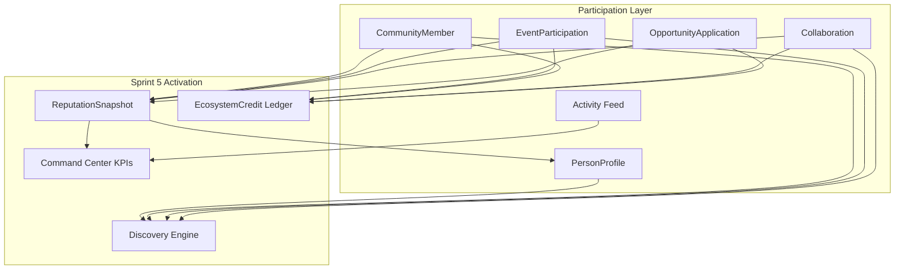

# Phase 6.5 — Ecosystem Activation Layer (FINAL)

**Status:** Complete across 5 sprints  
**Date:** 2026-06-12

## Mission

Transform TSC from identity + intelligence platform into a **participation-first ecosystem** where people join communities, attend events, collaborate, apply to opportunities, build reputation, and earn credits — without rebuilding Phase 5 analytics.

---

## Sprint map

| Sprint | Modules | Report |
|--------|---------|--------|
| **1** | PersonProfile, Ecosystem Passport, Verification V1 | [phase6.5-sprint1-report.md](./phase6.5-sprint1-report.md) |
| **2** | Community Membership, Event Participation | [phase6.5-sprint2-report.md](./phase6.5-sprint2-report.md) |
| **3** | Activity Feed, PersonFollow | [phase6.5-sprint3-report.md](./phase6.5-sprint3-report.md) |
| **4** | Collaboration Marketplace | [phase6.5-sprint4-report.md](./phase6.5-sprint4-report.md) |
| **5** | Reputation, Credits, Discovery, Command Center participation | [phase6.5-sprint5-report.md](./phase6.5-sprint5-report.md) |

---

## Architecture (participation stack)



---

## API surface (Phase 6.5 cumulative)

| Domain | Key routes |
|--------|------------|
| Profile | `/profile/*`, `/profile/:slug/ecosystem` |
| Community | `/communities/:id/join`, `/leave`, `/members` |
| Events | `/events/:id/register`, `/check-in`, `/participants` |
| Activity | `/activity/feed/*`, `/activity/record` |
| Follow | `/follow/*` |
| Collaboration | `/collaborations/*` |
| Reputation | `/reputation/person/:id`, `/reputation/community/:id`, `/reputation/refresh/*` |
| Credits | `/credits/me`, `/credits/me/history`, `/credits/earn` |
| Discovery | `/discovery/people`, `/communities`, `/events`, `/collaborations` |
| Intelligence | `/intelligence/command-center`, `/intelligence/participation-dashboard` |

---

## Schema fragments — single migration list

```
packages/database/prisma/phase6.5-profile.prisma
packages/database/prisma/phase6.5-membership.prisma
packages/database/prisma/phase6.5-participation.prisma
packages/database/prisma/phase6.5-activity.prisma
packages/database/prisma/phase6.5-collaboration.prisma
packages/database/prisma/phase6.5-reputation.prisma
```

### Merge steps

1. Append all 6 fragments to `packages/database/prisma/schema.prisma`
2. Extend `Person`, `Community`, `Event` per fragment comments
3. Ensure `ActivityAction` includes `posted_collaboration`, `applied_collaboration`
4. Run: `pnpm --filter @tsc/database prisma migrate dev --name phase6_5_ecosystem_activation`
5. Build: `pnpm --filter @tsc/contracts build && pnpm --filter @tsc/database build && pnpm --filter @tsc/types build`
6. Register Nest modules in `app.module.ts` (ReputationModule, CreditsModule, DiscoveryModule — done Sprint 5)
7. Proxy new API paths in CoreKnot dev server
8. Merge CoreKnot route patches from sprint INTEGRATION.patch.md files

---

## Design constraints (honored)

- **Reputation:** Rule-based weights on existing participation tables — no new analytics calculators
- **Discovery:** Graph queries + profile fields; optional enrichment from Phase 5 `/intelligence/recommendations/*`
- **Credits:** Ledger earn-only; idempotent per reference; spend deferred Phase 7
- **Command Center:** Participation aggregates from Activity, CommunityMember, Collaboration — reuses reputation averages for ecosystem health

---

## Phase 7 readiness

| Capability | State |
|------------|-------|
| Person reputation + percentile | ✅ Snapshots + profile cache |
| Community reputation | ✅ Snapshot API |
| Credit balance per person | ✅ Ledger with history |
| Earn on participation events | ✅ 4 hooks wired |
| Discovery surfaces | ✅ 4 endpoints + client |
| Executive participation KPIs | ✅ Command center section |
| Credit redemption / perks | ⏳ Phase 7 |
| Reputation cron / reviews | ⏳ Phase 7 |
| `help_member` earn workflow | ⏳ Phase 7 stub only |

**Recommended Phase 7 first moves:** perks catalog + `POST /credits/spend`, scheduled `POST /reputation/refresh` cron, discovery UI page in CoreKnot nav, wire Ecosystem Passport to live reputation/credits.

---

## Intentionally not in Phase 6.5

- New ML scoring / analytics package
- Credit spend or marketplace redemption
- Full discovery UI page (API + hooks only; page optional merge)
- Real-time websocket participation dashboards
- Review/rating ingestion for reputation `reviews` dimension

---

## Reports index

- [Sprint 1](./phase6.5-sprint1-report.md) — Profile + Passport + Verification
- [Sprint 2](./phase6.5-sprint2-report.md) — Community + Events
- [Sprint 3](./phase6.5-sprint3-report.md) — Activity + Follow
- [Sprint 4](./phase6.5-sprint4-report.md) — Collaboration Marketplace
- [Sprint 5](./phase6.5-sprint5-report.md) — Reputation + Credits + Discovery + Command Center

**Phase 6.5 Ecosystem Activation Layer: SHIPPED.**
