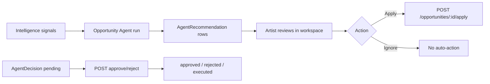

# Phase 9 Step 1 — Decision Layer + Opportunity Agent (Module 1)

**Status:** Complete (implementation)  
**Date:** 2026-06-12

## Summary

Phase 9 Step 1 ships the **Decision Layer foundation** and **Module 1 — Opportunity Agent**. Intelligence signals (Rec V2, audience, communities, past applications) flow into persisted `AgentRecommendation` rows. Artists **review and apply** via existing marketplace flow — no auto-apply. Human approval endpoints exist for `AgentDecision` (used by later modules).

**Out of scope:** Modules 2–10, Phase 10, Automation V2 (Step 8), new ML training.

---

## Schema

Fragment: `packages/database/prisma/phase9-step1.prisma`  
Merged into `packages/database/prisma/schema.prisma`:

| Model / enum | Purpose |
|--------------|---------|
| `Agent` | Registered agent (`slug`, `type`, `config`, `isActive`) |
| `AgentTask` | Run lifecycle (`input`/`output` JSON, status, timestamps) |
| `AgentDecision` | Entity-level decision with human approval (`pending`→`approved`/`rejected`/`executed`) |
| `AgentRecommendation` | Actionable suggestion for person/artist with score + confidence |
| `AgentType` | opportunity, career, community, event, brand_match, talent_discovery, forecast, copilot, workflow |
| `ActivityAction` +1 | `agent_recommendation_created` |

---

## Packages

| Package | Files |
|---------|-------|
| `@tsc/database` | `src/agents.ts` — enums, `OPPORTUNITY_AGENT_SLUG`, includes |
| `@tsc/types` | `src/agents.ts` — recommendation/decision/run payloads |
| `@tsc/contracts` | `src/agents/index.ts` — Zod input schemas |
| `@tsc/database` activity | `agent_recommendation_created` in `ACTIVITY_ACTIONS` |

---

## API (`apps/api/src/modules/agents`)

`AgentsModule` registered in `app.module.ts`.

### Decision Engine

| Method | Purpose |
|--------|---------|
| `DecisionEngineService.recordRecommendation()` | Persist recommendation + activity stub + automation stub |
| `DecisionEngineService.recordDecision()` | Persist pending decision |
| `POST /agents/decisions/:id/approve` | Approve pending decision |
| `POST /agents/decisions/:id/reject` | Reject pending decision |

### Recommendations

| Method | Route | Auth | Purpose |
|--------|-------|------|---------|
| GET | `/agents/recommendations/for-me` | StubAuthGuard | Current person's agent recommendations |
| GET | `/agents/recommendations/artist/:artistId` | StubAuthGuard | Artist-scoped recommendations |

### Module 1 — Opportunity Agent

| Method | Route | Purpose |
|--------|-------|---------|
| POST | `/agents/opportunity/run` | Trigger agent for artist (admin or artist manager) |
| GET | `/agents/opportunity/recommendations/:artistId` | List persisted agent recommendations |

**Run pipeline:**

1. Create `AgentTask` (running)
2. Read artist context: genres, city, `FanProfile` cities, superfans, `CommunityMember` (MEMBER_OF), past `OpportunityApplication`
3. Score open marketplace listings via `@tsc/analytics` `scoreArtistOpportunities` (Rec V2)
4. Write `AgentRecommendation` rows (exclude already-applied opportunities)
5. Activity: `agent_recommendation_created` (private visibility)
6. Complete `AgentTask`

**Does NOT auto-apply** — artist uses marketplace apply flow from UI.

### Phase 5 Automation (stub only)

`DecisionEngineService.stubAutomationOnRecommendation()` logs intent — no `AutomationRule` changes. Full V2 wiring deferred to **Step 8**.

---

## CoreKnot UI

| File | Purpose |
|------|---------|
| `lib/agentsApi.js` | API + mocks for recommendations, run, approve/reject |
| `components/agents/RecommendedForYouPanel.jsx` | Artist workspace panel — run agent + list |
| `components/agents/AgentRecommendationCard.jsx` | Score, confidence, [Apply] → existing apply mutation |
| `pages/operating/artists/ArtistWorkspacePage.jsx` | `RecommendedForYouPanel` above legacy opportunity intelligence |

---

## Approval flow



- **Recommendations:** artist approves implicitly by clicking **Apply** (existing flow).
- **Decisions:** explicit human approval via `/agents/decisions/:id/approve|reject` (foundation for Modules 2–10).

---

## Merge steps

1. Schema already merged in workspace snapshot from `phase9-step1.prisma`.
2. Run migration:
   ```bash
   cd packages/database && npx prisma migrate dev --name phase9-step1-agents
   ```
3. Rebuild packages:
   ```bash
   npm run build -w @tsc/database -w @tsc/types -w @tsc/contracts -w @tsc/analytics
   npm run build -w @tsc/api
   ```
4. Restart API; open artist workspace → **Recommended for you** → **Run Opportunity Agent**.
5. Verify `GET /api/agents/recommendations/for-me` and activity feed for `agent_recommendation_created`.

---

## Deferred to Step 2+

| Item | Target |
|------|--------|
| Module 2 — Career Agent | Step 2 |
| Module 3 — Community Agent | Step 3 |
| Module 4 — Event Agent | Step 4 |
| Module 5 — Brand Match Agent | Step 5 |
| Module 6 — Talent Discovery Agent | Step 6 |
| Module 7 — Forecast Agent | Step 7 |
| Automation V2 + rule triggers | Step 8 |
| Module 8 — Copilot | Step 9 |
| Module 9 — Autonomous Workflows | Step 10 |
| Decision → executed side effects | Per-module |
| Recommendation dismiss/expired lifecycle | Step 2 |
| Copilot chat UI | Step 9 |
| Phase 10 | Not started |

---

## Verification

- [ ] `prisma validate` passes
- [ ] `POST /agents/opportunity/run` creates recommendations + task
- [ ] `GET /agents/recommendations/for-me` returns items for artist member
- [ ] Apply button hits existing marketplace apply — no duplicate auto-apply
- [ ] `POST /agents/decisions/:id/approve` transitions pending → approved
- [ ] Activity records `agent_recommendation_created`
