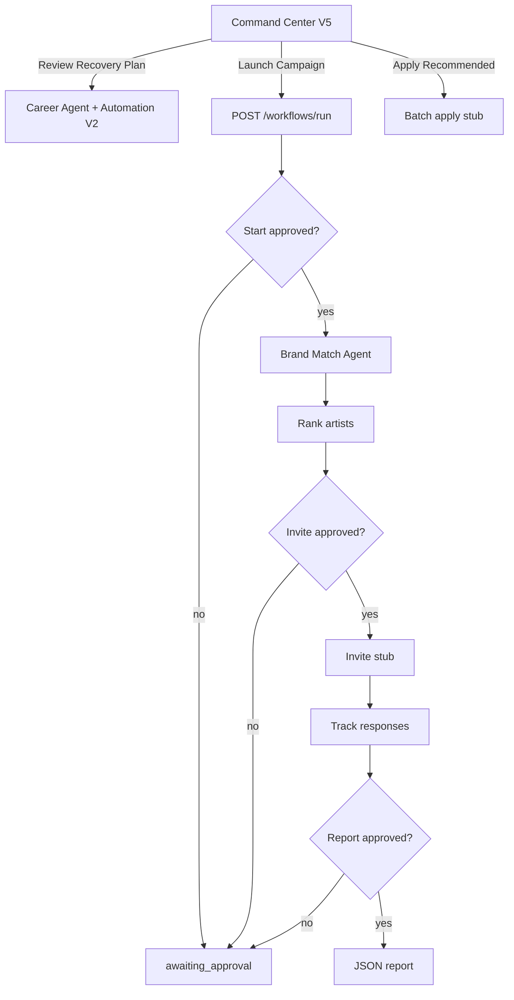

# Phase 9 Step 10 — Autonomous Workflows + Command Center V5 (FINAL)

**Status:** Complete (implementation)  
**Date:** 2026-06-12

## Summary

Phase 9 Step 10 ships **Module 10 — Autonomous Workflows** and **Command Center V5 — Acts, not just reports**. Multi-step workflows orchestrate existing agents (Brand Match, Career, Opportunity) with human approval gates at start, before destructive steps (invite stub), and at end (report). Command Center V5 extends V4 with pending decision counts, active workflow runs, actionable insight buttons, and wired executive actions.

**Phase 9 is complete.** All 10 steps (Modules 1–10 + Command Center V5) are implemented.

**Out of scope:** Phase 10 Industry Infrastructure, real email dispatch, external LLM.

---

## Phase 9 — Full summary (Steps 1–10)

| Step | Module | Delivered |
|------|--------|-----------|
| **1** | Decision Layer + Opportunity Agent | `Agent`, `AgentTask`, `AgentDecision`, `AgentRecommendation`; opportunity run + human approval endpoints |
| **2** | Career Agent (Career OS) | Career action scoring, dashboard, dismiss/apply flows |
| **3** | Community Agent | Community suggestions (events, polls, re-engage) |
| **4** | Event Agent | Pre/post event insights + suggestion approval |
| **5** | Brand Match Agent | Trust-based artist matching, invite stub, campaign history |
| **6** | Talent Discovery Agent | Emerging cities, fast-growing artists, alert feed |
| **7** | Forecast Agent | Rule-based projections + `Insight` / `InsightAction` feed |
| **8** | Automation Engine V2 | Signal rules (health, churn, deal stale, superfan drop) + evaluate |
| **9** | Ecosystem Copilot | Rule-based intent router, chat UI, read-only compose |
| **10** | Autonomous Workflows + Command Center V5 | Workflow orchestration, approval gates, actionable executive UI (this step) |

---

## Schema

Fragment: `packages/database/prisma/phase9-step10.prisma`  
Merged into `packages/database/prisma/schema.prisma`:

| Model / enum | Purpose |
|--------------|---------|
| `AutonomousWorkflow` | Workflow definition (`slug`, `triggerType`, `steps` JSON, `status`) |
| `AutonomousWorkflowRun` | Run lifecycle (`currentStep`, `stepsLog`, `payload`, `result`, approval timestamps) |
| `AutonomousWorkflowTriggerType` | manual, campaign_created, insight_action, schedule |
| `AutonomousWorkflowRunStatus` | pending, running, awaiting_approval, completed, failed, cancelled |
| `ActivityAction` +5 | workflow started/step/approved/completed/cancelled |

---

## Workflow catalog

| Slug | Name | Steps | Approval gates |
|------|------|-------|----------------|
| `brand_campaign_outreach` | Brand Campaign Outreach | 6 | Start brief · before send invitations · before final report |

### Step pipeline (`brand_campaign_outreach`)

1. **Review campaign brief** — start gate (human approve)
2. **Find matching artists** — `BrandMatchAgentService.run`
3. **Rank artist matches** — sort by score
4. **Send campaign invitations** — stub (`stub:campaign_invite …`); requires approval
5. **Track application responses** — count applied recommendations for brand
6. **Generate outreach report** — JSON report; requires approval at end

Seed: `AutonomousWorkflowRepository.ensureSeedWorkflows()` on first catalog/run.

---

## API — Autonomous Workflows (`apps/api/src/modules/agents`)

| Method | Route | Purpose |
|--------|-------|---------|
| GET | `/agents/workflows` | Catalog (seeded workflows) |
| POST | `/agents/workflows/run` | Start run — body: `{ workflowSlug, payload, approveStart? }` |
| GET | `/agents/workflows/runs/:id` | Status + step log |
| POST | `/agents/workflows/runs/:id/approve` | Human approve paused step |
| POST | `/agents/workflows/runs/:id/cancel` | Cancel active run |

Auth: `StubAuthGuard` + admin role.

### Run body example

```json
{
  "workflowSlug": "brand_campaign_outreach",
  "payload": {
    "brandId": "brand-redbull",
    "genre": "electronic",
    "city": "Bangalore",
    "budget": 500000,
    "limit": 10
  },
  "approveStart": true
}
```

---

## API — Command Center V5 (`apps/api/src/modules/intelligence`)

| Method | Route | Purpose |
|--------|-------|---------|
| GET | `/intelligence/command-center/v5?period=weekly\|monthly` | V4 payload + `actionableInsights` + `workflows` block |
| POST | `/intelligence/actions/review-recovery-plan` | Career agent run + automation evaluate artist |
| POST | `/intelligence/actions/apply-recommended` | Batch apply stub |
| POST | `/intelligence/actions/launch-community-campaign` | Starts `brand_campaign_outreach` workflow stub |

V5 `workflows` block:

```typescript
{
  pendingDecisionsCount: number;
  activeRunsCount: number;
  recentRuns: Array<{ id, workflowSlug, workflowName, status, currentStep, startedAt }>;
}
```

---

## Packages

| Package | Files |
|---------|-------|
| `@tsc/database` | `src/workflows.ts` — catalog, `BRAND_CAMPAIGN_OUTREACH_STEPS`, slugs |
| `@tsc/database` | `src/agents.ts` — `WORKFLOW_AGENT_SLUG` |
| `@tsc/database` | `src/activity.ts` — workflow activity actions |
| `@tsc/types` | Workflow + Command Center V5 payloads in `src/agents.ts` |
| `@tsc/contracts` | `AutonomousWorkflowRunInputSchema`, `CommandCenterV5ActionInputSchema` |

---

## CoreKnot UI

| File | Purpose |
|------|---------|
| `lib/intelligenceApi.js` | `fetchCommandCenter` → `/command-center/v5`; V5 action POST helpers |
| `lib/workflowsApi.js` | Workflow run/approve/cancel client + mocks |
| `hooks/queries/intelligence.js` | V5 action mutations |
| `pages/operating/ExecutiveCommandCenterPage.jsx` | V5 header, workflow KPIs, actionable insights, wired buttons |

### Command Center V5 actions (UI)

| Section | Button | Backend |
|---------|--------|---------|
| Artists At Risk | Review Recovery Plan | Career run + automation evaluate |
| Top Opportunities | Apply Recommended | Batch apply stub |
| Communities Growing Fast | Launch Campaign? | Workflow run stub |
| Actionable Insights | Execute | `POST /agents/insights/:id/actions/:actionType` |

---

## Flow



---

## Merge steps

1. Prisma migration:
   ```bash
   cd packages/database && npx prisma migrate dev --name phase9-step10-autonomous-workflows
   ```
2. Rebuild packages:
   ```bash
   npm run build -w @tsc/database -w @tsc/types -w @tsc/contracts
   npm run build -w @tsc/api
   ```
3. Proxy routes:
   - `/api/intelligence/command-center/v5`
   - `/api/intelligence/actions/review-recovery-plan`
   - `/api/intelligence/actions/apply-recommended`
   - `/api/intelligence/actions/launch-community-campaign`
   - `/api/agents/workflows/*`
4. Restart API; open Command Center → verify V5 header, workflow KPIs, action buttons
5. Test workflow:
   ```bash
   POST /api/agents/workflows/run
   GET  /api/agents/workflows/runs/:id
   POST /api/agents/workflows/runs/:id/approve
   ```

---

## Phase 10.1 readiness notes

| Entry point | Location | Phase 10 use |
|-------------|----------|--------------|
| Industry entity models | Not started | Phase 10.1 schema (`phase10-step1.prisma`) |
| Workflow trigger `campaign_created` | `AutonomousWorkflowTriggerType` | Wire to brand campaign create hook |
| Invite / email stubs | `send_invitations` step | Replace with Resend / industry dispatch |
| Command Center V5 actions | `runCommandCenterV5Action` | Wire to real marketplace apply + CRM |
| Decision approval queue | `pendingDecisionsCount` in V5 | Industry compliance review workflows |
| Copilot + Workflows | Copilot intents + workflow slugs | Natural-language workflow launch |
| Automation V2 + Workflows | Shared approval gates | Unified human-in-the-loop inbox |

**Recommended Phase 10.1 first slice:** Industry Infrastructure schema + brand/agency/label passport extensions — do not implement in Step 10.

---

## Verification

- [ ] `prisma validate` passes
- [ ] `GET /agents/workflows` returns `brand_campaign_outreach`
- [ ] `POST /agents/workflows/run` pauses at start without `approveStart`
- [ ] `POST /agents/workflows/runs/:id/approve` advances through invite + report gates
- [ ] `GET /intelligence/command-center/v5` includes `workflows` + `actionableInsights`
- [ ] Review Recovery Plan triggers career + automation evaluate
- [ ] Launch Campaign? creates workflow run
- [ ] Activity records workflow lifecycle actions
- [ ] Command Center UI shows V5 + mocks when API unreachable

---

## Deferred post-Phase 9

| Item | Target |
|------|--------|
| Real email / Resend for invitations | Phase 10+ |
| Scheduled workflow triggers (`schedule`) | Phase 10+ |
| Workflow builder UI | Phase 10+ |
| OpenAI copilot → workflow launch | Post-MVP |
| Phase 10 Industry Infrastructure | Phase 10.1 |

**Phase 9 complete. Ready for Phase 10 entry.**
