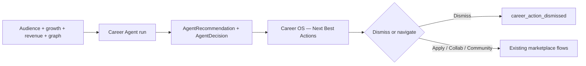

# Phase 9 Step 2 — Career Agent (Module 2) — Career OS

**Status:** Complete (implementation)  
**Date:** 2026-06-12

## Summary

Phase 9 Step 2 ships **Module 2 — Career Agent** and the **Career OS** UI. Rule-based scoring reads audience health, growth, revenue stubs, community membership, reputation/trust snapshots, graph collaborations, and marketplace opportunities. Outputs persisted `AgentRecommendation` rows plus `AgentDecision` records with `decisionType: career_action`. Artists review **Next Best Actions** in Career OS — no auto-execution.

**Out of scope:** Modules 3–10, Phase 10, new ML training.

---

## Action types (`suggestedActionType`)

| Type | Example | Signals |
|------|---------|---------|
| `play_city` | Play Bangalore | City intelligence heat, fan cities, superfans |
| `collaborate` | Collaborate with Prabh Deep | Genre overlap, COLLABORATED_WITH graph, open collab posts |
| `apply_opportunity` | Apply for Festival Y | Rec V2 opportunity scoring (festival-first) |
| `grow_community` | Launch / Join Community Z | MEMBER_OF gap, community candidates |
| `improve_health` | Improve Audience Growth | AudienceHealthSnapshot weak metrics |

Each action includes: `title`, `rationale`, `score`, `confidence`, `priority` (`low`/`medium`/`high`), `metadata.reasonCodes`.

---

## Schema

Fragment: `packages/database/prisma/phase9-step2.prisma`  
Merged into `packages/database/prisma/schema.prisma`:

| Change | Purpose |
|--------|---------|
| `ActivityAction` +2 | `career_actions_generated`, `career_action_dismissed` |

**No new models** — reuses Step 1 `Agent`, `AgentTask`, `AgentDecision`, `AgentRecommendation`.

---

## Packages

| Package | Files |
|---------|-------|
| `@tsc/database` | `CAREER_AGENT_SLUG`, `CAREER_SUGGESTED_ACTION_TYPES` in `src/agents.ts`; activity actions |
| `@tsc/types` | Career payloads + `CareerSuggestedActionType` in `src/agents.ts` |
| `@tsc/contracts` | `CareerAgentRunInputSchema`, `CareerSuggestedActionTypeSchema` |

---

## API (`apps/api/src/modules/agents`)

### Career Agent

| Method | Route | Purpose |
|--------|-------|---------|
| POST | `/agents/career/run/:artistId` | Analyze signals → recommendations + decisions |
| GET | `/agents/career/actions/:artistId` | List active career recommendations |
| POST | `/agents/career/actions/:id/dismiss` | Dismiss recommendation (`status: dismissed`) |
| GET | `/agents/career/dashboard/:artistId` | Career OS summary payload |

**Run pipeline:**

1. Create `AgentTask` (running)
2. Read artist context: audience health, superfans, reputation, trust, revenue stubs (Deal + SupportAction), communities, COLLABORATED_WITH, applications
3. Rule-based score across 5 action types (`calculateCityIntelligence`, `scoreArtistOpportunities`)
4. Write `AgentRecommendation` + `AgentDecision` (`career_action`, pending) per action
5. Activity: `career_actions_generated` (private)
6. Complete `AgentTask`

**Dismiss:** updates recommendation status; activity `career_action_dismissed`.

Uses existing `DecisionEngineService` from Step 1.

---

## CoreKnot UI

| File | Purpose |
|------|---------|
| `lib/careerApi.js` | API + mocks (Bangalore, Prabh Deep, NH7 festival) |
| `pages/career/CareerOSPage.jsx` | Career OS dashboard + Next Best Actions |
| `components/career/CareerActionCard.jsx` | Dismiss, navigate to apply/collab/community/audience-os |
| `pages/career/INTEGRATION.patch.md` | Router wiring |
| `pages/operating/artists/ArtistWorkspacePage.jsx` | **Career OS →** link in header |

---

## Flow



---

## Merge steps

1. Schema fragment merged — run migration:
   ```bash
   cd packages/database && npx prisma migrate dev --name phase9-step2-career-agent
   ```
2. Rebuild packages:
   ```bash
   npm run build -w @tsc/database -w @tsc/types -w @tsc/contracts -w @tsc/analytics
   npm run build -w @tsc/api
   ```
3. Wire CoreKnot route per `pages/career/INTEGRATION.patch.md`
4. Restart API; open artist workspace → **Career OS →** → **Generate actions**
5. Verify dismiss + activity feed for `career_actions_generated` / `career_action_dismissed`

---

## Deferred to Step 3+

| Item | Target |
|------|--------|
| Module 3 — Community Agent | Step 3 |
| Recommendation applied/expired lifecycle side effects | Step 3+ |
| Career decision approve → execute hooks | Per-module |
| Automation V2 triggers on career actions | Step 8 |
| Modules 4–10, Phase 10 | Later steps |

---

## Verification

- [ ] `prisma validate` passes
- [ ] `POST /agents/career/run/:artistId` creates recommendations + `career_action` decisions
- [ ] `GET /agents/career/dashboard/:artistId` returns signal summary + actions
- [ ] `POST /agents/career/actions/:id/dismiss` sets status dismissed
- [ ] Career OS UI shows mocks when API unavailable
- [ ] Activity records `career_actions_generated` and `career_action_dismissed`
