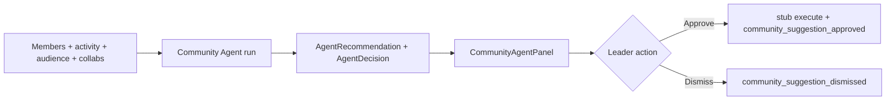

# Phase 9 Step 3 — Community Agent (Module 3)

**Status:** Complete (implementation)  
**Date:** 2026-06-12

## Summary

Phase 9 Step 3 ships **Module 3 — Community Agent** for community managers. Rule-based analysis reads `CommunityMember`, activity feed, `CommunityAudienceSnapshot`, collaboration marketplace (genre/city filter), and top contributors. Outputs persisted `AgentRecommendation` rows plus pending `AgentDecision` records (`decisionType: community_suggestion`). Leaders **approve or dismiss** in Community OS — approve triggers stub execute (log + activity).

**Out of scope:** Modules 4–10, Phase 10, poll entity (metadata stub only), new ML training.

---

## Suggestion types (`suggestionType` in metadata)

| Type | Example | Signals |
|------|---------|---------|
| `re_engage_member` | Re-engage 47 inactive members | No posts/activity 30d+ |
| `recommend_member` | Promote Priya to Moderator | High contributor score |
| `recommend_member` | Invite creator to collaborate | Open collab + genre/city match |
| `suggest_event` | Host beat battles in Bangalore | Event gap + trend stub |
| `create_poll` | Create engagement poll | Soft engagement/growth (metadata-only poll stub) |

Each suggestion includes: `title`, `rationale`, `score`, `confidence`, `priority`, `metadata.reasonCodes`, `metadata.communityId`.

---

## Schema

Fragment: `packages/database/prisma/phase9-step3.prisma`  
Merged into `packages/database/prisma/schema.prisma`:

| Change | Purpose |
|--------|---------|
| `ActivityAction` +3 | `community_agent_suggestions_generated`, `community_suggestion_approved`, `community_suggestion_dismissed` |

**No new models** — reuses Step 1 `Agent`, `AgentTask`, `AgentDecision`, `AgentRecommendation`.

---

## Packages

| Package | Files |
|---------|-------|
| `@tsc/database` | `COMMUNITY_AGENT_SLUG`, `COMMUNITY_SUGGESTION_TYPES` in `src/agents.ts`; activity actions |
| `@tsc/types` | Community payloads + `CommunitySuggestionType` in `src/agents.ts` |
| `@tsc/contracts` | `CommunityAgentRunInputSchema`, `CommunitySuggestionTypeSchema` |

---

## API (`apps/api/src/modules/agents`)

### Community Agent

| Method | Route | Purpose |
|--------|-------|---------|
| POST | `/agents/community/run/:communityId` | Analyze signals → recommendations + decisions |
| GET | `/agents/community/suggestions/:communityId` | List active suggestions + summary (inactive, moderators, trends) |
| POST | `/agents/community/suggestions/:id/approve` | Leader approves → stub execute + activity |
| POST | `/agents/community/suggestions/:id/dismiss` | Dismiss recommendation + reject pending decision |

**Run pipeline:**

1. Create `AgentTask` (running)
2. Read community context: members, inactive (30d), top contributors, audience snapshot, collabs, events, activity
3. Rule-based score across 4 suggestion types
4. Write `AgentRecommendation` (`metadata.communityId`) + `AgentDecision` (`community_suggestion`, pending)
5. Activity: `community_agent_suggestions_generated` (private)
6. Complete `AgentTask`

**Approve stub execute:**

| Type | Stub output |
|------|-------------|
| `suggest_event` | `stub:event_draft_created` |
| `create_poll` | `stub:poll_metadata_logged` (no poll entity) |
| `recommend_member` | `stub:moderator_promotion_intent` or `stub:collab_invite_intent` |
| `re_engage_member` | `stub:re_engagement_campaign` |

Activity: `community_suggestion_approved`. Recommendation → `applied`; decision → `executed`.

**Dismiss:** recommendation `dismissed`; decision `rejected`; activity `community_suggestion_dismissed`.

Auth: community leader (`Founder`/`Admin`/`Moderator`), linked artist manager, or platform admin.

---

## CoreKnot UI

| File | Purpose |
|------|---------|
| `lib/communityAgentApi.js` | API + TSC Underground mocks |
| `components/community/CommunityAgentPanel.jsx` | Inactive count, moderator candidates, trends, suggestion cards |
| `pages/operating/communities/CommunityDashboardPage.jsx` | `CommunityAgentPanel` above Audience panel |
| `pages/operating/communities/CommunityLeaderPortal.jsx` | `CommunityAgentPanel` at top of leader tools |

---

## Flow



---

## Merge steps

1. Schema fragment merged — run migration:
   ```bash
   cd packages/database && npx prisma migrate dev --name phase9-step3-community-agent
   ```
2. Rebuild packages:
   ```bash
   npm run build -w @tsc/database -w @tsc/types -w @tsc/contracts
   npm run build -w @tsc/api
   ```
3. Restart API; open TSC Underground dashboard or leader portal → **Run agent**
4. Verify approve/dismiss + activity feed for `community_agent_suggestions_generated` / `community_suggestion_approved`

---

## Deferred to Step 4+

| Item | Target |
|------|--------|
| Module 4 — Event Agent | Step 4 |
| Real poll entity + poll creation side effect | Later |
| Real event draft creation on approve | Per-module execute hooks |
| Re-engagement email/push campaign | Later |
| Moderator role promotion on approve | Later (stub only) |
| Automation V2 triggers on community suggestions | Step 8 |
| Modules 5–10, Phase 10 | Later steps |

---

## Verification

- [ ] `prisma validate` passes
- [ ] `POST /agents/community/run/:communityId` creates recommendations + `community_suggestion` decisions
- [ ] `GET /agents/community/suggestions/:communityId` returns inactive count + moderator candidates + items
- [ ] `POST /agents/community/suggestions/:id/approve` logs stub + `community_suggestion_approved` activity
- [ ] `POST /agents/community/suggestions/:id/dismiss` sets status dismissed
- [ ] CommunityAgentPanel shows mocks when API unavailable
- [ ] Activity records `community_agent_suggestions_generated` and `community_suggestion_approved`
