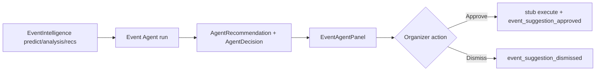

# Phase 9 Step 4 — Event Agent (Module 4)

**Status:** Complete (implementation)  
**Date:** 2026-06-12

## Summary

Phase 9 Step 4 ships **Module 4 — Event Agent** for event organizers. Wraps **EventIntelligence** (Phase 8 Step 7) — no duplicate calculators. Pre-event run uses `getPredict()` + graph recommendations; post-event uses `getIntelligence()` analysis + same recommendations. Rule-based scoring emits `AgentRecommendation` + pending `AgentDecision` (`decisionType: event_suggestion`). Organizers **approve or dismiss** in CoreKnot — approve triggers stub execute + activity.

**Out of scope:** Modules 5–10, Phase 10, real marketing/capacity/venue side effects, Automation V2.

---

## Suggestion types (`suggestionType` in metadata)

| Type | Phase | Example | Signals |
|------|-------|---------|---------|
| `optimize_marketing` | pre | Boost marketing to close attendance gap | Registrations &lt; 55% of predicted |
| `adjust_capacity` | pre | Review capacity and overflow plan | Predicted fill ≥ 82% capacity |
| `partner_venue` | pre | Partner with {venue/partner} | EventIntelligence graph recs |
| `repeat_in_city` | post | Repeat show in Mumbai | Conversion ≥ 65% + city fan density |
| `book_venue_again` | post | Rebook Blue Frog | Conversion ≥ 70% at venue |
| `expand_community` | post | Expand community after strong impact | Community/audience growth impact |

Each suggestion includes: `title`, `rationale`, `score`, `confidence`, `priority`, `metadata.eventId`, `metadata.phase`, `metadata.reasonCodes`.

---

## Schema

Fragment: `packages/database/prisma/phase9-step4.prisma`  
Merged into `packages/database/prisma/schema.prisma`:

| Change | Purpose |
|--------|---------|
| `ActivityAction` +3 | `event_agent_insights_generated`, `event_suggestion_approved`, `event_suggestion_dismissed` |

**No new models** — reuses Step 1 `Agent`, `AgentTask`, `AgentDecision`, `AgentRecommendation`.

---

## Packages

| Package | Files |
|---------|-------|
| `@tsc/database` | `EVENT_AGENT_SLUG`, `EVENT_SUGGESTION_TYPES` in `src/agents.ts`; activity actions |
| `@tsc/types` | Event agent payloads + `EventSuggestionType` in `src/agents.ts` |
| `@tsc/contracts` | `EventAgentRunInputSchema`, `EventSuggestionTypeSchema` |

---

## API (`apps/api/src/modules/agents`)

### Event Agent

| Method | Route | Purpose |
|--------|-------|---------|
| POST | `/agents/event/run/:eventId` | Pre or post based on `event.startsAt` vs now → recommendations + decisions |
| GET | `/agents/event/insights/:eventId` | Predictions + analysis + intelligence recs + active suggestions |
| POST | `/agents/event/suggestions/:id/approve` | Organizer approves → stub execute + activity |
| POST | `/agents/event/suggestions/:id/dismiss` | Dismiss recommendation + reject pending decision |

**Run pipeline:**

1. Create `AgentTask` (running)
2. Resolve phase: `pre` if `startsAt > now`, else `post`
3. Wrap `EventIntelligenceService`: `getPredict`, `getIntelligence`, `getRecommendations`
4. Rule-based score across phase-appropriate suggestion types
5. Write `AgentRecommendation` (`metadata.eventId`) + `AgentDecision` (`event_suggestion`, pending)
6. Activity: `event_agent_insights_generated` (private)
7. Complete `AgentTask`

**Approve stub execute:**

| Type | Stub output |
|------|-------------|
| `optimize_marketing` | `stub:marketing_boost_intent` |
| `adjust_capacity` | `stub:capacity_adjustment_intent` |
| `partner_venue` | `stub:venue_partner_outreach` |
| `repeat_in_city` | `stub:repeat_city_booking_intent` |
| `book_venue_again` | `stub:venue_rebook_intent` |
| `expand_community` | `stub:community_expansion_intent` |

Activity: `event_suggestion_approved`. Recommendation → `applied`; decision → `executed`.

Auth: admin, linked artist manager, or event organizer (`personOrganizesEvent`).

---

## CoreKnot UI

| File | Purpose |
|------|---------|
| `lib/eventAgentApi.js` | API + TSC Underground mocks (`evt-nh7`) |
| `components/events/EventAgentPanel.jsx` | Pre/post KPI sections, graph recs, suggestion cards |
| `pages/operating/events/INTEGRATION.patch.md` | Wire `EventAgentPanel` above `EventIntelligencePanel` |

---

## Flow



---

## Merge steps

1. Schema fragment merged — run migration:
   ```bash
   cd packages/database && npx prisma migrate dev --name phase9-step4-event-agent
   ```
2. Rebuild packages:
   ```bash
   npm run build -w @tsc/database -w @tsc/types -w @tsc/contracts
   npm run build -w @tsc/api
   ```
3. Restart API; open event detail (when wired) → **Run agent**
4. Verify approve/dismiss + activity feed for `event_agent_insights_generated` / `event_suggestion_approved`

---

## Deferred to Step 5+

| Item | Target |
|------|--------|
| Module 5 — Brand Match Agent | Step 5 |
| Real marketing campaign on approve | Later |
| Real capacity/venue booking side effects | Per-module execute hooks |
| Automation V2 triggers on event suggestions | Step 8 |
| Modules 6–10, Phase 10 | Later steps |

---

## Verification

- [ ] `prisma validate` passes
- [ ] `POST /agents/event/run/:eventId` creates recommendations + `event_suggestion` decisions (pre vs post by date)
- [ ] `GET /agents/event/insights/:eventId` returns predictions, analysis, intelligence recs, items
- [ ] `POST /agents/event/suggestions/:id/approve` logs stub + `event_suggestion_approved` activity
- [ ] `POST /agents/event/suggestions/:id/dismiss` sets status dismissed
- [ ] EventAgentPanel shows mocks when API unavailable
- [ ] Activity records `event_agent_insights_generated` and `event_suggestion_approved`
