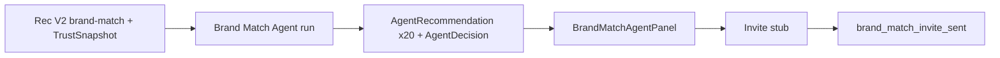

# Phase 9 Step 5 — Brand Match Agent (Module 5)

**Status:** Complete (implementation)  
**Date:** 2026-06-12

## Summary

Phase 9 Step 5 ships **Module 5 — Brand Match Agent** for brand marketers. Wraps existing **Recommendation V2** `POST /intelligence/recommendations/v2/brand-match` via `TrustService.brandMatch` — no new ML. Campaign brief (genre, audience age, city, budget) returns top 20 ranked artists with confidence. Each run writes `AgentRecommendation` per artist, one pending `AgentDecision` (`decisionType: brand_match_campaign`), and `AgentTask` run log. Brands **invite artists** via stub per match row.

**Out of scope:** Modules 6–10, Phase 10, real campaign creation / outreach side effects, Automation V2.

---

## Campaign brief

```json
{
  "brandId": "brand-redbull-in",
  "genre": "hip-hop",
  "audienceAge": "18-24",
  "city": "Mumbai",
  "budget": 500000,
  "limit": 20
}
```

Each artist recommendation stores: `metadata.brandId`, `metadata.taskId`, `metadata.artistId`, `metadata.reasonCodes`, `metadata.factors`, `metadata.brief`, trust-weighted score/confidence from Rec V2.

---

## Schema

Fragment: `packages/database/prisma/phase9-step5.prisma`  
Merged into `packages/database/prisma/schema.prisma`:

| Change | Purpose |
|--------|---------|
| `ActivityAction` +2 | `brand_match_run_completed`, `brand_match_invite_sent` |

**No new models** — reuses Step 1 `Agent`, `AgentTask`, `AgentDecision`, `AgentRecommendation`.

---

## Packages

| Package | Files |
|---------|-------|
| `@tsc/database` | `BRAND_MATCH_AGENT_SLUG` in `src/agents.ts`; activity actions |
| `@tsc/types` | Brand match agent payloads in `src/agents.ts` |
| `@tsc/contracts` | `BrandMatchAgentRunInputSchema` |

---

## API (`apps/api/src/modules/agents`)

### Brand Match Agent

| Method | Route | Purpose |
|--------|-------|---------|
| POST | `/agents/brand-match/run` | Brief → Rec V2 brand-match → recommendations + campaign decision |
| GET | `/agents/brand-match/results/:brandId` | Latest run results + pending decision |
| POST | `/agents/brand-match/results/:recommendationId/invite` | Stub invite artist to campaign |
| GET | `/agents/brand-match/campaigns/:brandId` | Run history from `AgentTask` |

**Run pipeline:**

1. Create `AgentTask` (running) with brief in `input`
2. Wrap `TrustService.brandMatch` (Rec V2 + TrustSnapshot)
3. Top N (default 20) → `AgentRecommendation` per artist (`metadata.brandId`, `metadata.taskId`)
4. One `AgentDecision` (`brand_match_campaign`, pending) for brand approval
5. Activity: `brand_match_run_completed` (private)
6. Complete `AgentTask`

**Invite stub:**

| Action | Stub output |
|--------|-------------|
| Invite artist | `stub:campaign_artist_invite brandId=… artistId=…` |

Activity: `brand_match_invite_sent`. Recommendation → `applied`.

Auth: platform admin or brand owner (`brand.personId`).

---

## CoreKnot UI

| File | Purpose |
|------|---------|
| `lib/brandMatchAgentApi.js` | API + mocks (Red Bull India, Naezy, Prabh Deep, Yashraj, MC Altaf) |
| `components/brand/BrandMatchAgentPanel.jsx` | Campaign brief form, ranked list, confidence bars, [Invite] stub, history |
| `pages/brand/BrandDetailPage.jsx` | `BrandMatchAgentPanel` replaces legacy `BrandMatchResultsPanel` |

---

## Flow



---

## Merge steps

1. Schema fragment merged — run migration:
   ```bash
   cd packages/database && npx prisma migrate dev --name phase9-step5-brand-match-agent
   ```
2. Rebuild packages:
   ```bash
   npm run build -w @tsc/database -w @tsc/types -w @tsc/contracts
   npm run build -w @tsc/api
   ```
3. Restart API; open brand detail (e.g. Red Bull India) → **Run agent**
4. Verify ranked artists, invite stub, activity for `brand_match_run_completed` / `brand_match_invite_sent`

---

## Deferred to Step 6+

| Item | Target |
|------|--------|
| Module 6 — Talent Discovery Agent | Step 6 |
| Brand approve/dismiss `brand_match_campaign` decision | Step 6 or Automation V2 |
| Real campaign + artist outreach on invite | Later |
| Automation V2 triggers on brand match | Step 8 |
| Modules 7–10, Phase 10 | Later steps |

---

## Verification

- [ ] `prisma validate` passes
- [ ] `POST /agents/brand-match/run` creates 20 recommendations + `brand_match_campaign` decision
- [ ] `GET /agents/brand-match/results/:brandId` returns latest run items + pending decision
- [ ] `POST /agents/brand-match/results/:id/invite` logs stub + `brand_match_invite_sent`
- [ ] `GET /agents/brand-match/campaigns/:brandId` returns task history
- [ ] BrandMatchAgentPanel shows mocks when API unavailable
- [ ] Activity records `brand_match_run_completed` and `brand_match_invite_sent`
