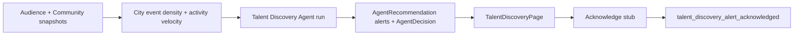

# Phase 9 Step 6 — Talent Discovery Agent (Module 6)

**Status:** Complete (implementation)  
**Date:** 2026-06-12

## Summary

Phase 9 Step 6 ships **Module 6 — Talent Discovery Agent**, the platform moat feature for finding talent before anyone else. Rule-based scan reads `AudienceHealthSnapshot` audience growth, `CommunityAudienceSnapshot` member growth, city event density, superfan velocity stub, and activity feed velocity. Each run writes `AgentRecommendation` rows (`alertType: talent_discovery_alert`) for `Artist`, `Community`, or `City` entities, one pending `AgentDecision` (`decisionType: talent_discovery_scan`), and `AgentTask` run log. Platform admins review alerts in CoreKnot — no auto-outreach.

**Out of scope:** Modules 7–10, Phase 10, new ML training, Automation V2.

---

## Growth formulas (`packages/database/src/talent-discovery.ts`)

| Signal | Formula |
|--------|---------|
| **Audience / member growth** | Reuses Audience V2: `((current − previous) / previous) × 100` over 30d windows |
| **Superfan velocity stub** | `growthPercent(gold+ snapshots current 30d, prior 30d)` |
| **Activity feed velocity stub** | `growthPercent(activity count current 30d, prior 30d)` for entity target |
| **City scene growth** | `0.35×avgMemberGrowth + 0.30×eventDensityGrowth + 0.20×activityVelocity + 0.15×artistAudienceGrowth` |
| **Event density growth** | Event count in city+genre: current 30d vs prior 30d |
| **Undervalued community** | `memberGrowth ≥ 8%` AND `activeMembers ≤ 800` AND (`fanGrowth ≥ memberGrowth×0.5` OR `activeMembers < 600`) |
| **Fast artist alert** | `audienceGrowth ≥ 12%` (reuses `HIGH_GROWTH_AUDIENCE_THRESHOLD`) |
| **Emerging city alert** | `sceneGrowth ≥ 50%` (`EMERGING_CITY_SCENE_THRESHOLD`) |
| **Alert score** | Entity-weighted growth + velocity boost → 0–100; confidence 0.45–0.95 |

Example titles:
- `Nagpur Hip-Hop Scene +300% growth`
- `Undervalued community: Beat Bazaar`
- `Fast growing artist: MC Altaf`

---

## Schema

Fragment: `packages/database/prisma/phase9-step6.prisma`  
Merged into `packages/database/prisma/schema.prisma`:

| Change | Purpose |
|--------|---------|
| `ActivityAction` +2 | `talent_discovery_scan_completed`, `talent_discovery_alert_acknowledged` |

**No new models** — reuses Step 1 `Agent`, `AgentTask`, `AgentDecision`, `AgentRecommendation`.

---

## Packages

| Package | Files |
|---------|-------|
| `@tsc/database` | `TALENT_DISCOVERY_AGENT_SLUG`, alert entity types in `src/agents.ts`; formulas in `src/talent-discovery.ts`; activity actions |
| `@tsc/types` | Talent discovery payloads in `src/agents.ts` |
| `@tsc/contracts` | `TalentDiscoveryAgentRunInputSchema`, `TalentDiscoveryAlertsQuerySchema` |

---

## API (`apps/api/src/modules/agents`)

### Talent Discovery Agent

| Method | Route | Purpose |
|--------|-------|---------|
| POST | `/agents/talent-discovery/run` | Platform admin scan → alerts + pending decision |
| GET | `/agents/talent-discovery/alerts` | Latest scan alerts (`entityType` filter) |
| POST | `/agents/talent-discovery/alerts/:id/acknowledge` | Ack stub → recommendation `applied` |
| GET | `/agents/talent-discovery/emerging-cities` | City+genre scene table |
| GET | `/agents/talent-discovery/fast-growing-artists` | Artist growth table |

**Run pipeline:**

1. Create `AgentTask` (running)
2. Scan artists (`AudienceHealthSnapshot`), undervalued communities (`CommunityAudienceSnapshot`), city+genre scenes (events + community growth + activity)
3. Each alert → `AgentRecommendation` with `metadata.alertType: talent_discovery_alert`, `entityType`, `growthPercent`, velocity stubs, `reasonCodes`
4. One `AgentDecision` (`talent_discovery_scan`, pending) for platform review
5. Activity: `talent_discovery_scan_completed` (private)
6. Complete `AgentTask`

**Ack stub:** `stub:talent_discovery_ack entityType=… entityId=…`  
Activity: `talent_discovery_alert_acknowledged`

Auth: platform admin only (`ctx.roles.includes('admin')`).

---

## CoreKnot UI

| File | Purpose |
|------|---------|
| `lib/talentDiscoveryApi.js` | API + mocks (Nagpur +300%, Beat Bazaar, MC Altaf) |
| `pages/operating/TalentDiscoveryPage.jsx` | Alerts feed + emerging cities + fast artists tables |
| `pages/operating/TalentDiscoveryPage.INTEGRATION.patch.md` | Router + proxy wiring |
| `pages/operating/ExecutiveCommandCenterPage.jsx` | **Talent Discovery →** link in header |

---

## Flow



---

## Merge steps

1. Schema fragment merged — run migration:
   ```bash
   cd packages/database && npx prisma migrate dev --name phase9-step6-talent-discovery-agent
   ```
2. Rebuild packages:
   ```bash
   npm run build -w @tsc/database -w @tsc/types -w @tsc/contracts
   npm run build -w @tsc/api
   ```
3. Wire CoreKnot route per `TalentDiscoveryPage.INTEGRATION.patch.md`; proxy `/api/agents/talent-discovery/*`
4. Restart API; open Command Center → **Talent Discovery →** or `/operating/talent-discovery`
5. Verify scan, alerts feed, acknowledge stub, emerging cities + fast artists tables

---

## Deferred to Step 7+

| Item | Target |
|------|--------|
| Module 7 — Forecast Agent | Step 7 |
| Approve/reject `talent_discovery_scan` decision (platform review UI) | Step 7 or Automation V2 |
| Brand `brand_match_campaign` decision approve/dismiss | Step 7 |
| Real outreach on acknowledged alerts | Later |
| Automation V2 triggers on talent discovery | Step 8 |
| ML-based scene detection | Out of scope |
| Modules 8–10, Phase 10 | Later steps |

---

## Verification

- [ ] `prisma validate` passes
- [ ] `POST /agents/talent-discovery/run` creates alerts + `talent_discovery_scan` decision (admin)
- [ ] `GET /agents/talent-discovery/alerts?entityType=City` filters correctly
- [ ] `POST /agents/talent-discovery/alerts/:id/acknowledge` logs stub + `talent_discovery_alert_acknowledged`
- [ ] `GET /agents/talent-discovery/emerging-cities` returns scene rows
- [ ] `GET /agents/talent-discovery/fast-growing-artists` returns artist rows
- [ ] TalentDiscoveryPage shows mocks when API unavailable
- [ ] Command Center links to Talent Discovery page
- [ ] Activity records `talent_discovery_scan_completed` and `talent_discovery_alert_acknowledged`
