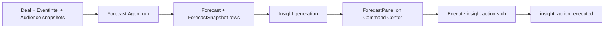

# Phase 9 Step 7 — Forecast Agent (Module 7)

**Status:** Complete (implementation)  
**Date:** 2026-06-12

## Summary

Phase 9 Step 7 ships **Module 7 — Ecosystem Forecasting**, rule-based linear projections from graph data (no ML training). Five metrics — revenue, attendance, growth, demand, membership churn — persist as `Forecast` + `ForecastSnapshot` rows. Threshold-based `Insight` + `InsightAction` stubs feed the Command Center. CoreKnot `ForecastPanel` sits below Command Center V4 as V5 prep stub.

**Out of scope:** Modules 8–10, Phase 10, Command Center V5 full UI, Automation V2.

---

## Forecast formulas (`packages/database/src/forecast.ts`)

| Metric | Baseline (last 30d) | Projection |
|--------|---------------------|------------|
| **Revenue** | `Σ RevenueTransaction` in window + `0.15 × open Deal pipeline value` | d30 = baseline; d90 = baseline × 3 |
| **Attendance** | `Σ EventIntelligenceSnapshot.actualAttendance` for scoped events | d30 = baseline; d90 = baseline × 3 |
| **Growth** | Avg latest `AudienceHealthSnapshot.audienceGrowth` per scoped artist | d30/d90 = same rate (hold) |
| **Demand** | `OpportunityApplication` count in last 30d | d30 = count; d90 = count × 3 |
| **Membership churn** | `cancelled / (active + cancelled)` stub in window | d30/d90 = same rate (hold) |

**Confidence bands:** `lower = predicted × 0.85`, `upper = predicted × 1.15` (±15%)

**Model version:** `linear_run_rate_v1`

Example: ₹42L revenue run-rate (30d) → 90d projection ₹1.26Cr with band ₹1.07Cr–₹1.45Cr.

---

## Schema

Fragment: `packages/database/prisma/phase9-step7.prisma`  
Merged into `packages/database/prisma/schema.prisma`:

| Model / enum | Purpose |
|--------------|---------|
| `ForecastMetric` | revenue, attendance, growth, demand, membership_churn |
| `ForecastHorizon` | d30, d90 |
| `Forecast` | Entity-scoped forecast run header |
| `ForecastSnapshot` | Point estimate + bounds + factors JSON |
| `Insight` | Category, title, severity, payload |
| `InsightAction` | Stub action per insight |
| `InsightSeverity` | info, warning, critical |
| `ActivityAction` +2 | `forecast_generated`, `insight_action_executed` |

---

## Packages

| Package | Files |
|---------|-------|
| `@tsc/database` | `FORECAST_*` constants, projection helpers in `src/forecast.ts`; `FORECAST_AGENT_SLUG` in `src/agents.ts` |
| `@tsc/types` | Forecast + insight payloads in `src/agents.ts` |
| `@tsc/contracts` | `ForecastAgentRunInputSchema`, `InsightsFeedQuerySchema` |

---

## API (`apps/api/src/modules/agents`)

### Forecast Agent

| Method | Route | Purpose |
|--------|-------|---------|
| POST | `/agents/forecast/run` | Admin batch (Platform) or entity-scoped run |
| GET | `/agents/forecast/:entityType/:entityId` | Latest forecasts by metric |
| GET | `/agents/forecast/platform` | Executive rollup for Command Center V5 prep |
| GET | `/agents/insights` | Platform insights feed |
| POST | `/agents/insights/:id/actions/:actionType` | Stub execute insight action |

**Run pipeline:**

1. Create `AgentTask` (running)
2. Load 30d baselines per metric from Deal/RevenueTransaction, EventIntelligence, AudienceHealthSnapshot, OpportunityApplication, MembershipSubscription
3. Project d30/d90 with `projectRunRate` or `projectRateMetric` + ±15% bounds
4. Persist `Forecast` + `ForecastSnapshot` per metric × horizon
5. Generate threshold `Insight` rows (growth, churn, demand, revenue flat)
6. Activity: `forecast_generated` (private)
7. Complete `AgentTask`

**Insight action stub:** `stub:insight_action insightId=… actionType=…`  
Activity: `insight_action_executed`

Auth: platform admin only (`ctx.roles.includes('admin')`).

---

## CoreKnot UI

| File | Purpose |
|------|---------|
| `lib/forecastApi.js` | API + mocks (₹42L revenue, 186 apps demand, 3.8% churn) |
| `components/forecast/ForecastPanel.jsx` | Platform rollups + insight cards with severity |
| `pages/operating/ExecutiveCommandCenterPage.jsx` | `ForecastPanel` below V4 participation section |

Proxy: `/api/agents/forecast/*`, `/api/agents/insights/*`

---

## Flow



---

## Merge steps

1. Schema fragment merged — run migration:
   ```bash
   cd packages/database && npx prisma migrate dev --name phase9-step7-forecast-agent
   ```
2. Rebuild packages:
   ```bash
   npm run build -w @tsc/database -w @tsc/types -w @tsc/contracts
   npm run build -w @tsc/api
   ```
3. Proxy `/api/agents/forecast/*` and `/api/agents/insights/*` to `@tsc/api`
4. Restart API; open Command Center → scroll to **Ecosystem Forecasting** panel
5. Verify run, platform rollup, insights feed, insight action stub

---

## Deferred to Step 8+

| Item | Target |
|------|--------|
| Module 8 — Copilot Agent | Step 8 |
| Automation V2 triggers on forecast insights | Step 8 |
| Command Center V5 full forecasting UI | Step 8+ |
| ML-based forecasting | Out of scope |
| Real insight action execution (campaigns, retention) | Later |
| Approve/reject pending agent decisions (talent discovery, brand match) | Step 8 |
| Modules 9–10, Phase 10 | Later steps |

---

## Verification

- [ ] `prisma validate` passes
- [ ] `POST /agents/forecast/run` creates Forecast rows + insights (admin)
- [ ] `GET /agents/forecast/platform` returns 5-metric rollup
- [ ] `GET /agents/forecast/Platform/tsc-platform` returns entity forecasts
- [ ] `GET /agents/insights` returns severity-tagged insights
- [ ] `POST /agents/insights/:id/actions/:actionType` logs stub + `insight_action_executed`
- [ ] ForecastPanel shows mocks when API unavailable
- [ ] Command Center renders ForecastPanel below V4
- [ ] Activity records `forecast_generated` and `insight_action_executed`
