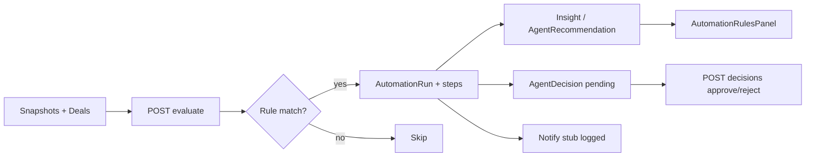

# Phase 9 Step 8 — Automation Engine V2 (Module 8)

**Status:** Complete (implementation)  
**Date:** 2026-06-12

## Summary

Phase 9 Step 8 ships **Module 8 — Automation Engine V2**. Signal-based rules evaluate live intelligence snapshots (`ArtistHealthSnapshot`, `AudienceHealthSnapshot`, `Deal`, `SuperfanSnapshot`). Matches create `AutomationRun` rows with step logs, emit `Insight` / `AgentRecommendation`, and route approval-required actions through `DecisionEngine` as pending `AgentDecision`. Phase 5 workflow triggers (`artist_path`, `booking_inquiry`, `workshop_lead`) remain on `POST /trigger`. CoreKnot `AutomationRulesPanel` on Command Center lists rules + recent runs with evaluate stub.

**Out of scope:** Module 9 Copilot (Step 9), Module 10 Autonomous Workflows (Step 10), Phase 10, real email/task dispatch.

---

## Rule catalog (`AUTOMATION_V2_RULE_CATALOG`)

| Rule | Trigger | Threshold | Actions (logged in run steps) |
|------|---------|-----------|----------------------------------|
| Artist health below threshold | `health_below` | score &lt; 60 | Alert insight + opportunity recommendation + notify manager (decision pending) |
| Audience churn spike | `churn_above` | churn &gt; 20% | Warning insight + Career Agent run stub |
| Deal stuck in negotiation | `deal_stale` | negotiation &gt; 14d | Notify stub + decision pending |
| Superfan count drop | `superfan_drop` | ≥10% drop (gold+) | Re-engagement `AgentRecommendation` |

Seeded on first evaluate via `AutomationEngineV2Repository.ensureSeedRules()` (upsert by `metadata.catalogId`).

Phase 5 workflows unchanged — manual `POST /intelligence/automation/trigger` with `workflowType`.

---

## Condition evaluator

| Trigger | Data source | Match logic |
|---------|-------------|-------------|
| `health_below` | `ArtistHealthSnapshot` | Latest row per artist; `healthScore < threshold` |
| `churn_above` | `AudienceHealthSnapshot` | Latest row; `audienceChurn > threshold` |
| `deal_stale` | `Deal` | `status = negotiation` and `updatedAt` older than `staleDays` |
| `superfan_drop` | `SuperfanSnapshot` | Compare gold/platinum/legend counts between last two snapshot dates; drop % ≥ threshold |

Artist-scoped evaluate filters all four triggers to one `artistId`.

---

## Schema

Fragment: `packages/database/prisma/phase9-step8.prisma`  
Merged into `packages/database/prisma/schema.prisma`:

| Model / enum | Purpose |
|--------------|---------|
| `AutomationTriggerType` | Phase 5 + V2 triggers (`health_below`, `churn_above`, `deal_stale`, `superfan_drop`) |
| `AutomationRule` | Rule definition + `triggerType` column |
| `AutomationRun` | Execution log with optional FKs |
| `ArtistHealthSnapshot` | Artist health signal (Phase 5 model, now in canonical schema) |
| `Goal` / `GoalProgress` | Phase 5 goal tracking (now in canonical schema) |
| `ActivityAction` +2 | `automation_rule_evaluated`, `automation_action_stubbed` |

---

## Packages

| Package | Files |
|---------|-------|
| `@tsc/database` | `src/automation.ts` — trigger constants, thresholds, `AUTOMATION_V2_RULE_CATALOG`, includes |
| `@tsc/database` | `src/agents.ts` — `AUTOMATION_AGENT_SLUG` |
| `@tsc/database` | `src/activity.ts` — new activity actions |

---

## API (`apps/api/src/modules/intelligence`)

| Method | Route | Purpose |
|--------|-------|---------|
| GET | `/intelligence/automation/rules` | List rules (optional `triggerType`, `workflowType`, `status`) |
| POST | `/intelligence/automation/evaluate` | Run all active V2 rules (cron stub) |
| POST | `/intelligence/automation/evaluate/artist/:id` | Artist-scoped evaluate |
| GET | `/intelligence/automation/runs/recent` | Recent runs with rule summary |
| POST | `/intelligence/automation/trigger` | Phase 5 workflow stubs (unchanged) |

### Evaluate pipeline

1. `ensureSeedRules()` — upsert catalog rules
2. Load active rules where `triggerType` ∈ V2 set
3. For each rule, evaluate condition against snapshots / deals / superfans
4. On match: create `AutomationRun` → execute step actions
5. Actions emit `Insight`, `AgentRecommendation`, or `AgentDecision` (pending) via `DecisionEngineService`
6. Notify/email steps stubbed — logged in run steps + `automation_action_stubbed` activity
7. Complete run; record `automation_rule_evaluated` activity

Auth: `StubAuthGuard` on all routes.

---

## CoreKnot UI

| File | Purpose |
|------|---------|
| `lib/automationV2Api.js` | Rules, evaluate, recent runs + mocks |
| `components/automation/AutomationRulesPanel.jsx` | Rule list, recent runs, Run evaluate button |
| `pages/operating/ExecutiveCommandCenterPage.jsx` | Panel below `ForecastPanel` |

Proxy: `/api/intelligence/automation/*`

---

## Flow



---

## Merge steps

1. Schema fragment merged — run migration:
   ```bash
   cd packages/database && npx prisma migrate dev --name phase9-step8-automation-v2
   ```
2. Rebuild packages:
   ```bash
   npm run build -w @tsc/database -w @tsc/types -w @tsc/contracts
   npm run build -w @tsc/api
   ```
3. Proxy `/api/intelligence/automation/*` to `@tsc/api`
4. Restart API; open Command Center → **Automation Engine V2** panel
5. Click **Run evaluate**; verify `GET /runs/recent` and activity `automation_rule_evaluated`

---

## Deferred to Step 9+

| Item | Target |
|------|--------|
| Module 9 — Copilot Agent | Step 9 |
| Module 10 — Autonomous Workflows | Step 10 |
| Cron scheduler for `POST /evaluate` | Infra / Step 10 |
| Real notify/email/task dispatch | Integrations |
| Auto-invoke Career Agent on churn match | Step 9+ |
| Copilot chat UI | Step 9 |
| Phase 10 | Not started |

---

## Verification

- [ ] `prisma validate` passes
- [ ] `POST /intelligence/automation/evaluate` seeds rules + returns evaluate payload
- [ ] `POST /intelligence/automation/evaluate/artist/:id` scopes to artist
- [ ] `GET /intelligence/automation/runs/recent` returns runs with step logs
- [ ] Matching health rule creates Insight + Recommendation + pending Decision
- [ ] Phase 5 `POST /trigger` still runs artist_path / booking_inquiry / workshop_lead
- [ ] AutomationRulesPanel shows mocks when API unavailable
- [ ] Activity records `automation_rule_evaluated` and `automation_action_stubbed`
