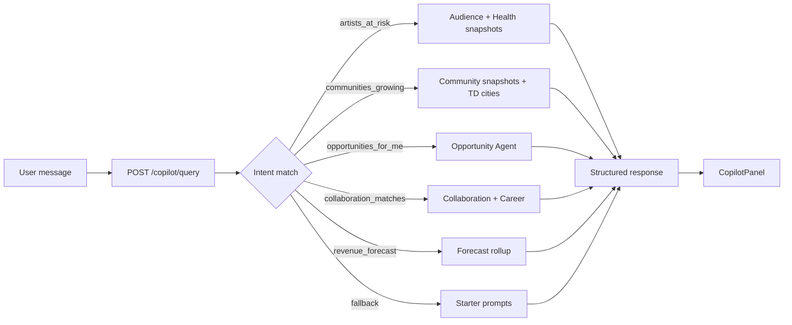

# Phase 9 Step 9 — Ecosystem Copilot (Module 9)

**Status:** Complete (implementation)  
**Date:** 2026-06-12

## Summary

Phase 9 Step 9 ships **Module 9 — Ecosystem Copilot**, the first real AI-style interface for TSC Platform. Users ask natural-language questions; a **rule-based intent router** (no external LLM in MVP) composes read-only data from existing agents and intelligence APIs. Responses return structured `{ answer, data, sources[], suggestedFollowUps[] }`. Sessions are stored on `AgentTask.output.copilotSession` JSON — no new Prisma model.

**Out of scope:** Module 10 Autonomous Workflows (Step 10 FINAL), Phase 10, OpenAI/LLM integration (stub hook only).

---

## Intent catalog (`COPILOT_INTENT_CATALOG`)

| Intent | Example query | Data sources |
|--------|---------------|--------------|
| `artists_at_risk` | "Show artists at risk" | Audience churn insights + `ArtistHealthSnapshot` (&lt; 60) |
| `communities_growing` | "Which communities are growing fastest?" | `CommunityAudienceSnapshot` + Talent Discovery emerging cities |
| `opportunities_for_me` | "What opportunities should I apply to?" | Opportunity Agent recommendations |
| `collaboration_matches` | "Who should I collaborate with?" | Collaboration marketplace browse + Career Agent `collaborate` actions |
| `revenue_forecast` | "What is the revenue forecast?" | Forecast Agent platform rollup |
| `fallback` | Unmatched text | Lists supported prompts |

Pattern definitions: `packages/database/src/copilot.ts`

---

## API (`apps/api/src/modules/agents`)

| Method | Route | Purpose |
|--------|-------|---------|
| POST | `/agents/copilot/query` | Route message → intent → compose response |
| GET | `/agents/copilot/suggestions` | Starter prompts |
| POST | `/agents/copilot/feedback` | Thumbs up/down stub |

### Query body

```json
{
  "message": "Show artists at risk",
  "personId": "optional",
  "artistId": "optional",
  "context": {}
}
```

### Pipeline

1. `detectIntent(message)` — regex patterns from catalog
2. Create `AgentTask` (running) on `copilot-agent`
3. Route to handler — delegate to Audience, Opportunity, Career, Talent Discovery, Forecast, Collaboration services
4. Complete task with `copilotSession` in output metadata
5. Activity: `copilot_query_answered` (private)
6. Return structured payload with `llmHook: 'stub'`

Auth: `StubAuthGuard` on all copilot routes.

---

## Packages

| Package | Files |
|---------|-------|
| `@tsc/database` | `src/copilot.ts` — intent catalog, starter prompts, `COPILOT_AGENT_SLUG` |
| `@tsc/database` | `src/agents.ts` — `COPILOT_AGENT_SLUG` |
| `@tsc/database` | `src/activity.ts` — `copilot_query_answered` |
| `@tsc/contracts` | `CopilotQueryInputSchema`, `CopilotFeedbackInputSchema` |
| `@tsc/types` | `CopilotQueryPayload`, suggestions, feedback types |

Schema: `ActivityAction` enum +1 `copilot_query_answered` (no new models).

---

## CoreKnot UI

| File | Purpose |
|------|---------|
| `lib/copilotApi.js` | Query, suggestions, feedback + mocks per intent |
| `components/copilot/CopilotPanel.jsx` | Chat UI, data tables, follow-ups, feedback |
| `pages/copilot/CopilotPage.jsx` | Dedicated `/copilot` page |
| `pages/copilot/INTEGRATION.patch.md` | Router + floating button merge steps |
| `ExecutiveCommandCenterPage.jsx` | Compact `CopilotPanel` below automation |

Proxy: `/api/agents/copilot/*`

---

## Flow



---

## Merge steps

1. Activity enum migration:
   ```bash
   cd packages/database && npx prisma migrate dev --name phase9-step9-copilot-activity
   ```
2. Rebuild packages:
   ```bash
   npm run build -w @tsc/database -w @tsc/types -w @tsc/contracts
   npm run build -w @tsc/api
   ```
3. Proxy `/api/agents/copilot/*` to `@tsc/api`
4. Apply `pages/copilot/INTEGRATION.patch.md` routes (optional `/copilot` page)
5. Restart API; open Command Center → **Ecosystem Copilot** panel or `/copilot`
6. Try starter prompts; verify activity `copilot_query_answered`

---

## Deferred to Step 10+

| Item | Target |
|------|--------|
| Module 10 — Autonomous Workflows | Step 10 FINAL |
| OpenAI / external LLM provider hook | Post-MVP |
| Discovery graph people matches in copilot | Enhancement |
| Participation dashboard direct compose | Enhancement (avoids IntelligenceModule cycle) |
| Cron / proactive copilot digests | Step 10 |
| Phase 10 | Not started |

---

## Verification

- [ ] `prisma validate` passes
- [ ] `POST /agents/copilot/query` returns structured payload for each starter prompt
- [ ] `GET /agents/copilot/suggestions` returns 5 items
- [ ] `POST /agents/copilot/feedback` returns `recorded` stub
- [ ] `AgentTask.output` contains `copilotSession` on successful query
- [ ] Activity records `copilot_query_answered`
- [ ] CopilotPanel shows mocks when API unavailable
- [ ] Fallback intent lists supported queries
