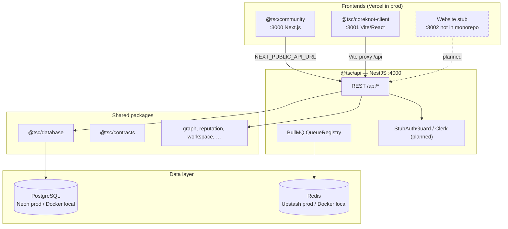

# TSC Platform — Project Memory (Master Index)

> Agent and developer index. **Production architecture authority:** [docs/architecture/MASTER-PRODUCTION-ARCHITECTURE.md](../docs/architecture/MASTER-PRODUCTION-ARCHITECTURE.md)  
> Last verified against codebase: June 2026.

## Purpose

TSC Platform is a **pnpm + Turbo monorepo** for The Shakti Collective — a creative-industry ecosystem connecting artists, communities, venues, and operators. It ships:

- **NestJS API** (`@tsc/api`) — domain backend, Prisma/Postgres, BullMQ/Redis queues
- **Community app** (`@tsc/community`) — Next.js 15 public-facing social product
- **CoreKnot client** (`@tsc/coreknot-client`) — Vite/React legacy operator UI shell
- **13 shared packages** — database schema, contracts, domain logic, SDKs

Production target stack: **Railway (API) + Vercel (frontends) + Neon (Postgres) + Upstash (Redis)** — not Render.

---

## Table of Contents

| Area | File | Summary |
|------|------|---------|
| **Architecture (canonical)** | [docs/architecture/README.md](../docs/architecture/README.md) | Production architecture — **prefer over .specify/architecture/** |
| **Architecture (legacy index)** | [system-overview.md](architecture/system-overview.md) | Historical — defer to docs/architecture/ |
| | [monorepo-structure.md](architecture/monorepo-structure.md) | Workspaces, apps, packages, tooling |
| | [data-flow.md](architecture/data-flow.md) | API ↔ DB ↔ Redis ↔ frontends |
| **Apps** | [api.md](apps/api.md) | NestJS modules, health, queues |
| | [community.md](apps/community.md) | Next.js routes, Clerk/stub auth |
| | [coreknot.md](apps/coreknot.md) | Vite client, legacy pages, API proxy |
| **Packages** | [overview.md](packages/overview.md) | All 16 workspace packages + dep graph |
| | [database.md](packages/database.md) | Prisma schema, db:push vs migrate |
| **Infrastructure** | [local-dev.md](infrastructure/local-dev.md) | Docker, scripts, ports, start commands |
| | [production-deploy.md](infrastructure/production-deploy.md) | Railway, Vercel, Neon, Upstash |
| | [env-vars.md](infrastructure/env-vars.md) | All env vars, required vs optional |
| **Operations** | [setup-runbook.md](operations/setup-runbook.md) | Step-by-step local + prod phases |
| | [troubleshooting.md](operations/troubleshooting.md) | Known failures + fixes |
| | [ci-cd.md](operations/ci-cd.md) | CI gaps, org-scaffold templates |
| **Decisions** | [known-gaps.md](decisions/known-gaps.md) | Doc conflicts, blockers, fragility |
| **Agents** | [multi-agent-hierarchy.md](agents/multi-agent-hierarchy.md) | 18-agent operating model, sweeps, reports |

### Related repo docs (outside `.specify/`)

| File | Role |
|------|------|
| [AGENTS.md](../AGENTS.md) | Cursor entry point for multi-agent hierarchy |
| [.agents/MEMORY.md](../.agents/MEMORY.md) | Agent continuity — post-R0 backend state |
| [.specify/infrastructure/local-dev.md](infrastructure/local-dev.md) | Human-facing local dev guide |
| [ENVIRONMENT_GUIDE.md](../ENVIRONMENT_GUIDE.md) | Local/staging/prod env matrix and auth modes |
| [.env.example](../.env.example) | Env template (no secrets) |
| [.specify/operations/setup-runbook.md](operations/setup-runbook.md) | Multi-repo migration + prod deploy |
| [org-scaffold/README.md](../org-scaffold/README.md) | Future GitHub org repo templates |

---

## High-Level Architecture



---

## Quick Start (Canonical Local Setup)

```powershell
# Prerequisites: Node 20+, pnpm 9.15+, Docker Desktop (optional)

# 1. One-time setup (install, .env, db:push, build)
pnpm setup

# 2. Edit .env — Clerk keys, DATABASE_URL, REDIS_URL (see env-vars.md)

# 3. Start a dev stack
pnpm start:community    # infra + API :4000 + Community :3000
pnpm start:coreknot     # infra + API :4000 + CoreKnot :3001
pnpm start:website      # infra + API :4000 + Website stub :3002
pnpm start:all          # all frontends

# Without Docker (Neon + empty REDIS_URL):
pnpm start:coreknot:nodocker
```

**Health check used by start scripts:** `GET http://localhost:4000/api/health/ready` (Railway uses same path). Legacy feed health preserved at `/api/feed/health`.

| Route | Purpose |
|-------|---------|
| `GET /api/health` | Summary (service, env, timestamp) |
| `GET /api/health/live` | Liveness |
| `GET /api/health/ready` | Readiness — Prisma `SELECT 1` + Redis PING |
| `GET /api/feed/health` | Legacy module stub (preserved) |

Implementation: `apps/api/src/modules/health/` — registered in `AppModule`; 10 unit tests.

| Service | Port | URL |
|---------|------|-----|
| Community | 3000 | http://localhost:3000 |
| CoreKnot | 3001 | http://localhost:3001 |
| Website (stub) | 3002 | http://localhost:3002 |
| API | 4000 | http://localhost:4000/api |
| Prisma Studio | 5555 | `pnpm db:studio` |

---

## Current State (June 2026)

### What works

| Capability | Status | Notes |
|------------|--------|-------|
| Monorepo install + build | ✅ | `pnpm build` PASS — 16/17 packages, all key apps |
| `db:generate` | ✅ | Minimal script fix applied |
| Local dev (no Docker) | ✅ | `kill:ports` → `start:coreknot:nodocker` → `dev:coreknot` → :4000 health 200, :3001 200 |
| Local stack launchers | ✅ | `pnpm start:*` via `scripts/start-stack.ps1` |
| Smart infra skipping | ✅ | `start-infra.ps1` detects Neon/Upstash |
| Prisma schema | ✅ | ~95 models in `packages/database` |
| API dev server | ✅ | NestJS 11, global prefix `api` |
| Community dev | ✅ | Next.js 15, stub auth path works |
| CoreKnot Vite shell | ✅ | Port 3001, API proxy configured |
| Stub auth (dev) | ✅ | `TSC_AUTH_STUB` + `NEXT_PUBLIC_AUTH_STUB` |
| Redis optional | ✅ | Empty `REDIS_URL` → stub queue mode |

**Known quirk:** `start:coreknot:nodocker` FE window may not leave :3001 listening in automated runs — use foreground `dev:coreknot` instead.

### What's broken / incomplete

| Issue | Severity | Detail |
|-------|----------|--------|
| Docker engine 500 | Low | Optional when using Neon + Upstash / `nodocker` path |
| Prisma migrations | Medium | Empty migration history — `db:push` only |
| Clerk keys | Medium | `.env` still has `REPLACE_ME` placeholders (founder) |
| Duplicate API processes | High | Multiple starts / `start:*` + manual `pnpm dev:api` → EADDRINUSE :4000 |
| Website not in monorepo | Medium | `pnpm dev:website` prints stub message |
| `setup.ps1` vs `start-infra.ps1` | Medium | Setup always runs `docker compose up`; infra script is smarter |
| Removed root STARTUP.md | Low | Canonical local dev: `.specify/infrastructure/local-dev.md` |
| Port doc conflicts | Low | Runbook env matrix ports ≠ local dev ports |
| Production DNS/deploy | High | Founder: GitHub push, Railway, Cloudflare |
| CI lint / audit debt | Medium | Workflows exist; some lint + `pnpm audit` findings remain |
| Typesense / R2 | Low | Scaffold only — env missing |

### Resolved in R0 sprint (2026-06-13)

- Global API health (`/api/health`, `/live`, `/ready`)
- Swagger at `/api/docs` + OpenAPI export
- Unified `ClerkAuthGuard` with dev stub
- Root `.github/workflows` (lint, typecheck, test, build, security)
- Observability scaffold (Sentry, PostHog, BetterStack)
- API typecheck 0 errors

### Production deployment status

| Component | Target | Monorepo status |
|-----------|--------|-----------------|
| API | Railway | Code in `apps/api`; scaffold in `org-scaffold/tsc-api` |
| Community | Vercel | Code in `apps/community` |
| CoreKnot | Vercel | Client in `apps/coreknot/client` |
| Website | Vercel | Not extracted — `org-scaffold/tsc-web` stub |
| Postgres | Neon | Connection via `DATABASE_URL` |
| Redis | Upstash | Connection via `REDIS_URL` |
| Multi-repo migration | Planned | Build unblocked; deploy IaC + migrations still pending |

---

## Key Commands Reference

| Command | Purpose |
|---------|---------|
| `pnpm setup` | First-time: install, .env, docker, db:push, build |
| `pnpm start:infra` | Smart Docker Postgres/Redis (skips Neon/remote Redis) |
| `pnpm db:push` | Apply Prisma schema (no migrations yet) |
| `pnpm db:migrate` | `prisma migrate dev` (when migrations exist) |
| `pnpm kill:ports` | Free 3000–3002, 4000 |
| `pnpm stop` | Stop Docker infra |

See [operations/setup-runbook.md](operations/setup-runbook.md) for full phased guide.
