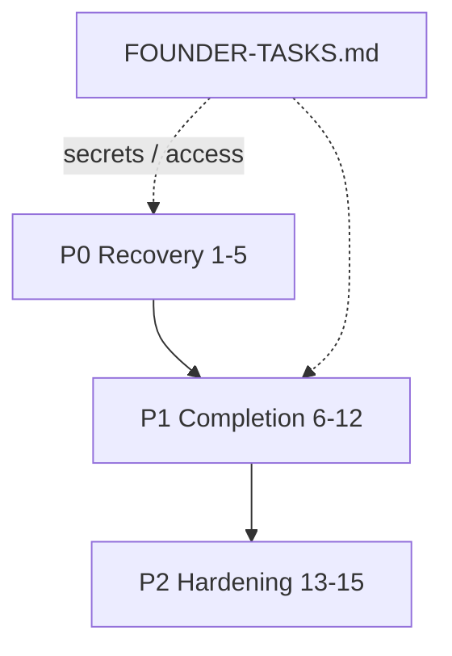

# Execution Agents

[← Hierarchy](../multi-agent-hierarchy.md) · [Founder tasks](FOUNDER-TASKS.md)

**Purpose:** Remediation and completion agents — fix blockers, eliminate debt, restore production. Run in strict priority order; P0 must pass before P1 work that depends on runtime/auth.

Unlike layer agents (ongoing health sweeps), execution agents are **one-shot or sprint-scoped** with explicit deliverables under `.agents/reports/execution/`.

---

## Execution order

| Phase | Order | Priority | Agents |
|-------|-------|----------|--------|
| **Recovery** | 1–5 | **P0** | Platform Recovery Commander → API Typecheck → Auth → Runtime → DNS/Production |
| **Completion** | 6–12 | **P1** | Placeholder elimination → Community → Observability → QA → Search → Storage → DevOps |
| **Hardening** | 13–15 | **P2** | Database health → Security → Documentation |



**Founder prerequisite:** Agents cannot complete P0 DNS, Clerk, Railway, Vercel, R2, Typesense, or monitoring without user secrets. See [FOUNDER-TASKS.md](FOUNDER-TASKS.md) before starting agent 03–05 and 10–12.

---

## Agent registry

| # | Agent | Priority | Profile | Cursor command | Deliverable |
|---|-------|----------|---------|----------------|-------------|
| 01 | Platform Recovery Commander | P0 | [01-platform-recovery-commander.md](01-platform-recovery-commander.md) | `/recovery-commander` | `.agents/reports/execution/01-recovery-commander.md` |
| 02 | API Typecheck Elimination | P0 | [02-api-typecheck-elimination.md](02-api-typecheck-elimination.md) | `/fix-typecheck` | `.agents/reports/execution/02-typecheck-status.md` |
| 03 | Auth Recovery | P0 | [03-auth-recovery.md](03-auth-recovery.md) | `/fix-auth` | `.agents/reports/execution/03-auth-recovery.md` |
| 04 | Runtime Recovery | P0 | [04-runtime-recovery.md](04-runtime-recovery.md) | `/fix-runtime` | `.agents/reports/execution/04-runtime-recovery.md` |
| 05 | DNS & Production Recovery | P0 | [05-dns-production-recovery.md](05-dns-production-recovery.md) | — | `.agents/reports/execution/05-dns-production.md` |
| 06 | Placeholder Elimination | P1 | [06-placeholder-elimination.md](06-placeholder-elimination.md) | — | `.agents/reports/execution/06-placeholder-status.md` |
| 07 | Community Completion | P1 | [07-community-completion.md](07-community-completion.md) | — | `.agents/reports/execution/07-community-completion.md` |
| 08 | Observability | P1 | [08-observability.md](08-observability.md) | — | `.agents/reports/execution/08-observability.md` |
| 09 | QA Automation | P1 | [09-qa-automation.md](09-qa-automation.md) | — | `.agents/reports/execution/09-qa-automation.md` |
| 10 | Search Infrastructure | P1 | [10-search-infra.md](10-search-infra.md) | — | `.agents/reports/execution/10-search-infra.md` |
| 11 | Storage | P1 | [11-storage.md](11-storage.md) | — | `.agents/reports/execution/11-storage.md` |
| 12 | DevOps | P1 | [12-devops.md](12-devops.md) | — | `.agents/reports/execution/12-devops.md` |
| 13 | Database Health | P2 | [13-database-health.md](13-database-health.md) | — | `.agents/reports/execution/13-database-health.md` |
| 14 | Security | P2 | [14-security.md](14-security.md) | — | `.agents/reports/execution/14-security.md` |
| 15 | Documentation | P2 | [15-documentation.md](15-documentation.md) | — | `.agents/reports/execution/15-documentation.md` |

---

## Priority definitions

| Priority | Meaning | Gate |
|----------|---------|------|
| **P0** | Platform unusable or prod unreachable | Must complete before P1 runtime-dependent work |
| **P1** | Feature debt, missing infra, no E2E | After P0 green; unblocks product confidence |
| **P2** | Hardening, audit, doc accuracy | After P1 or in parallel where independent |

---

## Cross-agent dependencies

| Agent | Depends on | Blocks |
|-------|------------|--------|
| 01 Commander | — | All others (triage + sequencing) |
| 02 Typecheck | — | CI, contract work, 06–07 |
| 03 Auth | Founder Clerk keys (optional stub path) | 04, 07, prod auth |
| 04 Runtime | 02, 03 | 09 QA smoke |
| 05 DNS/Prod | Founder Cloudflare, Railway, Vercel | Prod verification |
| 06 Placeholders | 04 | 07 Community UX |
| 10 Search | Founder Typesense | Search features |
| 11 Storage | Founder R2 | Media uploads |
| 08 Observability | Founder monitoring tokens | Prod incident response |

---

## Running execution agents

1. Complete applicable steps in [FOUNDER-TASKS.md](FOUNDER-TASKS.md).
2. Run agents **01 → 15** in order; skip only when deliverable already PASS.
3. Write report to each agent's **Deliverable path** (create `.agents/reports/execution/` if missing; gitignored, optional regen).
4. Update [AGENTS.md](../../../AGENTS.md) and [.agents/MEMORY.md](../../../.agents/MEMORY.md) after P0 complete.

```powershell
# Baseline before any execution agent
pnpm sweep:local
```

**Cursor shortcuts (P0):** `/recovery-commander`, `/fix-typecheck`, `/fix-auth`, `/fix-runtime`
