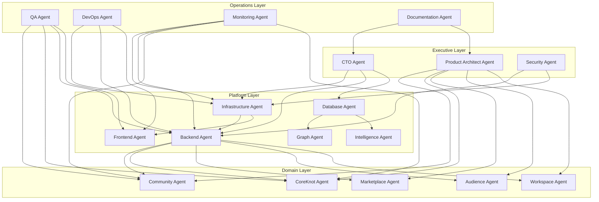

# Multi-Agent Hierarchy

[← Master index](../MASTER.md) · [AGENTS.md](../../AGENTS.md)

## Purpose

After Platform Recovery Sprint, TSC Platform operates through **18 responsibility-based agents** organized in four layers. Agents sweep platform health — infrastructure, domains, and operations — not individual repos. The monorepo (`TSC Platform`) remains the single source of truth until the [org-scaffold migration](../../org-scaffold/README.md) completes.

---

## Layer diagram



---

## Agent registry

| # | Agent | Layer | Output report | Frequency |
|---|-------|-------|---------------|-----------|
| 1 | [CTO Agent](executive-layer.md#1-cto-agent) | Executive | `platform-health-report.md` | Daily |
| 2 | [Product Architect Agent](executive-layer.md#2-product-architect-agent) | Executive | `roadmap-status.md` | Weekly |
| 3 | [Security Agent](executive-layer.md#3-security-agent) | Executive | `security-report.md` | Daily |
| 4 | [Infrastructure Agent](platform-layer.md#4-infrastructure-agent) | Platform | `infra-status.md` | Daily |
| 5 | [Backend Agent](platform-layer.md#5-backend-agent) | Platform | `backend-status.md` | Daily |
| 6 | [Frontend Agent](platform-layer.md#6-frontend-agent) | Platform | `frontend-status.md` | Daily |
| 7 | [Database Agent](platform-layer.md#7-database-agent) | Platform | `database-health.md` | Daily |
| 8 | [Graph Agent](platform-layer.md#8-graph-agent) | Platform | `graph-health.md` | Weekly |
| 9 | [Intelligence Agent](platform-layer.md#9-intelligence-agent) | Platform | `intelligence-health.md` | Daily |
| 10 | [Community Agent](domain-layer.md#10-community-agent) | Domain | `community-status.md` | Daily |
| 11 | [CoreKnot Agent](domain-layer.md#11-coreknot-agent) | Domain | `coreknot-status.md` | Daily |
| 12 | [Marketplace Agent](domain-layer.md#12-marketplace-agent) | Domain | `marketplace-status.md` | Weekly |
| 13 | [Audience Agent](domain-layer.md#13-audience-agent) | Domain | `audience-status.md` | Weekly |
| 14 | [Workspace Agent](domain-layer.md#14-workspace-agent) | Domain | `workspace-status.md` | Weekly |
| 15 | [QA Agent](operations-layer.md#15-qa-agent) | Operations | `qa-report.md` | Per PR / weekly |
| 16 | [DevOps Agent](operations-layer.md#16-devops-agent) | Operations | `deployment-status.md` | Per deploy |
| 17 | [Monitoring Agent](operations-layer.md#17-monitoring-agent) | Operations | `monitoring-report.md` | Daily |
| 18 | [Documentation Agent](operations-layer.md#18-documentation-agent) | Operations | `documentation-health.md` | Weekly |

All reports use templates in [`reports/templates/`](reports/templates/) and write to `.agents/reports/`.

---

## Sweep workflows

### Local environment sweep

**Runbook:** [sweeps/local-environment-sweep.md](sweeps/local-environment-sweep.md)  
**Script:** `scripts/sweep-local.ps1` (`pnpm sweep:local`)  
**Triggers:** Daily dev start, pre-PR, recovery sprint checkpoints

**Agents invoked (sequential):**

1. Infrastructure Agent — Postgres, Redis, Typesense, Storage, Auth
2. Backend Agent — `@tsc/api` build + runtime + health
3. Frontend Agent — Community, CoreKnot, Website builds
4. Database Agent — schema validate, migration status
5. DevOps Agent — CI workflow presence, local git state
6. QA Agent — smoke checks on critical paths

**Output:** `.agents/reports/local-sweep-report.md` (aggregated) + individual agent reports

### Production sweep

**Runbook:** [sweeps/production-sweep.md](sweeps/production-sweep.md)  
**Script:** `scripts/sweep-prod.ps1` (`pnpm sweep:prod`)  
**Triggers:** Daily (Monitoring Agent), post-deploy (DevOps Agent), weekly executive review

**Agents invoked (parallel where possible):**

| Section | Primary agent |
|---------|---------------|
| Executive Summary | CTO Agent |
| Infrastructure Health | Infrastructure Agent |
| Product Health | Product Architect Agent |
| Identity Health | Security Agent + Backend Agent |
| Graph Health | Graph Agent |
| Participation Health | Community Agent |
| Economy Health | Marketplace Agent |
| Audience Health | Audience Agent |
| Intelligence Health | Intelligence Agent |
| Security Health | Security Agent |

**Output:** `.agents/reports/production-sweep-report.md`

---

## Master status format

Every sweep and agent report ends with this block (template: [`reports/templates/_master-status-section.md`](reports/templates/_master-status-section.md)):

```
WORKING
========
<items operating as expected>

PARTIAL
========
<degraded but usable>

BROKEN
========
<failures blocking users or deploys>

MISSING
========
<not implemented or not configured>

NEXT PRIORITY
========
<ordered remediation list>
```

---

## Coordination rules

1. **Escalation:** Domain agents escalate BROKEN items to Platform layer; Platform escalates cross-cutting issues to Executive layer.
2. **No duplicate fixes:** CTO Agent tracks duplicate systems and repo sprawl before domain agents propose new services.
3. **Single launcher:** Infrastructure + Backend agents enforce one API process rule (`pnpm start:*` OR `pnpm dev:api`, not both).
4. **Health endpoint canonical path:** `/api/feed/health` for API liveness until global `/api/health` is implemented (see [known-gaps](../decisions/known-gaps.md)).
5. **Report freshness:** Daily agents must timestamp reports; stale reports (>48h) flagged by CTO Agent.

---

## Platform references

| Resource | Path |
|----------|------|
| System overview | [architecture/system-overview.md](../architecture/system-overview.md) |
| Monorepo structure | [architecture/monorepo-structure.md](../architecture/monorepo-structure.md) |
| Env vars | [infrastructure/env-vars.md](../infrastructure/env-vars.md) |
| CI/CD | [operations/ci-cd.md](../operations/ci-cd.md) |
| Known gaps | [decisions/known-gaps.md](../decisions/known-gaps.md) |
| Infra runbooks | [.agents/infra/](../../.agents/infra/) |
| Production setup | [.agents/production-setup-runbook.md](../../.agents/production-setup-runbook.md) |

---

## Related

- [Executive layer agents](executive-layer.md)
- [Platform layer agents](platform-layer.md)
- [Domain layer agents](domain-layer.md)
- [Operations layer agents](operations-layer.md)
