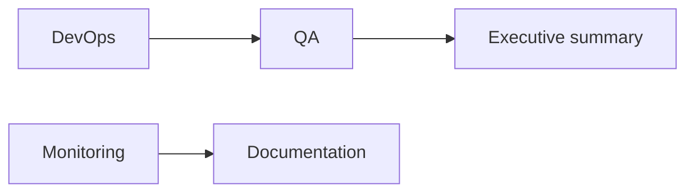

# Operations Layer Agents

[← Hierarchy](multi-agent-hierarchy.md)

Quality assurance, deployment pipelines, observability, and documentation health.

---

## 15. QA Agent

| Field | Value |
|-------|-------|
| **Layer** | Operations |
| **Purpose** | E2E, integration, regression, smoke tests (Playwright) |
| **Output** | `.agents/reports/qa-report.md` |
| **Template** | [reports/templates/qa-report.md](reports/templates/qa-report.md) |
| **Frequency** | Per PR / weekly |

### Task checklist

- [ ] Run acceptance checklist from recovery sprint baseline (see `test-report.md`)
- [ ] Verify API boot and health endpoints
- [ ] Smoke test Community, CoreKnot, Website HTTP responses
- [ ] Run `pnpm lint` across workspace (note platform-specific failures)
- [ ] Run `pnpm test` if test scripts exist per package
- [ ] Check Playwright/E2E config if present under `apps/` or `tests/`
- [ ] Verify no mock data in critical user paths (agents, community routes)
- [ ] Document blocked E2E flows (auth, API circular deps)

### Checks / verifications

| Check | Command | Pass criteria |
|-------|---------|---------------|
| API health | `curl :4000/api/feed/health` | HTTP 200 |
| Community | `curl :3000/feed` | HTTP 200 (not 500) |
| CoreKnot preview | `vite preview` | HTTP 200 |
| Lint | `pnpm lint` | Exit 0 or documented exceptions |
| Build | `pnpm build` | All key packages |
| Migrations | `prisma migrate status` | Document MISSING state |

### Tools / commands

```powershell
pnpm lint
pnpm test
pnpm build
pnpm dev:api
# Playwright (when configured):
# pnpm exec playwright test
```

**Reference:** Root `test-report.md` (Recovery Sprint QA baseline)

---

## 16. DevOps Agent

| Field | Value |
|-------|-------|
| **Layer** | Operations |
| **Purpose** | GitHub Actions, deployments, Docker, Railway, Vercel |
| **Output** | `.agents/reports/deployment-status.md` |
| **Template** | [reports/templates/deployment-status.md](reports/templates/deployment-status.md) |
| **Frequency** | Per deploy |

### Task checklist

- [ ] Verify root CI workflows: `.github/workflows/ci.yml`, `ci-api.yml`, `ci-community.yml`, `ci-coreknot-client.yml`, `ci-packages.yml`, `ci-website.yml`
- [ ] Check branch protection on `main` / `develop` (GitHub settings)
- [ ] Verify GitHub secrets documented in `.specify/operations/ci-cd.md`
- [ ] Review Railway config: `org-scaffold/tsc-api/railway.json`
- [ ] Review Vercel configs: `org-scaffold/tsc-community/vercel.json`, `tsc-coreknot/vercel.json`
- [ ] Test Docker compose: `docker compose up -d` + healthchecks
- [ ] Compare org-scaffold CI templates vs live monorepo workflows
- [ ] Track deploy hooks and smoke steps post-deploy

### Checks / verifications

| Component | Path | Status |
|-----------|------|--------|
| Root CI | `.github/workflows/ci.yml` | Present |
| API CI | `.github/workflows/ci-api.yml` | Present |
| Docker | `docker-compose.yml` | Postgres + Redis |
| Railway target | Production API | `api.theshakticollective.in` |
| Vercel targets | Community, CoreKnot | `*.theshakticollective.in` |
| Deploy IaC | org-scaffold | Templates; live deploy manual |

### Tools / commands

```powershell
gh workflow list
gh run list --limit 5
docker compose ps
pnpm stop
# Deploy verification (requires gh + remote access):
# gh run view --log
```

---

## 17. Monitoring Agent

| Field | Value |
|-------|-------|
| **Layer** | Operations |
| **Purpose** | Sentry, PostHog, BetterStack — errors, performance, usage, crashes |
| **Output** | `.agents/reports/monitoring-report.md` |
| **Template** | [reports/templates/monitoring-report.md](reports/templates/monitoring-report.md) |
| **Frequency** | Daily |

### Task checklist

- [ ] Verify PostHog env: `POSTHOG_PROJECT_TOKEN`, `NEXT_PUBLIC_POSTHOG_KEY`
- [ ] Check API PostHog service: `apps/api/src/modules/analytics/posthog.service.ts`
- [ ] Verify Sentry DSN env vars if configured (`SENTRY_DSN`, `SENTRY_AUTH_TOKEN`)
- [ ] Check BetterStack/uptime monitors (external — document configured/missing)
- [ ] Review error rates from Sentry dashboard (when connected)
- [ ] Check PostHog project for recent `$pageview` / custom events
- [ ] Verify health check monitoring aligns with `.agents/infra/health-checks.md`
- [ ] Flag services without external uptime monitoring

### Checks / verifications

| Tool | Env vars | Integration path |
|------|----------|------------------|
| PostHog | `POSTHOG_*`, `NEXT_PUBLIC_POSTHOG_*` | API + Community |
| Sentry | `SENTRY_DSN` | Apps (if wired) |
| BetterStack | External dashboard | Uptime monitors |
| Module health | `/api/feed/health` | start-stack.ps1 poll |

### Tools / commands

```powershell
rg "posthog|sentry|PostHog|Sentry" apps packages --glob "*.{ts,tsx,js}"
# PostHog MCP (Cursor): query trends, errors when connected
```

**PostHog project:** Default project in org "The Shakti Collective" (see MCP active environment).

---

## 18. Documentation Agent

| Field | Value |
|-------|-------|
| **Layer** | Operations |
| **Purpose** | README, CONTEXT.md, API docs, architecture docs, ERDs — outdated/missing docs |
| **Output** | `.agents/reports/documentation-health.md` |
| **Template** | [reports/templates/documentation-health.md](reports/templates/documentation-health.md) |
| **Frequency** | Weekly |

### Task checklist

- [ ] Verify `.specify/MASTER.md` index matches actual files
- [ ] Check `.specify/infrastructure/local-dev.md` is canonical for local dev
- [ ] Audit `.env.example` completeness vs `.specify/infrastructure/env-vars.md`
- [ ] Verify app-specific docs: `.specify/apps/api.md`, `community.md`, `coreknot.md`
- [ ] Check for stale Render references (prod is Railway + Vercel)
- [ ] Review org-scaffold README vs live monorepo state
- [ ] Flag missing OpenAPI spec (`org-scaffold/tsc-docs/`)
- [ ] Verify agent docs in `.specify/agents/` are current

### Checks / verifications

| Doc | Path | Freshness check |
|-----|------|-----------------|
| Master index | `.specify/MASTER.md` | Links resolve |
| Known gaps | `.specify/decisions/known-gaps.md` | Matches current state |
| CI/CD | `.specify/operations/ci-cd.md` | Root workflows exist |
| Local dev | `.specify/infrastructure/local-dev.md` | No Render-as-prod |
| AGENTS | `AGENTS.md` | Points to hierarchy |
| Infra | `.agents/infra/` | Synced with org-scaffold |

### Tools / commands

```powershell
# Link check — manual review of MASTER.md TOC
rg "Render\.com|railway|vercel" .specify -i
ls .specify/architecture .specify/apps .specify/infrastructure .specify/operations
```

---

## Operations sweep order



DevOps validates CI/deploy → QA runs smoke tests → Monitoring aggregates signals → Documentation flags stale docs for CTO review.
