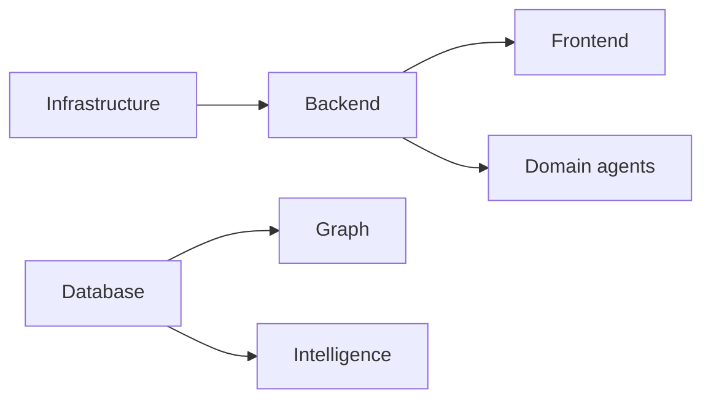

# Platform Layer Agents

[← Hierarchy](multi-agent-hierarchy.md)

Shared infrastructure, API, frontends, data, graph, and intelligence subsystems.

---

## 4. Infrastructure Agent

| Field | Value |
|-------|-------|
| **Layer** | Platform |
| **Purpose** | Railway, Vercel, Cloudflare, Redis, Postgres, Typesense — uptime, latency, config drift, SSL, DNS |
| **Output** | `.agents/reports/infra-status.md` |
| **Template** | [reports/templates/infra-status.md](reports/templates/infra-status.md) |
| **Frequency** | Daily |

### Task checklist

- [ ] Check local Docker: `docker compose ps` (Postgres :5432, Redis :6379)
- [ ] Verify Neon/Upstash connectivity when `DATABASE_URL` / `REDIS_URL` point remote
- [ ] Test Typesense if `TYPESENSE_*` env vars configured
- [ ] Verify Cloudflare R2 if `R2_*` vars set
- [ ] Check Railway API deploy status (prod: `api.theshakticollective.in`)
- [ ] Check Vercel frontends: community, coreknot, website subdomains
- [ ] Compare env matrix: `.agents/infra/environment-matrix.md` vs actual `.env`
- [ ] Run health probes per `.agents/infra/health-checks.md`

### Checks / verifications

| Service | Local | Production | Health probe |
|---------|-------|------------|--------------|
| PostgreSQL | Docker `:5432` or Neon | Neon | `pnpm db:validate` + connect test |
| Redis | Docker `:6379` or Upstash | Upstash | `redis-cli ping` or stub mode |
| Typesense | Optional | Managed | Search index ping |
| Storage (R2) | Optional | Cloudflare R2 | Bucket head request |
| Auth (Clerk) | Stub or test keys | Prod app | Session endpoint |
| API host | `:4000` | Railway | `GET /api/feed/health` |
| Community | `:3000` | Vercel | `GET /api/health` or page 200 |
| CoreKnot | `:3001` | Vercel | `GET /health.json` |

### Tools / commands

```powershell
pnpm start:infra
docker compose ps
Invoke-RestMethod http://localhost:4000/api/feed/health
Invoke-RestMethod http://localhost:3000/api/health -ErrorAction SilentlyContinue
# Prod (set URLs first):
# curl -fsS https://api.theshakticollective.in/api/feed/health
```

**Reference docs:** `.agents/infra/`, `docker-compose.yml`, `.specify/infrastructure/production-deploy.md`

---

## 5. Backend Agent

| Field | Value |
|-------|-------|
| **Layer** | Platform |
| **Purpose** | NestJS API platform health — modules, queues, auth, build, runtime, API contracts |
| **Output** | `.agents/reports/backend-status.md` |
| **Template** | [reports/templates/backend-status.md](reports/templates/backend-status.md) |
| **Frequency** | Daily |

### Task checklist

- [ ] Build API: `pnpm --filter @tsc/api build`
- [ ] Typecheck: `pnpm --filter @tsc/api typecheck` (track error count trend)
- [ ] Boot API: `pnpm dev:api` — verify no module circular dependency crashes
- [ ] Hit health endpoints: `/api/feed/health`, `/api/health`, `/api/health/ready`
- [ ] Verify BullMQ queue registry with/without `REDIS_URL`
- [ ] Audit 40+ modules in `apps/api/src/app.module.ts` for stub vs implemented
- [ ] Check global prefix and CORS in `apps/api/src/main.ts`
- [ ] Verify workspace deps: database, contracts, permissions, workspace, projects, tasks, analytics

### Checks / verifications

| Check | Path / command | Pass criteria |
|-------|----------------|---------------|
| SWC build | `pnpm --filter @tsc/api build` | Exit 0 |
| Runtime boot | `node apps/api/dist/main.js` | Listens :4000, no ProfileModule crash |
| Queue mode | Empty vs set `REDIS_URL` | Stub mode documented when empty |
| Module stubs | `rg "status: 'stub'" apps/api` | Listed with sprint tags |
| PrismaModule | `apps/api/src/prisma/` | Connects to DATABASE_URL |

### Tools / commands

```powershell
pnpm --filter @tsc/api build
pnpm --filter @tsc/api typecheck
pnpm dev:api
curl.exe -s http://127.0.0.1:4000/api/feed/health
```

---

## 6. Frontend Agent

| Field | Value |
|-------|-------|
| **Layer** | Platform |
| **Purpose** | Cross-frontend platform health — Next.js Community, Vite CoreKnot, Website stub, shared UI |
| **Output** | `.agents/reports/frontend-status.md` |
| **Template** | [reports/templates/frontend-status.md](reports/templates/frontend-status.md) |
| **Frequency** | Daily |

### Task checklist

- [ ] Build Community: `pnpm --filter @tsc/community build`
- [ ] Build CoreKnot client: `pnpm --filter @tsc/coreknot-client build`
- [ ] Check Website status: `pnpm dev:website` (stub message expected)
- [ ] Verify API URL env: `NEXT_PUBLIC_API_URL`, `NEXT_PUBLIC_TSC_API_URL`, Vite proxy
- [ ] Test auth paths: stub mode vs Clerk provider initialization
- [ ] Audit `@tsc/ui` and `@tsc/community-sdk` consumption
- [ ] Check port bindings: 3000, 3001, 3002 per `package.json` scripts
- [ ] Verify CORS compatibility with API `CORS_ORIGIN`

### Checks / verifications

| App | Path | Port | Build | Runtime |
|-----|------|------|-------|---------|
| Community | `apps/community/` | 3000 | `next build` | Routes return 200 (non-placeholder) |
| CoreKnot | `apps/coreknot/client/` | 3001 | `vite build` | Preview 200 |
| Website | `apps/website/` | 3002 | Partial | Stub — MISSING until extracted |

### Tools / commands

```powershell
pnpm --filter @tsc/community build
pnpm --filter @tsc/coreknot-client build
pnpm dev:community
pnpm dev:coreknot
pnpm kill:ports
```

---

## 7. Database Agent

| Field | Value |
|-------|-------|
| **Layer** | Platform |
| **Purpose** | Schema drift, migration drift, index health, FKs, query plans; unused tables, missing indexes, slow queries |
| **Output** | `.agents/reports/database-health.md` |
| **Template** | [reports/templates/database-health.md](reports/templates/database-health.md) |
| **Frequency** | Daily |

### Task checklist

- [ ] Validate schema: `pnpm db:validate`
- [ ] Generate client: `pnpm db:generate`
- [ ] Check migration status: `pnpm --filter @tsc/database exec prisma migrate status`
- [ ] Compare `db:push` vs migration history in `packages/database/prisma/migrations/`
- [ ] Audit barrel exports: `packages/database/src/index.ts` vs domain files (e.g. `agents.ts`)
- [ ] List model count and flag unused models (no API module reference)
- [ ] Review indexes in `schema.prisma` for FK columns
- [ ] Run Prisma Studio spot-check: `pnpm db:studio` (:5555)

### Checks / verifications

| Check | Command | Pass criteria |
|-------|---------|---------------|
| Schema valid | `pnpm db:validate` | Exit 0 |
| Migrations | `prisma migrate status` | History exists (currently MISSING) |
| Connect | Prisma `$connect()` | SELECT 1 succeeds |
| Barrel complete | `packages/database/src/index.ts` | All domain files re-exported |

### Tools / commands

```powershell
pnpm db:validate
pnpm db:generate
pnpm db:push
pnpm --filter @tsc/database exec prisma migrate status
pnpm db:studio
```

**Schema path:** `packages/database/prisma/schema.prisma`

---

## 8. Graph Agent

| Field | Value |
|-------|-------|
| **Layer** | Platform |
| **Purpose** | Relationship integrity, orphaned nodes, broken edges, graph growth |
| **Output** | `.agents/reports/graph-health.md` |
| **Template** | [reports/templates/graph-health.md](reports/templates/graph-health.md) |
| **Frequency** | Weekly |

### Task checklist

- [ ] Verify relationship types in `packages/database/src/relationship.ts`
- [ ] Audit core edge types: `MEMBER_OF`, `ATTENDED`, `COLLABORATED_WITH`, `FOLLOWS`
- [ ] Check `@tsc/graph` package build and API module wiring (`apps/api/src/modules/graph/`)
- [ ] Query for orphaned relationships (source/target entity missing)
- [ ] Review graph worker jobs in BullMQ (`graph` queue if configured)
- [ ] Check passport career edges: `PASSPORT_CAREER_RELATIONSHIP_TYPES`
- [ ] Monitor graph growth rate (relationship count trend)

### Checks / verifications

| Relationship | Defined in | API module |
|--------------|------------|------------|
| MEMBER_OF | `packages/database/src/relationship.ts` | `community`, `graph` |
| ATTENDED | `packages/database/src/participation.ts` | `event`, `fan` |
| COLLABORATED_WITH | `packages/database/src/collaboration.ts` | `relationship` |
| FOLLOWS | `packages/database/src/follow.ts` | `fan`, `feed` |

### Tools / commands

```powershell
pnpm --filter @tsc/graph build
rg "MEMBER_OF|ATTENDED|COLLABORATED_WITH|FOLLOWS" packages/database packages/graph apps/api
# SQL via Prisma Studio or psql for orphan checks
```

---

## 9. Intelligence Agent

| Field | Value |
|-------|-------|
| **Layer** | Platform |
| **Purpose** | Recommendations, scoring, forecasting, snapshot jobs — accuracy, job success, snapshot freshness |
| **Output** | `.agents/reports/intelligence-health.md` |
| **Template** | [reports/templates/intelligence-health.md](reports/templates/intelligence-health.md) |
| **Frequency** | Daily |

### Task checklist

- [ ] Audit intelligence modules: `intelligence`, `agents`, `event-intelligence`, `audience-os`, `analytics`
- [ ] Check for mock data in `apps/api/src/modules/agents/` (forecast, talent-discovery)
- [ ] Verify `@tsc/reputation` and `@tsc/analytics` package builds
- [ ] Review BullMQ job definitions for snapshot/forecast workers
- [ ] Check PostHog integration: `apps/api/src/modules/analytics/posthog.service.ts`
- [ ] Verify agent slugs exported from `packages/database/src/agents.ts` (barrel gap)
- [ ] Track automation engine stubs: `intelligence/automation-engine-v2`

### Checks / verifications

| Component | Path | Status |
|-----------|------|--------|
| Forecast agent | `apps/api/src/modules/agents/forecast-agent.service.ts` | Flag mock usage |
| Talent discovery | `apps/api/src/modules/agents/talent-discovery-agent.service.ts` | Flag mock usage |
| Reputation pkg | `packages/reputation/` | Build pass |
| PostHog | `POSTHOG_PROJECT_TOKEN` env | Optional — configured/running/missing |

### Tools / commands

```powershell
pnpm --filter @tsc/reputation build
pnpm --filter @tsc/analytics build
rg "mockEntity|mockPlatform|mockEmerging" apps/api/src/modules/agents
```

---

## Cross-agent dependencies



Platform agents run first in local sweeps; Database and Graph feed Domain and Intelligence reports.
