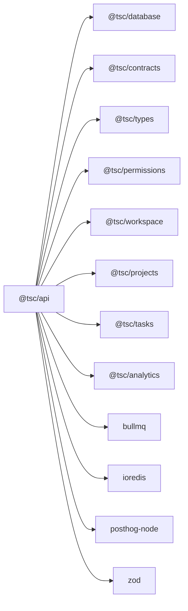
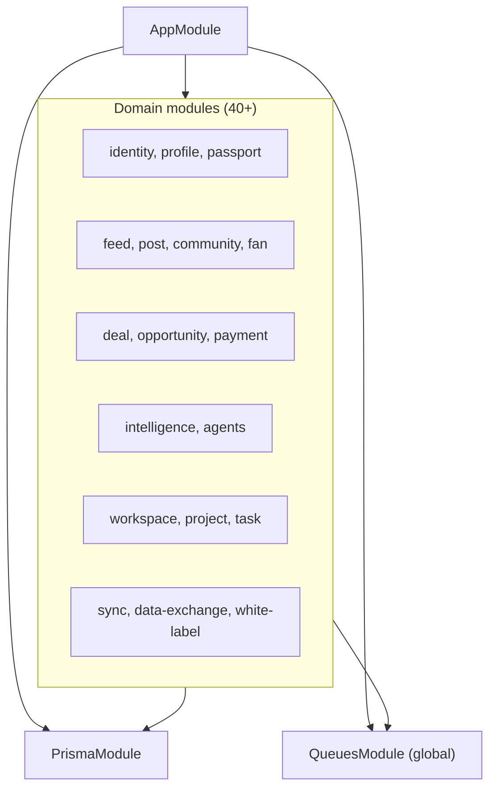
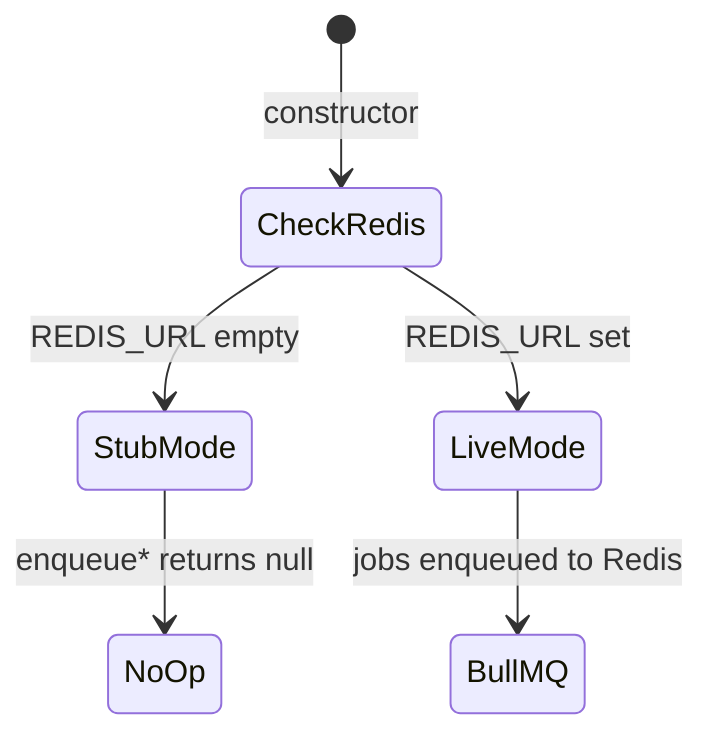
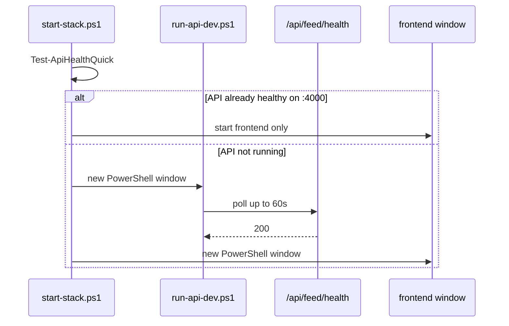

# API Application (`@tsc/api`)

[← Master index](../MASTER.md)

## Overview

| Property | Value |
|----------|-------|
| Path | `apps/api/` |
| Framework | NestJS 11 |
| Builder | SWC (`nest build`) |
| Default port | `4000` |
| Global prefix | `api` (`API_GLOBAL_PREFIX`) |
| Bind address | `0.0.0.0` |

Entry: `apps/api/src/main.ts` — creates app, sets prefix, CORS, listens on `PORT`.

---

## Workspace Dependencies



---

## Module Architecture



Full import list in `apps/api/src/app.module.ts`.

### Module pattern

Most modules follow NestJS convention:

```
modules/<name>/
  <name>.module.ts
  <name>.controller.ts
  <name>.service.ts
  <name>.repository.ts   # Prisma access
  schema/index.ts        # Zod validation
  dto.ts                 # request/response types
```

---

## Scripts

| Command | Action |
|---------|--------|
| `pnpm --filter @tsc/api dev` | `nest start --watch` |
| `pnpm --filter @tsc/api build` | `nest build` → `dist/main.js` |
| `pnpm --filter @tsc/api start` | `node dist/main.js` |
| `pnpm dev:api` | Root alias |

Production start (Railway): `node dist/main.js` after `pnpm build`.

---

## Health Endpoints

Global health module at `apps/api/src/modules/health/` (registered in `AppModule`):

| Route | Purpose |
|-------|---------|
| `GET /api/health` | Summary (service, env, timestamp) |
| `GET /api/health/live` | Liveness |
| `GET /api/health/ready` | Readiness — Prisma `SELECT 1` + Redis PING via `QueueRegistryService.pingRedis()` |
| `GET /api/feed/health` | Legacy module stub (preserved) |

Railway health check: `/api/health/ready`. Start scripts may still poll `/api/feed/health` in some paths — prefer `/api/health/ready`.

10 unit tests in `apps/api/src/modules/health/`.

---

## Swagger / OpenAPI

| Item | Value |
|------|-------|
| UI | `GET /api/docs` |
| JSON | `GET /api/docs-json` |
| Export | `pnpm openapi:export` → `apps/api/openapi/tsc-api.openapi.json` |
| Setup | `apps/api/src/swagger/swagger.setup.ts`, `generate-openapi.ts` |

---

## Authentication

**Current:** Unified `ClerkAuthGuard` — Clerk JWT when real keys set; dev stub when `TSC_AUTH_STUB=true` or keys contain `REPLACE_ME`. **`NODE_ENV=production` disables stub.**

Per-app env templates: `apps/*/.env.example` + root `ENVIRONMENT_GUIDE.md`.

---

## Observability

`ObservabilityModule` at `apps/api/src/observability/`:

| Provider | Env | Behavior |
|----------|-----|----------|
| Sentry | `SENTRY_DSN` | Initialized in `main.ts` when set |
| PostHog | token env | No-op without token |
| BetterStack | `BETTERSTACK_HEARTBEAT_URL` | Heartbeat scaffold |

---

## Queue System

`QueuesModule` is `@Global()` — `QueueRegistryService` injectable everywhere.



Queue names in `apps/api/src/queues/queue-names.ts`:

| Queue | Status |
|-------|--------|
| `tsc.feed` | Registered |
| `tsc.reputation` | Registered |
| `tsc.graph` | Registered |
| `tsc.recommendation` | Registered |
| emails | P1 gap |
| intelligence-snapshot | P1 gap |

---

## Key Domain Areas

| Area | Modules | Notes |
|------|---------|-------|
| Artist ecosystem | `artist`, `passport`, `reputation`, `credits` | Passport health scores |
| Community | `community`, `membership`, `feed`, `post` | Social graph |
| Events | `event`, `event-intelligence`, `booking` | Event intelligence |
| Intelligence | `intelligence`, `agents`, `audience-os` | Automation engine v2 |
| Workspace | `workspace`, `project`, `task`, `creative-identity`, `skills` | Operator tooling |
| Commerce | `commerce`, `payment`, `finance`, `deal` | Payment stubs when keys unset |
| Platform | `data-exchange`, `public-api`, `white-label`, `sync` | Webhooks, exports |

---

## API Startup in Dev Stack



**Fragility:** Running `pnpm dev:api` manually while `start:*` also launches API causes duplicate processes on port 4000.

---

## Production (Railway)

| Setting | Value |
|---------|-------|
| Config | `apps/api/railway.toml` |
| Root directory | Monorepo root (not `apps/api`) |
| Start | `pnpm --filter @tsc/api start:prod` |
| Health check | `/api/health/ready` |
| Org target | `TheShaktiCollective` on GitHub |
| API domain | `api.theshakticollective.in` |
| Env | See [env-vars.md](../infrastructure/env-vars.md), `ENVIRONMENT_GUIDE.md` |

---

## Related

- [data-flow.md](../architecture/data-flow.md)
- [database.md](../packages/database.md)
- [troubleshooting.md](../operations/troubleshooting.md)
