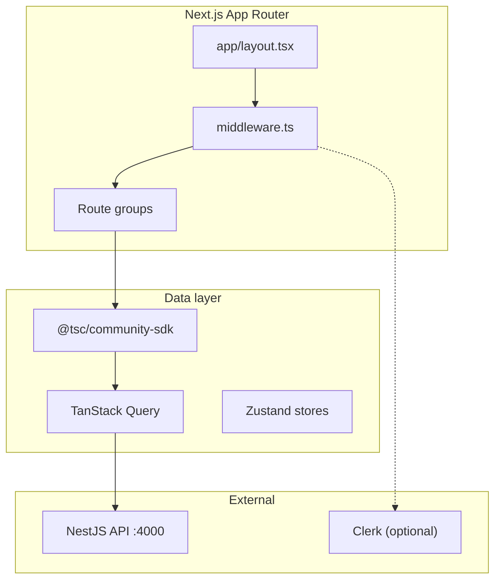
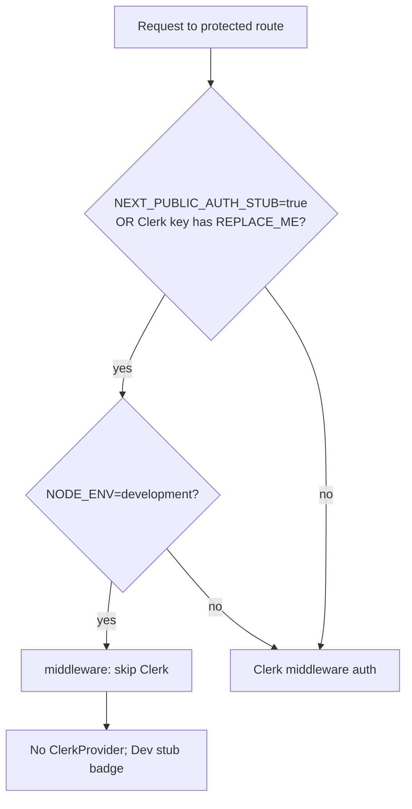
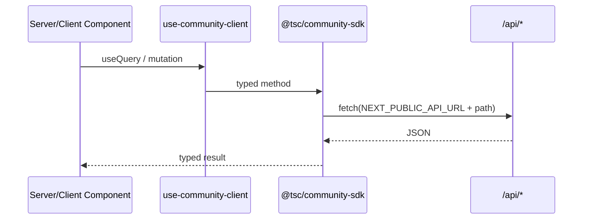

# Community Application (`@tsc/community`)

[← Master index](../MASTER.md)

## Overview

| Property | Value |
|----------|-------|
| Path | `apps/community/` |
| Framework | Next.js 15 (App Router) |
| React | 19 |
| Port | `3000` (fixed in package.json scripts) |
| Auth | Clerk (`@clerk/nextjs`) + dev stub bypass |

---

## Architecture



---

## Route Map

| Route group | Paths | Purpose |
|-------------|-------|---------|
| `(feed)` | `/feed`, `/discover`, `/messages`, `/notifications`, `/bookmarks` | Main social UX |
| `(profile)` | `/profile` | User profile |
| `(onboarding)` | `/onboarding` | New user flow |
| `(auth)` | `/sign-in`, `/sign-up` | Clerk auth pages |
| `(settings)` | `/settings` | Account settings |
| Public | `/`, `/artists`, `/communities`, `/events`, `/opportunities`, `/collaborations`, `/search` | Discovery |
| Dynamic | `/u/[username]`, `/community/[slug]`, `/event/[slug]` | Entity pages |

Artist passport lives in App Router (`/profile`, `/u/[username]`); build fix: removed legacy `src/pages/` stub.

---

## Environment

Next.js reads **`apps/community/.env.local`**, not root `.env` directly.

Setup syncs root → app:

```powershell
# Done by pnpm setup / setup.ps1
Copy-Item .env apps\community\.env.local
```

| Variable | Purpose |
|----------|---------|
| `NEXT_PUBLIC_API_URL` | API base (`http://localhost:4000/api`) |
| `NEXT_PUBLIC_TSC_API_URL` | Alias for API base |
| `NEXT_PUBLIC_APP_URL` | Self URL (`http://localhost:3000`) |
| `NEXT_PUBLIC_CLERK_*` | Clerk URLs and publishable key |
| `CLERK_SECRET_KEY` | Server-side Clerk |
| `NEXT_PUBLIC_AUTH_STUB` | Bypass Clerk in dev |
| `NEXT_PUBLIC_STUB_PERSON_ID` | Stub person for API calls |

See [env-vars.md](../infrastructure/env-vars.md).

---

## Stub Auth Flow



Implementation: `src/middleware.ts`, `src/lib/auth-stub.ts`, `src/components/layout/site-header.tsx`

---

## API Integration

Hook: `src/hooks/use-community-client.ts`  
SDK package: `@tsc/community-sdk` (typed fetch wrappers over `@tsc/contracts`)



---

## Scripts

| Command | Action |
|---------|--------|
| `pnpm dev:community` | `next dev --port 3000` |
| `pnpm start:community` | Full stack via `start-stack.ps1` |
| `pnpm dev:stack:community` | API + community only (no infra) |
| `pnpm --filter @tsc/community build` | Production build |

---

## UI Stack

- **Styling:** Tailwind CSS 3 + `tailwindcss-animate`
- **Components:** Radix primitives + local `src/components/ui/*` (shadcn-style)
- **Forms:** react-hook-form + zod resolvers
- **Motion:** framer-motion

`@tsc/ui` package exists in monorepo but community primarily uses local components today.

---

## Production (Vercel)

| Setting | Value |
|---------|-------|
| Target repo | `The-Shakti-Collective/tsc-community` |
| Domain | `community.theshakticollective.in` |
| Framework preset | Next.js |
| API URL (prod) | `https://api.theshakticollective.in` |

Scaffold: `org-scaffold/tsc-community/vercel.json`, `.github/workflows/ci.yml`

---

## Known Limitations

- Historical build issues importing incomplete CoreKnot client paths (replaced with local stubs per Stage 1 report)
- Clerk production JWT flow not fully wired to API
- Some pages are placeholders (`placeholder-page.tsx`)

See [known-gaps.md](../decisions/known-gaps.md).

---

## Related

- [community-sdk in packages/overview.md](../packages/overview.md)
- [api.md](api.md)
- [local-dev.md](../infrastructure/local-dev.md)
