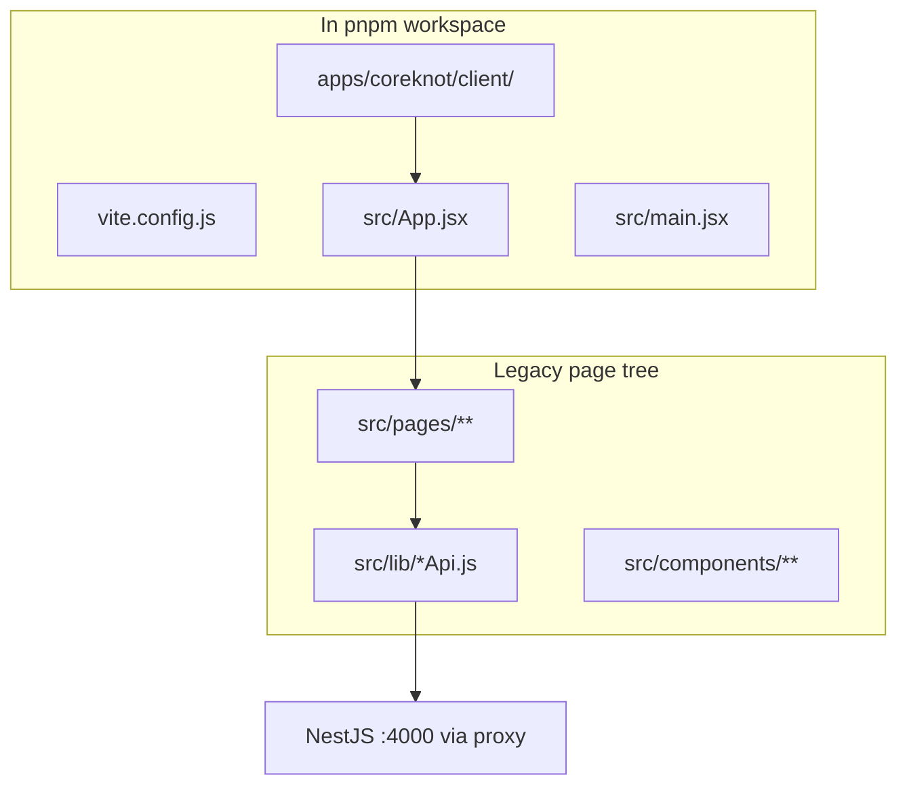
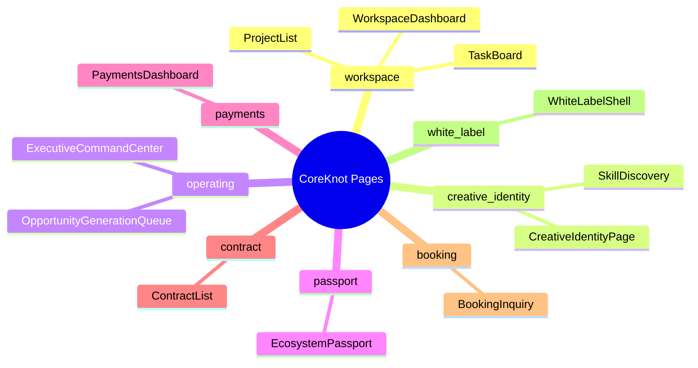
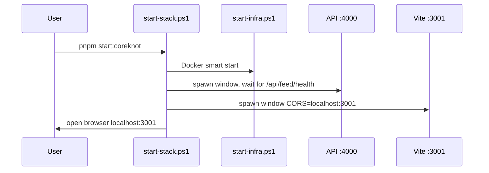

# CoreKnot Client (`@tsc/coreknot-client`)

[← Master index](../MASTER.md)

## Overview

| Property | Value |
|----------|-------|
| Workspace path | `apps/coreknot/client/` |
| Package name | `@tsc/coreknot-client` |
| Framework | Vite 6 + React 19 |
| Port | `3001` (`strictPort: true`) |
| Legacy sources | `apps/coreknot/` (parent — **not** a workspace package) |

CoreKnot is the **operator / industry-facing UI** — workspaces, creative identity, contracts, payments, executive command center, passports, and more. The Vite client is a dev shell that mounts legacy JSX pages from `src/pages/`.

---

## Structure



---

## API Connectivity

Vite dev server proxies `/api` to the NestJS API:

```javascript
// apps/coreknot/client/vite.config.js
server: {
  host: '0.0.0.0',
  port: 3001,
  strictPort: true,
  proxy: {
    '/api': { target: 'http://localhost:4000', changeOrigin: true },
  },
}
```

Client API modules (examples):

| File | Domain |
|------|--------|
| `workspaceApi.js` | Workspace CRUD |
| `projectApi.js` | Projects |
| `taskApi.js` | Tasks |
| `creativeIdentityApi.js` | Creative identity |
| `skillsApi.js` | Skills |
| `paymentsApi.js` | Payments |
| `contractApi.js` | Contracts |
| `bookingApi.js` | Bookings |
| `opportunityGenerationApi.js` | Opportunity queue |

Each uses relative `/api/...` paths — works through Vite proxy in dev; production needs `NEXT_PUBLIC_API_URL` or equivalent when migrated to Next.js/Vercel.

---

## Page Domains



Many pages include `INTEGRATION.patch.md` files documenting how to wire them into routing — migration work in progress.

---

## Scripts

| Command | Action |
|---------|--------|
| `pnpm dev:coreknot` | `vite` on :3001 |
| `pnpm start:coreknot` | Infra + API + CoreKnot (separate windows) |
| `pnpm start:coreknot:single` | API + CoreKnot in one terminal (`concurrently`) |
| `pnpm start:coreknot:nodocker` | Skip Docker, kill ports |
| `pnpm --filter @tsc/coreknot-client build` | `vite build` |

---

## Dev Stack Startup



CORS for CoreKnot: `CORS_ORIGIN=http://localhost:3001` set when API window starts.

---

## Relationship to `apps/coreknot/`

| Location | Role |
|----------|------|
| `apps/coreknot/client/` | **Active** Vite workspace package |
| `apps/coreknot/` | Legacy tree, nested `node_modules`, old Nest artifacts — not in `pnpm-workspace.yaml` as a package |

STARTUP.md historically said "CoreKnot not in pnpm workspace yet" — **partially outdated**: the **client** is in the workspace; the parent folder is not.

---

## Optional Legacy Sync

When a legacy CoreKnot server runs, the API `sync` module can push data:

```env
# Optional in .env
COREKNOT_SYNC_URL=http://localhost:3001/api/sync
COREKNOT_SYNC_SECRET=
```

---

## Production (Vercel)

| Setting | Value |
|---------|-------|
| Target repo | `The-Shakti-Collective/tsc-coreknot` |
| Domain | `coreknot.theshakticollective.in` |
| Build | Vite static or SSR migration TBD |

Scaffold: `org-scaffold/tsc-coreknot/vercel.json`

---

## Known Limitations

- No workspace package dependencies — all API coupling is via fetch/proxy
- Lint script is a no-op stub
- JSX pages not fully integrated into `App.jsx` routing
- Production API URL strategy not finalized in Vite build

---

## Related

- [api.md](api.md)
- [monorepo-structure.md](../architecture/monorepo-structure.md)
- [known-gaps.md](../decisions/known-gaps.md)
