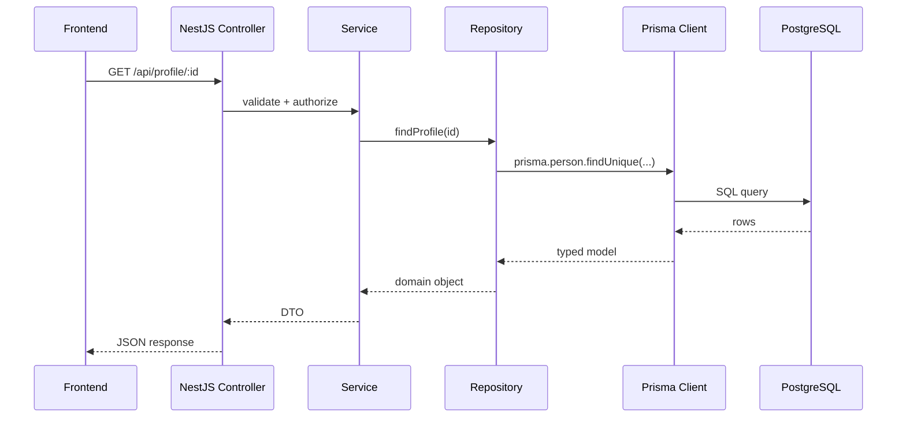
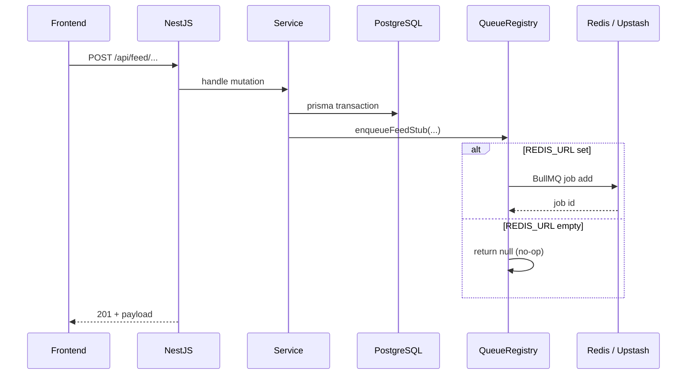
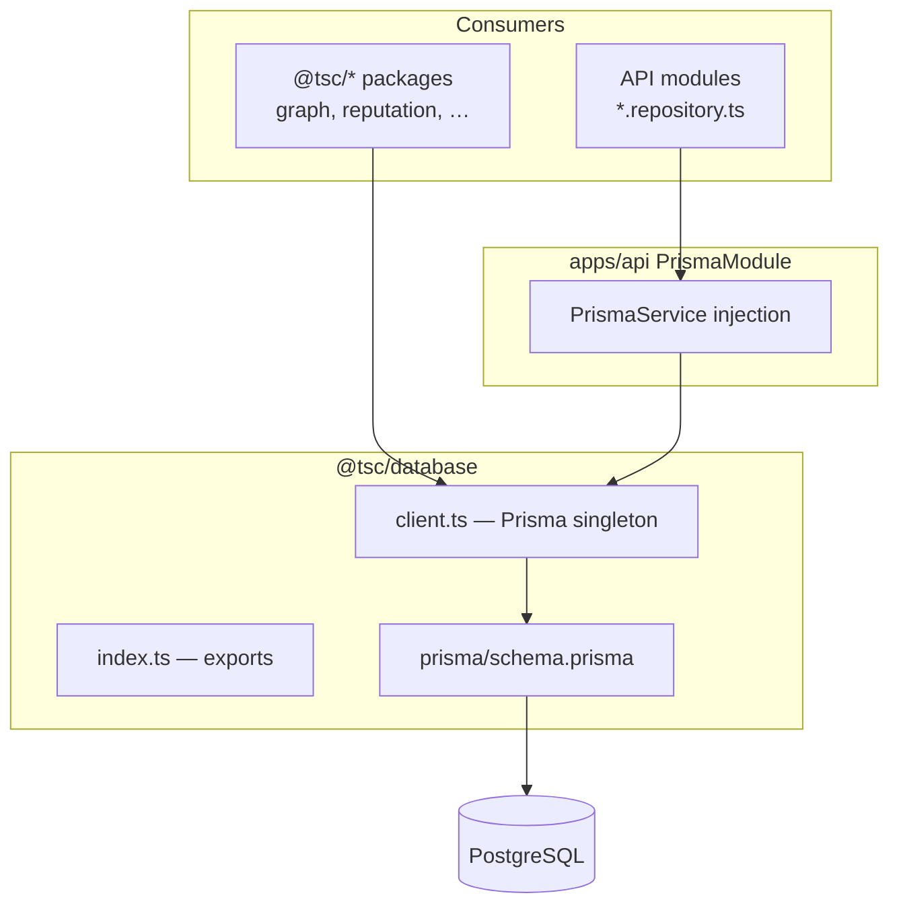
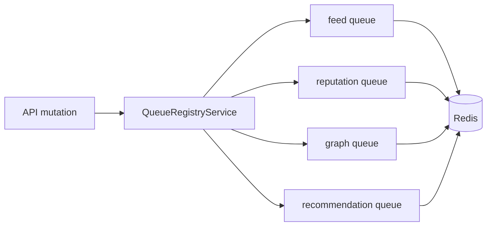
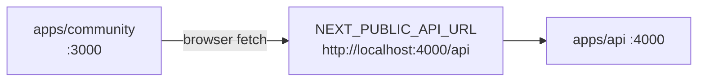
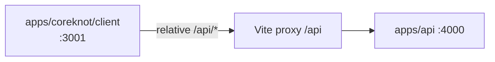
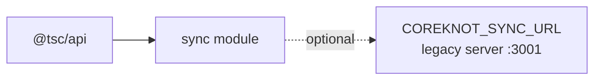
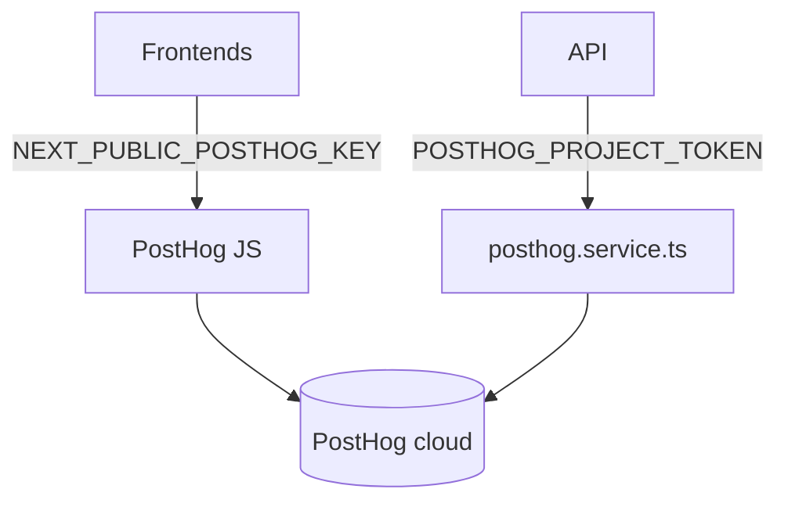
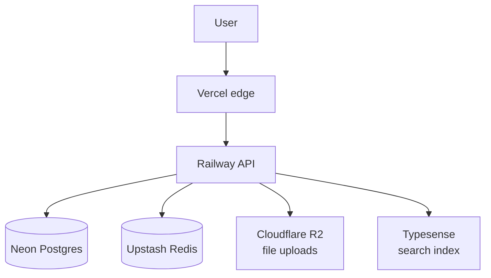

# Data Flow

[← Master index](../MASTER.md)

## Request Flow (Typical Read)



Community app uses `@tsc/community-sdk` (built on `@tsc/contracts` + `@tsc/types`) for typed API calls via `use-community-client.ts`.

---

## Write Flow with Optional Queue



Stub queue behavior is in `apps/api/src/queues/queue-registry.service.ts`: when `REDIS_URL` is unset, all queue handles are `null` and enqueue methods return `null` without error.

---

## Database Access Pattern



**Schema location:** `packages/database/prisma/schema.prisma`  
**Canonical comment:** "Stage 1 Step 1 merged schema" with phase fragments in `prisma/phase*.prisma` for audit.

---

## Redis / BullMQ Queues

| Queue name constant | Purpose |
|---------------------|---------|
| `feed` | Feed-related async jobs |
| `reputation` | Reputation recalculation |
| `graph` | Graph edge maintenance |
| `recommendation` | Recommendation engine jobs |



Local: `redis://localhost:6379` via Docker.  
Production: `rediss://` Upstash URL.  
Dev without Redis: queues disabled, HTTP + Postgres still work.

---

## Frontend → API Connectivity

### Community (Next.js)



Env synced from root `.env` → `apps/community/.env.local` by setup scripts.

### CoreKnot (Vite)



Configured in `apps/coreknot/client/vite.config.js`:

```javascript
proxy: { '/api': { target: 'http://localhost:4000', changeOrigin: true } }
```

### CORS

API reads `CORS_ORIGIN` (comma-separated). `start-stack.ps1` sets origin per target:

| Target | CORS origin |
|--------|-------------|
| community | `http://localhost:3000` |
| coreknot | `http://localhost:3001` |
| website | `http://localhost:3002` |
| all | all three comma-separated |

---

## Sync / CoreKnot Bridge (Optional)



Env vars (optional, commented in `.env.example`):

- `COREKNOT_SYNC_URL`
- `COREKNOT_SYNC_SECRET`

Used when a legacy CoreKnot server runs alongside the new API during migration.

---

## Analytics Data Flow



Both paths are optional — empty keys disable tracking.

---

## Production Data Path



See [production-deploy.md](../infrastructure/production-deploy.md).

---

## Related

- [database.md](../packages/database.md)
- [api.md](../apps/api.md)
- [env-vars.md](../infrastructure/env-vars.md)
