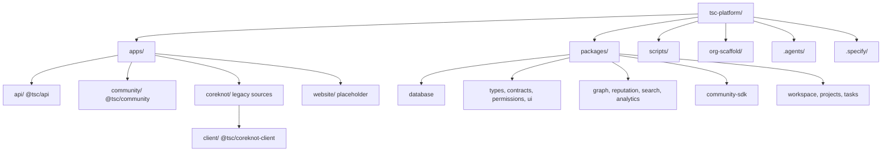
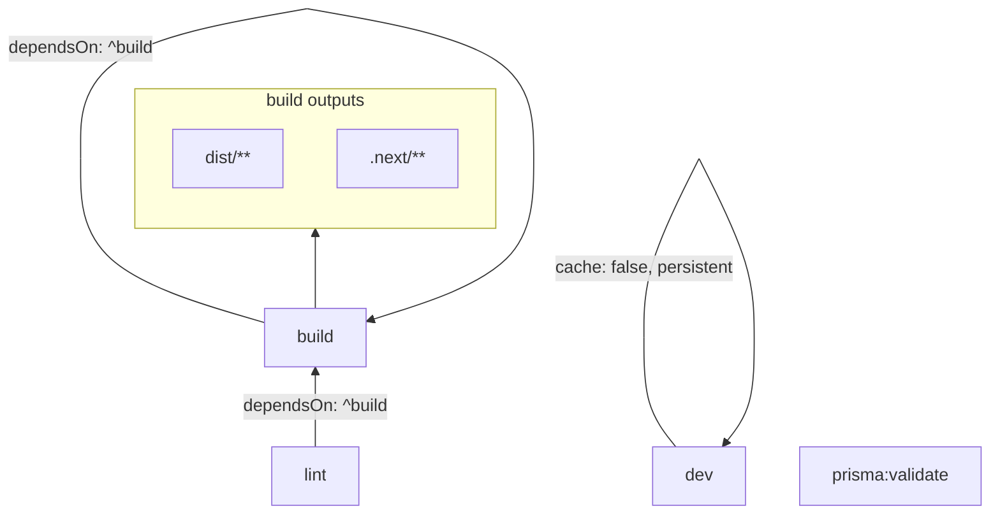
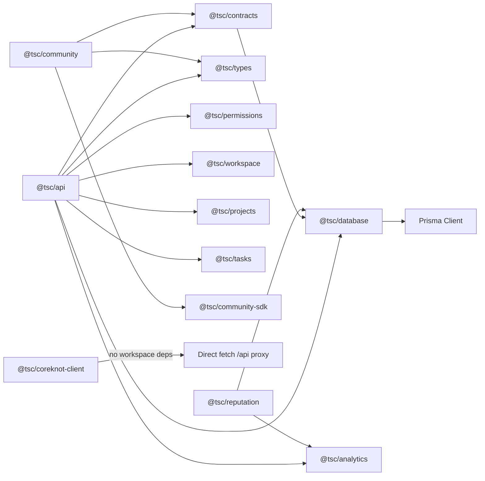

# Monorepo Structure

[← Master index](../MASTER.md)

## Workspace Configuration

**Package manager:** pnpm 9.15.0 (`packageManager` in root `package.json`)  
**Build orchestration:** Turbo 2.x (`turbo.json`)  
**Workspaces** (`pnpm-workspace.yaml`):

```yaml
packages:
  - "apps/*"
  - "apps/coreknot/client"
  - "packages/*"
```

The explicit `apps/coreknot/client` entry is required because the parent `apps/coreknot/` folder is **legacy source** and is not itself a workspace package.

---

## Directory Tree



---

## Workspace Members (16 verified)

Run `pnpm -r list --depth -1` to reproduce this list.

### Applications (3)

| Package | Path | Framework | Port |
|---------|------|-----------|------|
| `@tsc/api` | `apps/api/` | NestJS 11 | 4000 |
| `@tsc/community` | `apps/community/` | Next.js 15 | 3000 |
| `@tsc/coreknot-client` | `apps/coreknot/client/` | Vite 6 + React 19 | 3001 |

### Shared packages (13)

| Package | Path | Role |
|---------|------|------|
| `@tsc/database` | `packages/database/` | Prisma schema + client export |
| `@tsc/types` | `packages/types/` | Shared TypeScript types |
| `@tsc/contracts` | `packages/contracts/` | Zod schemas / API contracts |
| `@tsc/permissions` | `packages/permissions/` | RBAC helpers |
| `@tsc/community-sdk` | `packages/community-sdk/` | Community frontend API client |
| `@tsc/ui` | `packages/ui/` | Shared UI primitives |
| `@tsc/analytics` | `packages/analytics/` | Analytics domain logic |
| `@tsc/graph` | `packages/graph/` | Graph entity/relationship logic |
| `@tsc/reputation` | `packages/reputation/` | Reputation scoring |
| `@tsc/search` | `packages/search/` | Search helpers |
| `@tsc/workspace` | `packages/workspace/` | Workspace domain |
| `@tsc/projects` | `packages/projects/` | Project domain |
| `@tsc/tasks` | `packages/tasks/` | Task domain |

> **Note:** `.agents/production-setup-runbook.md` references "17 workspace packages." Verified count via pnpm is **16** (3 apps + 13 packages). The discrepancy may reflect a historical package or root workspace counting.

---

## Non-workspace paths

| Path | Status |
|------|--------|
| `apps/coreknot/` (parent) | Legacy React pages, API libs — not a pnpm package |
| `apps/website/` | Placeholder; `pnpm dev:website` exits with stub message |
| `org-scaffold/` | Future multi-repo templates — not part of workspace |
| `node_modules/` | Hoisted by pnpm |

---

## Turbo Task Graph



Root scripts:

| Script | Behavior |
|--------|----------|
| `pnpm build` | `pnpm -r run build` — all packages |
| `pnpm dev` | Turbo parallel: `@tsc/api` + `@tsc/community` only |
| `pnpm lint` | Turbo lint across workspace |

---

## Dependency Flow (Apps → Packages)



`@tsc/coreknot-client` has **no** workspace package dependencies — it calls the API via Vite proxy and local `src/lib/*Api.js` modules.

---

## Scripts Directory

| Script | Purpose |
|--------|---------|
| `setup.ps1` / `setup.sh` | First-time install + env + docker + db:push + build |
| `start-stack.ps1` | Infra + API + frontend launcher |
| `start-infra.ps1` | Smart Docker compose (Neon/Upstash aware) |
| `dev-stack.ps1` | API + frontend without infra |
| `stack-common.ps1` | Shared: health poll, browser open, API window |
| `run-api-dev.ps1` | Spawn API in separate PowerShell window |
| `run-frontend-dev.ps1` | Spawn frontend window |
| `kill-port.ps1` / `kill-all-dev-ports.ps1` | Port cleanup |
| `stop.ps1` | `docker compose down` |

---

## org-scaffold vs Live Monorepo

`org-scaffold/` holds **copy-ready templates** for the planned GitHub org split:

| Scaffold folder | Target repo | Maps from monorepo |
|-----------------|-------------|-------------------|
| `tsc-shared/` | The-Shakti-Collective/tsc-shared | `packages/types`, `contracts`, `permissions`, `ui`, `community-sdk` |
| `tsc-api/` | tsc-api | `apps/api/` + `packages/database` + domain packages |
| `tsc-community/` | tsc-community | `apps/community/` |
| `tsc-coreknot/` | tsc-coreknot | `apps/coreknot/` |
| `tsc-web/` | tsc-web | Greenfield marketing site |
| `tsc-infra/` | tsc-infra | CI templates, docker-compose, branch docs |
| `tsc-docs/` | tsc-docs | OpenAPI spec stub |

The live monorepo uses `workspace:*` links. Extracted repos will use published `@tsc/*` from GitHub Packages.

See [operations/ci-cd.md](../operations/ci-cd.md) and [decisions/known-gaps.md](../decisions/known-gaps.md).

---

## Related

- [Packages overview](../packages/overview.md)
- [Local dev](../infrastructure/local-dev.md)
