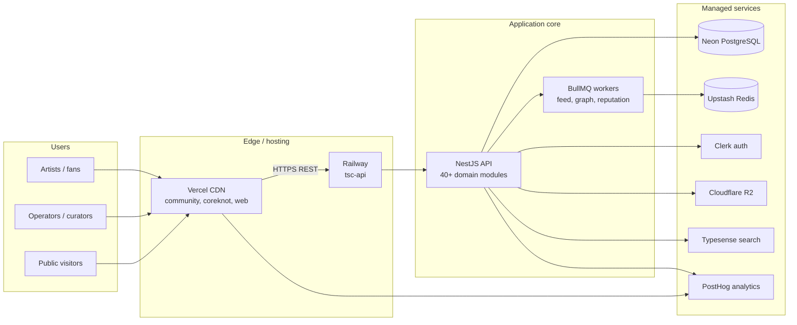
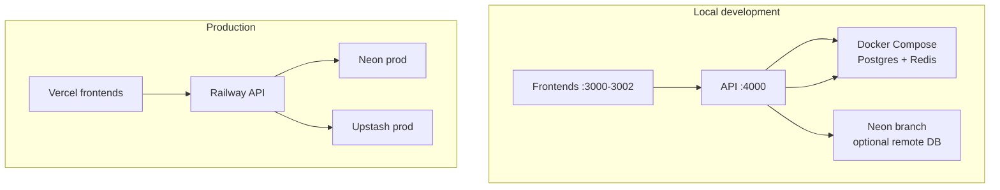
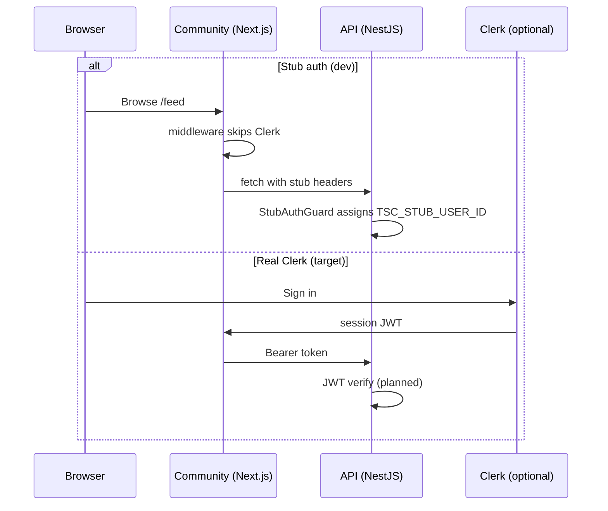

# System Overview

[← Master index](../MASTER.md)

## What TSC Platform Is

The Shakti Collective Platform is an **artist-and-community operating system**: profiles, passports, events, opportunities, workspaces, intelligence, and commerce — exposed through a shared NestJS API and multiple frontends.

The monorepo is the **single source of truth** during active development. A planned migration splits it into seven GitHub org repos (`org-scaffold/`). Until that migration completes, all changes land here.

---

## Runtime Topology

---

## Local vs Production

| Layer | Local | Production |
|-------|-------|------------|
| API host | `localhost:4000` | Railway (`api.theshakticollective.in`) |
| Community | `localhost:3000` | Vercel (`community.theshakticollective.in`) |
| CoreKnot | `localhost:3001` | Vercel (`coreknot.theshakticollective.in`) |
| Website | stub `:3002` | Vercel (`theshakticollective.in`) — separate repo |
| Postgres | Docker `:5432` or Neon dev | Neon staging/prod branches |
| Redis | Docker `:6379`, Upstash, or empty | Upstash staging/prod |
| Auth | Stub flags or Clerk test keys | Clerk staging/prod apps |

---

## API Surface

- **Global prefix:** `api` (env: `API_GLOBAL_PREFIX`)
- **Base URL (local):** `http://localhost:4000/api`
- **CORS:** `CORS_ORIGIN` — comma-separated origins for multi-frontend dev
- **Binding:** `0.0.0.0:$PORT` (Render/Railway compatible)

Domain modules registered in `apps/api/src/app.module.ts` include:

| Cluster | Modules |
|---------|---------|
| Identity & profile | `identity`, `profile`, `passport`, `tsc-identity`, `creative-identity` |
| Social & feed | `feed`, `post`, `notification`, `community`, `fan`, `audience` |
| Events & booking | `event`, `event-intelligence`, `booking`, `city` |
| Business | `deal`, `opportunity`, `contract`, `payment`, `finance`, `commerce` |
| Intelligence | `intelligence`, `agents`, `audience-os`, `analytics` |
| Graph & search | `graph`, `search`, `discovery`, `directory`, `relationship` |
| Workspace | `workspace`, `project`, `task` |
| Platform | `sync`, `data-exchange`, `public-api`, `white-label`, `queues` |

See [apps/api.md](../apps/api.md) for module detail.

---

## Authentication Model (Current)

---

## Health & Observability

| Endpoint | Exists | Used by |
|----------|--------|---------|
| `GET /api/feed/health` | ✅ | `start-stack.ps1`, `stack-common.ps1` |
| `GET /api/post/health` | ✅ | Module stub |
| `GET /api/notification/health` | ✅ | Module stub |
| `GET /api/health` | ❌ | Referenced in runbook, not implemented |

PostHog integration: `apps/api/src/modules/analytics/posthog.service.ts` (optional `POSTHOG_PROJECT_TOKEN`).

---

## Related

- [Monorepo structure](monorepo-structure.md)
- [Data flow](data-flow.md)
- [Production deploy](../infrastructure/production-deploy.md)
