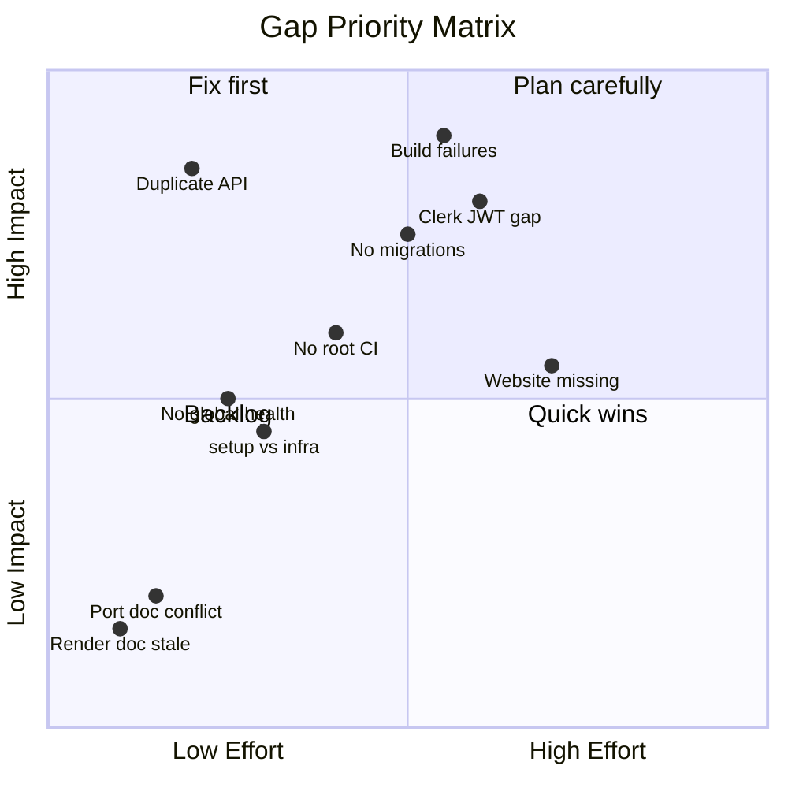
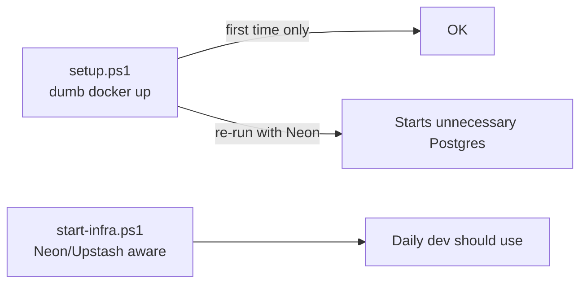
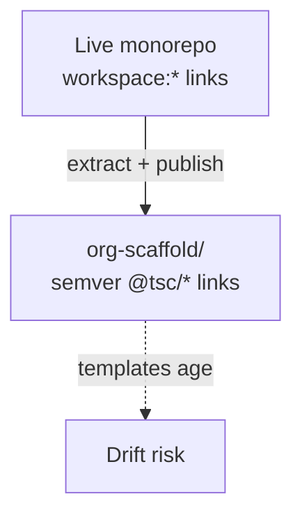
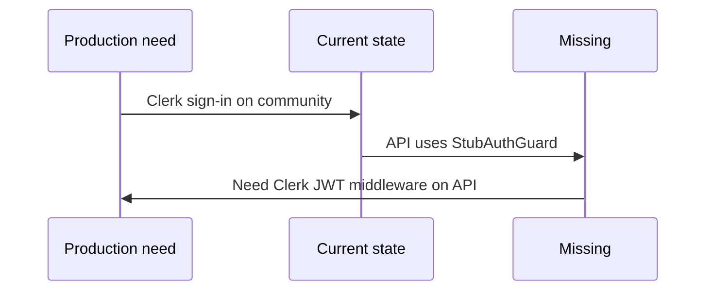
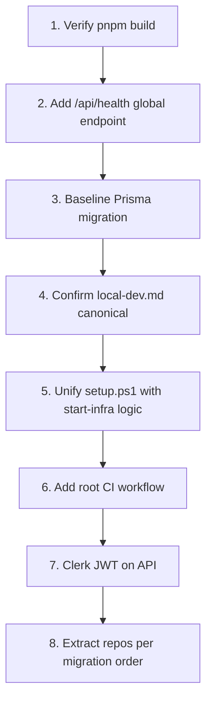

# Known Gaps & Decisions

[← Master index](../MASTER.md)

Documented conflicts, missing pieces, blockers, and architectural fragility. Use this file when auditing or planning fixes.

---

## Gap Summary



---

## Documentation Conflicts

| Topic | Was (removed) | Canonical truth |
|-------|---------------|-----------------|
| Production host | Root STARTUP → Render | **Railway + Vercel** — [production-deploy.md](../infrastructure/production-deploy.md) |
| Dev port matrix | Old runbook env matrix | **local-dev.md / package.json** — community :3000, coreknot :3001, website :3002 |
| Workspace package count | Historical "17" | **~20** — run `pnpm m ls --depth -1` |
| CoreKnot in workspace | Old STARTUP note | **Client in workspace; parent folder is not** |
| Health endpoint | `/health` variants | **`/api/health/ready`** (global module) |
| CORS env name | `.env.example` → `CORS_ORIGIN` | Both may be needed post-migration |

---

## Script Fragility

### setup.ps1 vs start-infra.ps1



**Decision:** Treat `pnpm setup` as one-time bootstrap. Daily infra via `pnpm start:infra` or `start-stack.ps1`.

### Duplicate API processes

| Trigger | Result |
|---------|--------|
| `pnpm start:*` + `pnpm dev:api` | EADDRINUSE :4000 |
| Two `start:*` without kill | Possible duplicate API windows |

**Decision:** Document "one launcher" rule (see [troubleshooting.md](../operations/troubleshooting.md)). `start-stack.ps1` reuses healthy API if `Test-ApiHealthQuick` passes.

### TSC_KILL_PORTS default

Auto-kill can surprise developers running unrelated services on 3000-4000.

**Mitigation:** `TSC_KILL_PORTS=false` in `.env`.

---

## Missing Features

| Feature | Status | Blocker for |
|---------|--------|-------------|
| Global `/api/health` | **Done (R0 2026-06-13)** | — |
| Swagger `/api/docs` | **Done (R0)** | — |
| Prisma migrations | Only `.gitkeep` | Production schema versioning |
| Clerk JWT on API | Code ready; founder keys missing | Production auth |
| Website app in monorepo | Stub script | `start:website` full stack |
| Root GitHub Actions | **Done (R0)** — lint debt remains | CI green on main |
| GitHub org repos + prod deploy | Founder manual | Production cutover |
| BullMQ workers | 4 queues registered; 2 P1 gaps | Background job processing |
| Typesense integration | Scaffold only | Search in prod |
| R2 upload pipeline | Scaffold only | File uploads in prod |
| Observability prod | Scaffold wired; founder DSN/tokens | Prod monitoring |

---

## Build Blockers (Pre-Migration Gate)

From [.specify/operations/setup-runbook.md](../operations/setup-runbook.md) Phase 4 — must pass before repo extraction:

```powershell
pnpm db:validate  # exit 0
pnpm db:generate  # exit 0
pnpm build        # exit 0
```

Historical failures (fixes claimed 2026-06-13 — **re-verify**):

| Package | Issue |
|---------|-------|
| `@tsc/analytics` | Import path / missing modules |
| `@tsc/api` | Nest declaration portability (TS2742) |
| `@tsc/community` | Invalid CoreKnot client imports |

**Decision:** Do not migrate to 7 repos until build gate passes — broken builds copy into all extracted repos.

---

## Monorepo vs org-scaffold Drift



| Area | Live monorepo | Scaffold |
|------|---------------|----------|
| Package linking | `workspace:*` | `@tsc/types@^0.1.0` from GitHub Packages |
| Docker compose | Root `docker-compose.yml` | `tsc-infra/local/docker-compose.yml` (may differ) |
| CI | None at root | Per-repo workflow templates |
| API modules | 40+ modules live | Partial OpenAPI in `tsc-docs/openapi/` |

**Decision:** `org-scaffold/` is aspirational target layout — verify against live monorepo before copy.

---

## Auth Architecture Gap



Community can use Clerk while API still accepts stub user — production requires end-to-end JWT verification.

---

## Redis / Queue Gap

When `REDIS_URL` empty:

- Queues are `null`
- `enqueue*Stub` returns `null` silently
- HTTP + Postgres work fine

**Implication:** Features depending on async jobs appear to succeed but jobs never run. No user-visible warning in API logs beyond missing Redis at startup.

---

## Render Rule in Workspace

`.cursor/plugins/.../render-platform.mdc` applies Render constraints (bind `0.0.0.0:$PORT`, ephemeral FS). API already binds correctly, but **production target is Railway**, not Render.

**Decision:** Render rules are generic good practice; do not deploy to Render for this project.

---

## Multi-Repo Migration Blockers

| Blocker | Owner action |
|---------|--------------|
| `pnpm build` not green | Fix package issues |
| `gh` CLI / org admin | Install + auth |
| 7 repos not created | Run runbook Appendix |
| Neon/Upstash/Railway/Vercel accounts | Provision |
| No baseline Prisma migration | Create `init` migration |

---

## Recommended Fix Order



---

## Related

- [MASTER.md](../MASTER.md) — Current state table
- [troubleshooting.md](../operations/troubleshooting.md)
- [ci-cd.md](../operations/ci-cd.md)
- [setup-runbook.md](../operations/setup-runbook.md)
