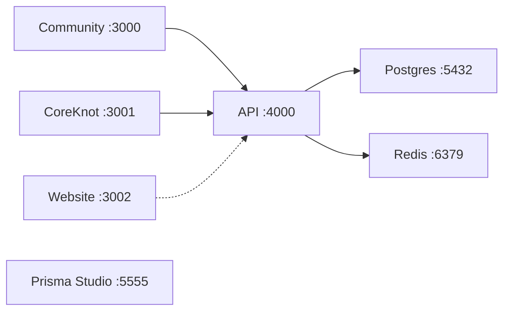
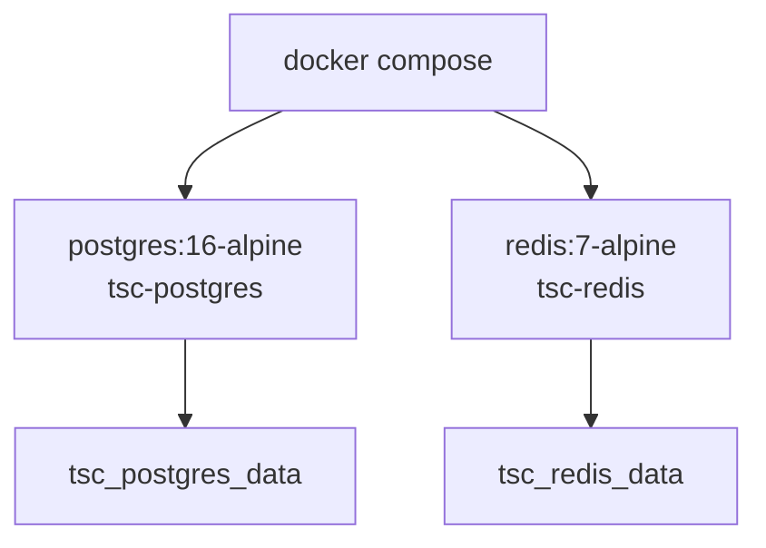
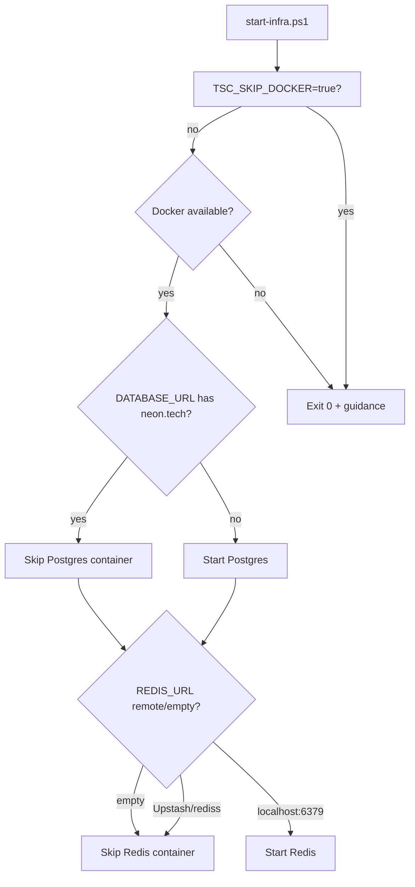
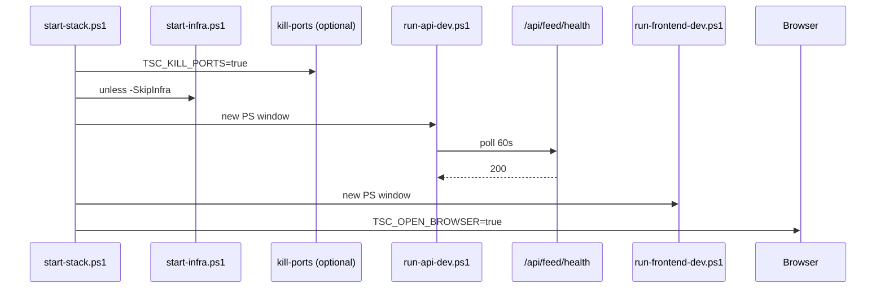

# Local Development Infrastructure

[← Master index](../MASTER.md)

## Prerequisites

| Tool | Version | Required |
|------|---------|----------|
| Node.js | 20+ | Yes |
| pnpm | 9.15+ | Yes (`corepack enable`) |
| Docker Desktop | 4.x | Optional (recommended) |
| PowerShell | 5.1+ | Windows scripts |

---

## Port Map



| Service | Port | Package / container |
|---------|------|---------------------|
| Community | 3000 | `@tsc/community` |
| CoreKnot | 3001 | `@tsc/coreknot-client` |
| Website (stub) | 3002 | Not in monorepo |
| API | 4000 | `@tsc/api` |
| Postgres | 5432 | `tsc-postgres` container |
| Redis | 6379 | `tsc-redis` container |
| Prisma Studio | 5555 | `pnpm db:studio` |

---

## Docker Compose

File: `docker-compose.yml`



| Service | Image | Credentials |
|---------|-------|-------------|
| Postgres | postgres:16-alpine | `postgres` / `postgres`, DB `tsc_community` |
| Redis | redis:7-alpine | no auth locally |

Commands:

```powershell
pnpm start:infra    # smart start (alias: pnpm infra:up)
pnpm infra:down     # docker compose down
pnpm stop           # stop.ps1
docker compose ps   # verify health
```

---

## Smart Infra (`start-infra.ps1`)

Unlike `setup.ps1`, `start-infra.ps1` reads `.env` and selectively starts containers:



Status messages printed:

- `Neon = DB OK` — remote Postgres
- `Redis = remote OK` — Upstash/cloud
- `Redis = skipped` — stub queue mode

---

## Setup vs Start: Fragility

| Script | Docker behavior | Issue |
|--------|-----------------|-------|
| `setup.ps1` | Always `docker compose up -d` if docker exists | No Neon/Upstash awareness |
| `start-infra.ps1` | Smart service selection | Preferred for daily dev |

**Recommendation:** After initial `pnpm setup`, use `pnpm start:infra` or let `start-stack.ps1` call infra — not re-run full setup.

---

## Start Commands

### Full stacks (infra + API + frontend)

```powershell
pnpm start:community     # default pnpm start
pnpm start:coreknot
pnpm start:website
pnpm start:all
```

### Variants

| Command | Difference |
|---------|------------|
| `start:coreknot:single` | One terminal via `concurrently` |
| `start:*:nodocker` | `-SkipInfra` flag |
| `start:coreknot:nodocker` | Also `-KillPorts` |

### Frontend + API only (infra already up)

```powershell
pnpm dev:stack:community
pnpm dev:stack:coreknot
pnpm dev:stack:website
```

### Manual two-terminal

```powershell
# Terminal 1
pnpm dev:api

# Terminal 2
pnpm dev:community   # or dev:coreknot
```

---

## Startup Sequence



API logs when using separate window: `logs/api-dev.log`

---

## No Docker Path

When virtualization unavailable or `TSC_SKIP_DOCKER=true`:

```powershell
# .env
DATABASE_URL=postgresql://...@ep-xxx.neon.tech/...?sslmode=require
REDIS_URL=                    # empty = stub queues
TSC_SKIP_DOCKER=true          # optional silence

pnpm start:coreknot:nodocker
# or
pnpm db:push    # first time with Neon
pnpm dev:api
pnpm dev:coreknot
```

---

## Hybrid Local Setup (Common)

```
Frontend :3000-3001  →  API :4000  →  Neon Postgres (remote)
                                   →  Docker Redis :6379 (local BullMQ)
```

Set `DATABASE_URL` to Neon, keep `REDIS_URL=redis://localhost:6379`, run `pnpm start:infra` for Redis only.

---

## Port Cleanup

```powershell
pnpm kill:ports              # 3000, 3001, 3002, 4000
pnpm kill:port 4000            # single port
```

`start-stack.ps1` auto-kills when `TSC_KILL_PORTS=true` (default).

**Critical:** Do not run `pnpm dev:api` while `start:*` already launched API in another window.

---

## Unix Scripts

| Windows | Unix |
|---------|------|
| `pnpm setup` | `pnpm setup:unix` / `scripts/setup.sh` |
| `pnpm start:community` | `pnpm start:unix` / `scripts/start-stack.sh` |

---

## Cursor Slash Commands

`.cursor/commands/` maps to `pnpm start:*`:

- `/start community`
- `/start coreknot`
- `/start website`
- `/start all`

---

## Related

- [setup-runbook.md](../operations/setup-runbook.md)
- [troubleshooting.md](../operations/troubleshooting.md)
- [env-vars.md](env-vars.md)
