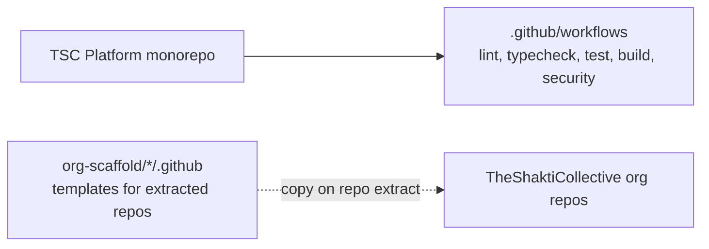
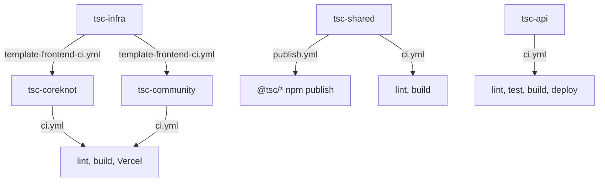
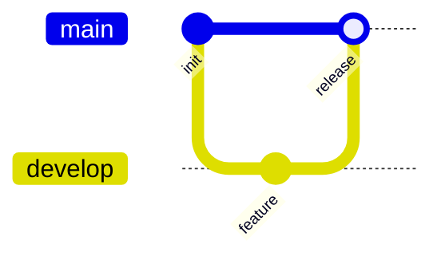
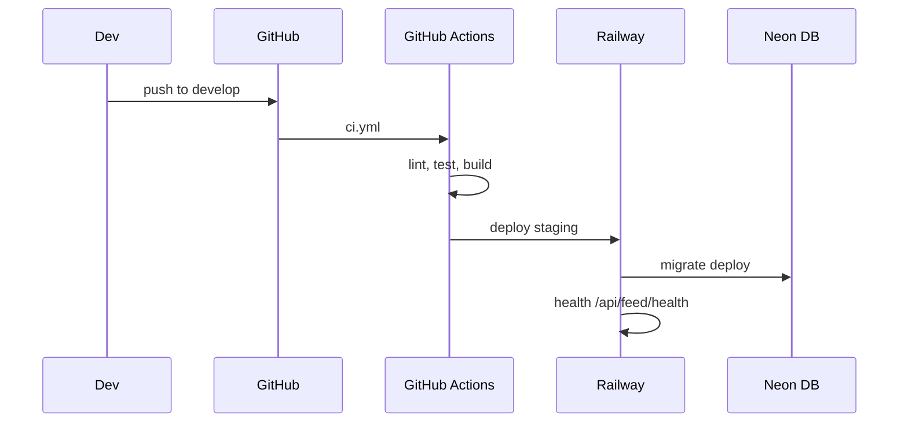
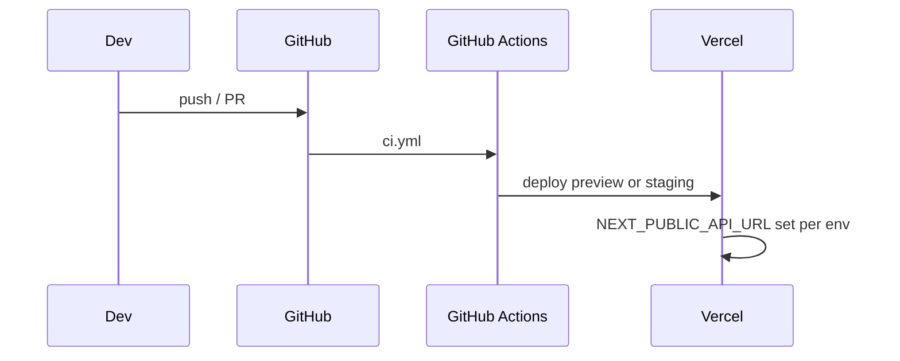
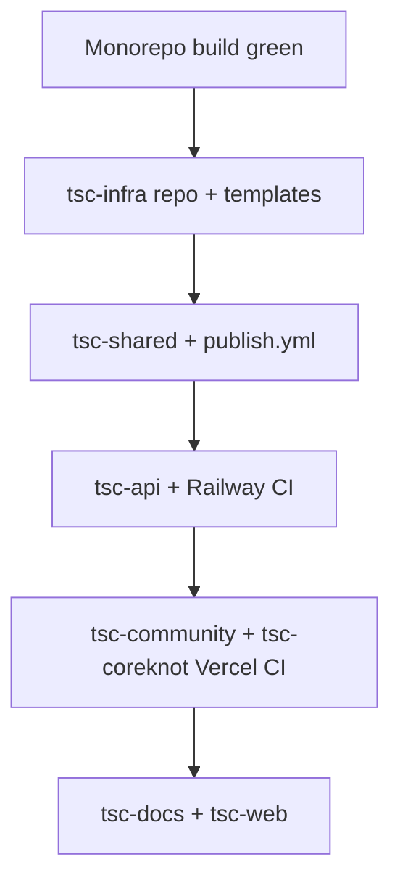

# CI/CD

[← Master index](../MASTER.md)

Current state of continuous integration, deployment automation, and scaffold templates.

---

## Current State



| Aspect | Monorepo today | Target (post-migration) |
|--------|----------------|-------------------------|
| Root CI workflows | **5 workflows** + `CODEOWNERS`, `BRANCH-STRATEGY.md` | Per-repo in extracted repos |
| Deploy automation | Railway config in `apps/api/railway.toml`; manual founder deploy | Railway + Vercel via GitHub Actions |
| Package publish | `workspace:*` local | GitHub Packages `@tsc/*` |
| Branch protection | Not configured | `main` + `develop` on all app repos |
| Required checks | Workflows defined; lint/audit debt | lint, typecheck, test, build |

---

## org-scaffold CI Templates



### Template locations

| Repo scaffold | Workflow | Purpose |
|---------------|----------|---------|
| `org-scaffold/tsc-infra/.github/workflows/template-frontend-ci.yml` | Copy to frontends | Reusable CI pattern |
| `org-scaffold/tsc-shared/.github/workflows/ci.yml` | Package CI | lint, build |
| `org-scaffold/tsc-shared/.github/workflows/publish.yml` | On `main` merge | Publish `@tsc/*` to GitHub Packages |
| `org-scaffold/tsc-api/.github/workflows/ci.yml` | API CI | lint, test, build, Railway deploy |
| `org-scaffold/tsc-community/.github/workflows/ci.yml` | Frontend CI | lint, build, Vercel |
| `org-scaffold/tsc-coreknot/.github/workflows/ci.yml` | Frontend CI | lint, build, Vercel |

---

## GitHub Organization Secrets (Planned)

From `.agents/production-setup-runbook.md`:

| Secret | Used by |
|--------|---------|
| `DATABASE_URL` | CI integration tests |
| `REDIS_URL` | CI integration tests |
| `CLERK_SECRET_KEY` | CI smoke tests |
| `CLERK_PUBLISHABLE_KEY` | Frontend CI |
| `R2_*` | API CI |
| `TYPESENSE_*` | API CI |
| `POSTHOG_API_KEY` | API + CI |
| `SENTRY_DSN` / `SENTRY_AUTH_TOKEN` | All apps |
| `RAILWAY_TOKEN` | tsc-api deploy |
| `VERCEL_TOKEN` / `VERCEL_ORG_ID` / `VERCEL_PROJECT_ID_*` | Frontend deploys |
| `NPM_TOKEN` | tsc-shared publish |

Set at **Organization → Settings → Secrets and variables → Actions**.

---

## Branch Strategy (Target)

Documented in `org-scaffold/tsc-infra/docs/branch-strategy.md`:



| Branch | Environment | Deploy target |
|--------|-------------|---------------|
| `main` | Production | Railway prod, Vercel prod |
| `develop` | Staging | Railway staging, Vercel staging |
| `feature/*` | Preview | Vercel preview URLs |

### Protection rules (target)

**`main`:**

- Require PR + 1 approval (2 for tsc-api)
- Required checks: lint, typecheck, test, build
- No force push

**`develop`:**

- Require PR
- Required checks: lint, typecheck, build

---

## Turbo in CI

Root `turbo.json` tasks:

| Task | dependsOn | Notes |
|------|-----------|-------|
| `build` | `^build` | Topological build |
| `lint` | `^build` | Lint after deps built |
| `dev` | — | Not used in CI |
| `prisma:validate` | — | DB schema check |

Recommended CI build command for monorepo (if adding root workflow):

```yaml
- run: pnpm install --frozen-lockfile
- run: pnpm db:validate
- run: pnpm db:generate
- run: pnpm build
```

---

## Deploy Pipelines (Target)

### Railway (tsc-api)



Scaffold: `org-scaffold/tsc-api/railway.json`

### Vercel (frontends)



Scaffolds: `org-scaffold/tsc-community/vercel.json`, `tsc-coreknot/vercel.json`

### tsc-shared publish

On merge to `main`:

1. `pnpm build` all packages
2. `pnpm publish` to `https://npm.pkg.github.com`
3. Consumers use `.npmrc`: `@tsc:registry=https://npm.pkg.github.com`

---

## Migration Order (CI perspective)



---

## Gaps to Close

| Gap | Priority | Action |
|-----|----------|--------|
| No monorepo `.github/workflows` | Medium | Add root CI while monorepo is SSOT |
| No automated tests in CI templates | High | Add test scripts to packages |
| `gh` CLI not on all dev machines | Low | Document in setup runbook |
| GitHub org repos not created | High | Run Appendix bootstrap in runbook |
| Health check path inconsistency | Medium | Standardize on `/api/feed/health` |

---

## Related

- [production-deploy.md](../infrastructure/production-deploy.md)
- [known-gaps.md](../decisions/known-gaps.md)
- [org-scaffold/README.md](../../org-scaffold/README.md)
