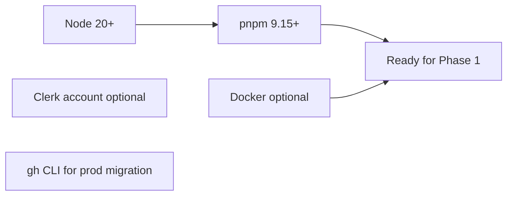
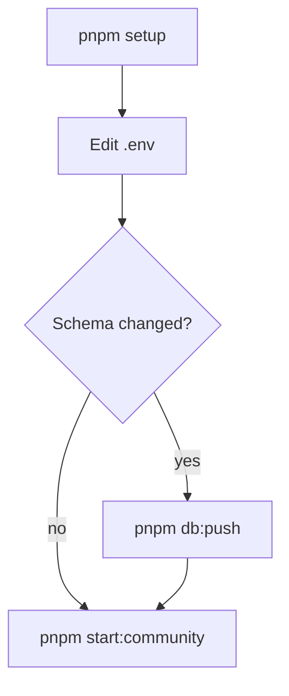
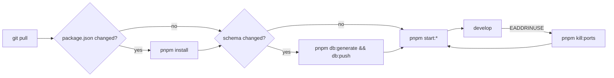
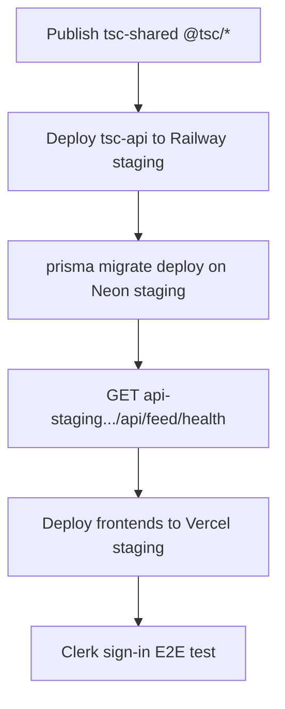

# Setup Runbook

[← Master index](../MASTER.md)

Step-by-step guide for local development and production deployment phases.

---

## Phase 0 — Prerequisites



```powershell
corepack enable
corepack prepare pnpm@9.15.0 --activate
node -v    # expect v20+
pnpm -v    # expect 9.15+
```

---

## Phase 1 — Local First-Time Setup (Canonical)



### Steps

1. **Clone / open repo**

```powershell
cd "c:\Users\ragha\OneDrive\Desktop\TSC Platform"
```

2. **Run setup** (install, .env, docker, db:generate, db:push, build)

```powershell
pnpm setup
```

What `scripts/setup.ps1` does:

| Step | Action |
|------|--------|
| 1 | Verify node, pnpm |
| 2 | Copy `.env.example` → `.env` if missing |
| 3 | Sync `.env` → `apps/community/.env.local` |
| 4 | `pnpm install` |
| 5 | `docker compose up -d` (if docker found) |
| 6 | `pnpm db:generate` |
| 7 | `pnpm db:push` |
| 8 | `pnpm build` |

3. **Configure `.env`**

Minimum for stub-auth local dev — see [env-vars.md](../infrastructure/env-vars.md).

4. **Start dev stack**

```powershell
pnpm start:community
# or
pnpm start:coreknot
```

5. **Verify**

| Check | URL / command |
|-------|---------------|
| API health | http://localhost:4000/api/feed/health |
| Community | http://localhost:3000 |
| CoreKnot | http://localhost:3001 |
| Containers | `docker compose ps` |

---

## Phase 2 — No Docker Setup

For Neon + optional Upstash / empty Redis:

```powershell
# .env
DATABASE_URL=postgresql://...@ep-xxx.neon.tech/...?sslmode=require
REDIS_URL=
TSC_SKIP_DOCKER=true

pnpm install
pnpm db:generate
pnpm db:push      # apply schema to Neon
pnpm build
pnpm start:coreknot:nodocker
```

---

## Phase 3 — Daily Development Loop



### Rules

- Use **one** API launcher — `start:*` OR `dev:api`, not both
- After `.env` changes, re-sync community: `Copy-Item .env apps\community\.env.local`
- Use `pnpm start:infra` instead of re-running full `setup` for Docker

---

## Phase 4 — Monorepo Health Gate (Pre-Migration)

Required before extracting `org-scaffold` repos:

```powershell
pnpm install
pnpm db:validate
pnpm db:generate
pnpm build
```

| Command | Expected |
|---------|----------|
| `pnpm db:validate` | exit 0 |
| `pnpm db:generate` | exit 0 |
| `pnpm build` | exit 0 (all 16 workspace packages) |

Smoke test:

```powershell
pnpm dev:api
# separate terminal:
curl http://localhost:4000/api/feed/health
```

---

## Phase 5 — GitHub Organization Setup

1. `gh auth login` with org admin on `The-Shakti-Collective`
2. Create 7 repos from `org-scaffold/` (see [ci-cd.md](ci-cd.md))
3. Configure teams, branch protection, org secrets
4. Full bootstrap commands: [.agents/shakti-collective-org-setup.md](../../.agents/shakti-collective-org-setup.md) and [org-scaffold/README.md](../../org-scaffold/README.md)

---

## Phase 6 — Platform Accounts

Provision before first deploy:

| Provider | Create |
|----------|--------|
| Neon | dev, staging, prod databases |
| Upstash | staging + prod Redis |
| Railway | API project |
| Vercel | 4 frontend projects |
| Cloudflare | DNS zone + R2 bucket |
| Clerk | staging + prod apps |
| Typesense | search cluster |
| Sentry | per-app projects |
| PostHog | project + keys |

---

## Phase 7 — Staging Deploy



Checklist:

- [ ] Railway staging linked to `develop`
- [ ] `DATABASE_URL`, `REDIS_URL`, Clerk, R2, Typesense on Railway
- [ ] Vercel staging domains configured
- [ ] `NEXT_PUBLIC_API_URL` → staging API
- [ ] Clerk webhook verified

---

## Phase 8 — Production Cutover

- [ ] PR `develop` → `main` on tsc-api
- [ ] Railway prod deploy green
- [ ] `prisma migrate deploy` on Neon prod (backup first)
- [ ] Vercel prod domains live
- [ ] DNS cutover on Cloudflare
- [ ] Smoke: sign-up → profile → API write → search → R2 upload
- [ ] Legacy domain redirect `theshakticollective.com` → `theshakticollective.in`

---

## Quick Reference

| Goal | Command |
|------|---------|
| First time | `pnpm setup` → edit `.env` → `pnpm start:community` |
| Schema sync | `pnpm db:push` |
| Infra only | `pnpm start:infra` |
| Kill stuck ports | `pnpm kill:ports` |
| Stop Docker | `pnpm stop` |
| Prisma GUI | `pnpm db:studio` |
| Windows build (no Turbo) | `pnpm run build:fallback` |
| Full workspace build | `pnpm run build:all` |
| E2E smoke | `pnpm run test:e2e` |
| Deploy artifact check | `pnpm run verify:dist` |

---

## Related

- [local-dev.md](../infrastructure/local-dev.md)
- [production-deploy.md](../infrastructure/production-deploy.md)
- [troubleshooting.md](troubleshooting.md)
