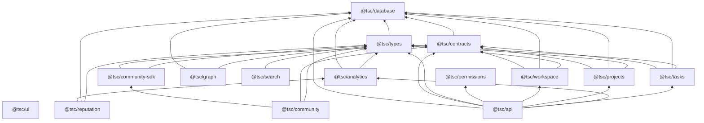
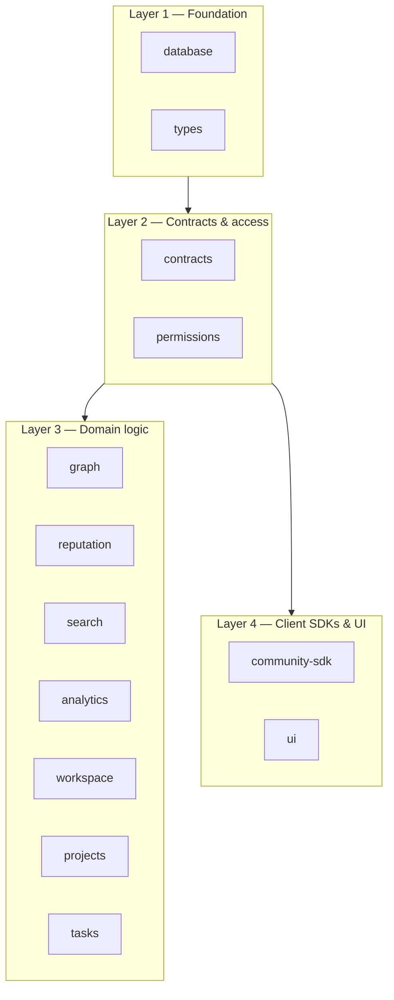
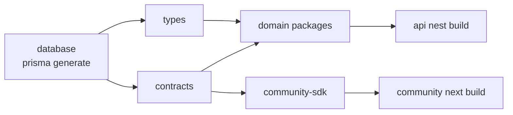

# Packages Overview

[← Master index](../MASTER.md)

## Summary

The monorepo contains **13 shared packages** under `packages/`, consumed primarily by `@tsc/api` and `@tsc/community`. All are `private: true`, version `0.0.0`, built with `tsc` to `dist/`.

---

## Package Inventory

| Package | Path | Build | Primary consumers |
|---------|------|-------|-------------------|
| `@tsc/database` | `packages/database/` | prisma generate + tsc | API, contracts, types, domain pkgs |
| `@tsc/types` | `packages/types/` | tsc | API, community, all domain pkgs |
| `@tsc/contracts` | `packages/contracts/` | tsc | API, community-sdk, community |
| `@tsc/permissions` | `packages/permissions/` | tsc | API |
| `@tsc/community-sdk` | `packages/community-sdk/` | tsc | community |
| `@tsc/ui` | `packages/ui/` | tsc | (future frontends) |
| `@tsc/analytics` | `packages/analytics/` | tsc | API, reputation |
| `@tsc/graph` | `packages/graph/` | tsc | API |
| `@tsc/reputation` | `packages/reputation/` | tsc | API |
| `@tsc/search` | `packages/search/` | tsc | API |
| `@tsc/workspace` | `packages/workspace/` | tsc | API |
| `@tsc/projects` | `packages/projects/` | tsc | API |
| `@tsc/tasks` | `packages/tasks/` | tsc | API |

---

## Dependency Graph



---

## Layer Model



---

## Package Details

### `@tsc/database`

Prisma schema SSOT. Exports:

- `.` — main index
- `./client` — Prisma singleton for packages

See [database.md](database.md).

### `@tsc/types`

Shared TypeScript interfaces aligned with Prisma models and API DTOs. Depends on `@tsc/database` for generated types.

### `@tsc/contracts`

Zod schemas for API request/response validation. Large surface area — co-located with API module schemas.

### `@tsc/permissions`

RBAC role/permission helpers for Clerk metadata integration (target).

### `@tsc/community-sdk`

Typed HTTP client for community app. Methods map to API routes defined in contracts.

### `@tsc/ui`

Shared React UI primitives — extracted to `tsc-shared` in migration plan.

### Domain packages (`graph`, `reputation`, `search`, `analytics`)

Business logic extracted from API for testability and future reuse. API modules delegate to these where integrated.

### Workspace trilogy (`workspace`, `projects`, `tasks`)

CoreKnot workspace domain — mirrors API modules `workspace`, `project`, `task`.

---

## Build Order

Turbo `build` uses `dependsOn: ["^build"]` — dependencies build first.



Recommended manual order when debugging:

```powershell
pnpm db:generate
pnpm --filter @tsc/database build
pnpm build   # full workspace
```

---

## Historical Build Issues

Per [.specify/operations/setup-runbook.md](../operations/setup-runbook.md) Phase 4:

| Package | Issue | Status |
|---------|-------|--------|
| `@tsc/analytics` | Missing imports, `@tsc/database/client` path | Fixes applied 2026-06-13 — re-verify |
| `@tsc/api` | Nest TS2742 declaration portability | SWC + `declaration: false` workaround |
| `@tsc/community` | CoreKnot client import paths | Replaced with local stubs |

Run `pnpm build` to verify current state.

---

## Migration to GitHub Packages

`org-scaffold/tsc-shared/` will publish:

- `@tsc/types`, `@tsc/contracts`, `@tsc/permissions`, `@tsc/ui`, `@tsc/constants`

API-internal packages stay in `tsc-api` repo:

- `database`, `graph`, `analytics`, `reputation`, `search`, `workspace`, `projects`, `tasks`

---

## Related

- [database.md](database.md)
- [monorepo-structure.md](../architecture/monorepo-structure.md)
- [api.md](../apps/api.md)
