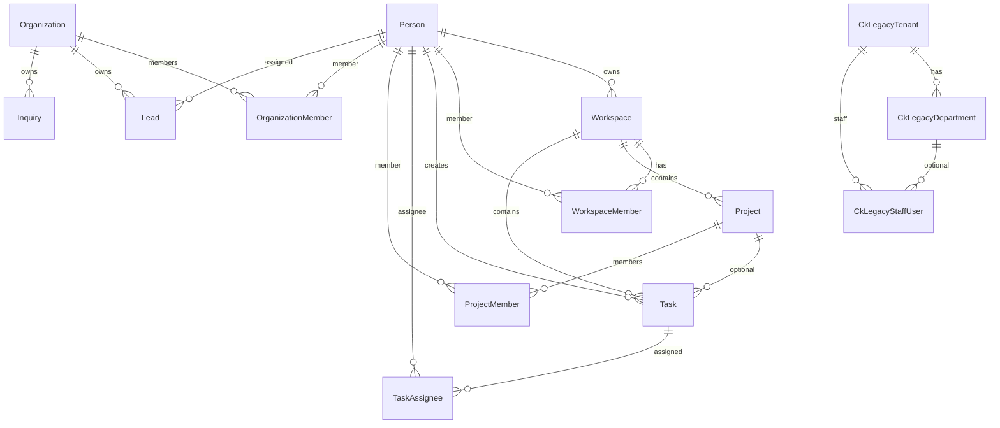

# CoreKnot Database Relationship Audit

**Mission:** CoreKnot Mongo Sunset — Agent 6  
**Date:** 2026-06-16  
**Schema source:** `packages/database/prisma/schema.prisma`  
**Live DB:** Neon (`DATABASE_URL` from `apps/coreknot/server/.env`) — queries executed  
**Prisma validate:** PASS

---

## Executive summary

| Area | Result |
|------|--------|
| Prisma schema validity | **PASS** |
| FK definitions (schema) | **PASS** — no broken `@relation` pairs in CoreKnot entities |
| Orphan FK rows (live DB) | **PASS** — 0 dangling parent references on all checked joins |
| Workspace ↔ project ↔ task consistency | **FAIL** — 113 tasks reference a project in a different workspace |
| Workspace membership boundaries | **FAIL** — 408 task assignees, 34 project members, 9 workspace owners lack membership rows |
| Organization / lead boundaries | **PASS** — 0 orphan orgs, 0 assignees outside org membership |
| Legacy auth (`ck_legacy_*`) | **PASS** — 0 orphan tenants/departments |
| Index coverage | **PARTIAL** — see recommendations |

**Overall:** Schema is structurally sound; **data-level ownership boundaries need remediation** before production certification.

---

## Live row counts (Neon, 2026-06-16)

| Entity | Rows |
|--------|-----:|
| Workspace | 14 |
| Project | 34 |
| Task | 392 |
| Lead | 2,029 |
| Organization | 3 |
| OrganizationMember | 19 |
| CkLegacyStaffUser | 16 |
| CkLegacyDocument | 0 |

---

## Schema inventory — CoreKnot entities

### Workspace & projects (Phase 12)

| Model | PK | Required parents | Cascade on delete |
|-------|-----|------------------|-------------------|
| `Workspace` | `id` | `ownerPersonId` → Person | owner Cascade |
| `WorkspaceMember` | `id` | workspace, person | both Cascade |
| `WorkspaceTeam` | `id` | workspace | Cascade |
| `Project` | `id` | workspace | Cascade |
| `ProjectMember` | composite | project, person | both Cascade |
| `Task` | `id` | workspace, createdByPersonId | workspace Cascade; project SetNull |
| `TaskAssignee` | composite | task, person | both Cascade |
| `TaskComment` | `id` | task, author | both Cascade |
| `TaskChecklist` | `id` | task | Cascade |

### Organization & CRM (CoreKnot Phases 1–3)

| Model | PK | Required parents | Cascade on delete |
|-------|-----|------------------|-------------------|
| `Organization` | `id` | — | — |
| `OrganizationMember` | `id` | organization, person | both Cascade |
| `OrganizationTeam` | `id` | organization; optional lead Person | org Cascade; lead SetNull |
| `OrganizationTeamMember` | `id` | team, person | both Cascade |
| `Lead` | `id` | organization; optional assignee Person | org Cascade; assignee SetNull |
| `Inquiry` | `id` | organization | org Cascade |
| `User` | `id` | person (Clerk bridge) | person Cascade |
| `Identity` | `id` | person | person Cascade |

### Domain ops (gigs, releases, finance stubs)

| Model | Parent | onDelete |
|-------|--------|----------|
| `Gig`, `Expense`, `Release`, `ArtistPathApplication` | Organization | Cascade |
| `Royalty` | Release | Cascade |
| `RoyaltyStatement` / `RoyaltyLineItem` | Organization / Statement | Cascade |
| `DistributionChannel` | Artist | Cascade |
| `DistributionSubmission` | Channel; optional Release | Cascade / SetNull |
| `ContentAsset`, `ContentItem` | Artist | Cascade |
| `MarketplaceListing`, `Message`, `Notification`, `AuditLog` | optional Organization | SetNull |
| `IntegrationConnection`, `AnalyticsMetricSnapshot` | optional Organization | SetNull |

### Legacy transitional (mongo mirror)

| Model | Table | FK constraints |
|-------|-------|----------------|
| `CkLegacyTenant` | `ck_legacy_tenants` | — |
| `CkLegacyDepartment` | `ck_legacy_departments` | tenant Cascade |
| `CkLegacyStaffUser` | `ck_legacy_staff_users` | tenant Cascade; department SetNull |
| `CkLegacyDocument` | `ck_legacy_documents` | **no FK** on `tenantId` (indexed only) |

### Tenancy gap (by design today)

There is **no Prisma FK** linking `Workspace` ↔ `Organization`. CoreKnot uses:

- **Workspace** — projects/tasks collaboration graph
- **Organization** — CRM, gigs, releases, domain notifications
- **CkLegacyTenant** — pre-Clerk staff auth

Agent 7 E2E must verify application-layer mapping (`SyncMapping`, tenant context) until unified tenancy lands.

---

## FK relationship diagram



---

## Validation checks — results

### Foreign key orphans (live DB)

| Check | Orphans | Status |
|-------|--------:|--------|
| Workspace → Person (owner) | 0 | **PASS** |
| WorkspaceMember → Workspace | 0 | **PASS** |
| WorkspaceMember → Person | 0 | **PASS** |
| Project → Workspace | 0 | **PASS** |
| Task → Workspace | 0 | **PASS** |
| Task → Project (when set) | 0 | **PASS** |
| Task → Person (creator) | 0 | **PASS** |
| TaskAssignee → Task / Person | 0 | **PASS** |
| Lead → Organization | 0 | **PASS** |
| Lead → Person (assignee, when set) | 0 | **PASS** |
| OrganizationMember → Organization / Person | 0 | **PASS** |
| CkLegacyStaffUser → Tenant / Department | 0 | **PASS** |
| CkLegacyDepartment → Tenant | 0 | **PASS** |

### Ownership & boundary checks (live DB)

| Check | Count | Status |
|-------|------:|--------|
| Task `workspaceId` ≠ project.`workspaceId` | **113** | **FAIL** |
| Workspace owner not in `WorkspaceMember` | **9** | **FAIL** |
| Task assignee not active workspace member | **408** | **FAIL** |
| Project member not active workspace member | **34** | **FAIL** |
| Lead assignee not active org member | 0 | **PASS** |

**Sample task/project workspace mismatch:**

| task_id | task workspaceId | project_id | project workspaceId |
|---------|------------------|------------|---------------------|
| `cmqdbyqys04x4j8wkz5uu0bmr` | `cmqdbxyrq04u4j8wk9s0nospt` | `cmqdby2ps04usj8wkraross4v` | `cmqdbxx8q04tpj8wk04th0c1l` |

Pattern: many tasks share workspace `cmqdbxyrq04u4j8wk9s0nospt` but point at projects in other workspaces — likely **mongo→postgres migration** mapped project FK without re-homing workspace.

### Schema-level checks

| Check | Status |
|-------|--------|
| `npx prisma validate` | **PASS** |
| All CoreKnot `@relation` pairs have inverse side | **PASS** |
| Cascade rules consistent (child dies with parent org/workspace) | **PASS** |
| Optional FKs use `SetNull` not `Cascade` where appropriate | **PASS** |
| `Task.projectId` optional — allows workspace/project drift | **BLOCKED** (app must enforce; no DB constraint) |
| `CkLegacyDocument.tenantId` — no FK | **BLOCKED** (intentional loose mirror; orphan risk if tenant deleted) |

---

## Orphan risk areas

| Risk | Severity | Notes |
|------|----------|-------|
| Task/project workspace mismatch | **High** | 113/392 tasks (29%) cross workspace boundary; breaks workspace-scoped queries |
| Assignees outside workspace membership | **High** | 408 assignments; authorization filters may hide tasks or leak across workspaces |
| Workspace owners not members | **Medium** | 9 workspaces; owner may fail membership-gated APIs |
| `CkLegacyDocument` without tenant FK | **Low** | 0 rows today; future wave-2 imports could orphan |
| Organization-scoped entities with `organizationId` nullable (`Message`, `Notification`, `AuditLog`) | **Low** | By design for cross-org system events |
| `SyncMapping` — no FK to entities | **Low** | External ID map; stale rows possible after deletes |
| Mongo legacy models still in codebase | **N/A** | Parallel schema — not in Postgres FK graph |

---

## Missing / weak indexes

| Model / query pattern | Current indexes | Recommendation |
|-----------------------|-----------------|----------------|
| `Lead` lookup by email | `(organizationId, stage)`, `(assignedPersonId)` | Add `@@index([organizationId, email])` for dedup/import |
| `Task` by workspace + project | `(workspaceId)`, `(projectId)` separate | Add `@@index([workspaceId, projectId])` for board views |
| `Task` cross-workspace detection | — | Add CHECK constraint or app validation: `project.workspaceId = task.workspaceId` |
| `WorkspaceMember` by workspace | unique `(workspaceId, personId)` only | Add `@@index([workspaceId, status])` for active-member lists |
| `CkLegacyDocument` | `(tenantId, entityType)` | Add FK to `CkLegacyTenant` when wave-2 stabilizes |
| `Organization` by slug | `@unique slug` | OK |

---

## Cascade rules summary

| Parent deleted | Children affected |
|----------------|-------------------|
| `Person` | Workspace (owned), members, tasks created, assignees — **Cascade** |
| `Workspace` | Members, teams, projects, tasks — **Cascade** |
| `Project` | Tasks keep row; `projectId` → **SetNull** |
| `Organization` | Leads, inquiries, gigs, expenses, releases, members — **Cascade** |
| `Lead` assignee Person deleted | `assignedPersonId` → **SetNull** (lead survives) |
| `CkLegacyTenant` | Departments, staff users — **Cascade** |

**Note:** `Project` delete does not delete tasks — tasks become workspace-level orphans with null `projectId`. Acceptable if intentional.

---

## Manual SQL — re-run checks

```sql
-- Orphan FK checks (all should return 0)
SELECT COUNT(*) FROM "Task" t
JOIN "Project" p ON t."projectId" = p.id
WHERE t."workspaceId" <> p."workspaceId";

SELECT COUNT(*) FROM "Workspace" w
LEFT JOIN "WorkspaceMember" wm ON wm."workspaceId" = w.id AND wm."personId" = w."ownerPersonId"
WHERE wm.id IS NULL;

SELECT COUNT(*) FROM "TaskAssignee" ta
JOIN "Task" t ON ta."taskId" = t.id
LEFT JOIN "WorkspaceMember" wm ON wm."workspaceId" = t."workspaceId"
  AND wm."personId" = ta."personId" AND wm.status = 'active'
WHERE wm.id IS NULL;
```

Full orphan battery: `apps/coreknot/server/scripts/_agent6-orphan-check.sql`

---

## Recommendations for Agent 7 (E2E)

### Must test

1. **Login** — `CkLegacyStaffUser` postgres auth (`COREKNOT_AUTH_STORE=postgres`)
2. **Workspace load** — list workspaces where user is owner but not member (9 cases)
3. **Project board** — projects whose tasks have workspace mismatch (expect wrong counts or empty columns)
4. **Task CRUD** — create task under project; verify workspaceId auto-set from project
5. **CRM leads** — list/filter by org; assign lead to org member (should pass — 0 boundary violations today)
6. **Cross-tenant isolation** — user A cannot read org B leads / workspace C tasks

### Known failures to document (not blockers for mongo sunset)

| Scenario | Expected |
|----------|----------|
| Task list filtered by workspace + project | May show tasks from other workspaces |
| Assignee picker limited to workspace members | May exclude valid assignees or include non-members |
| Owner-only workspace settings | May 403 if owner not in `WorkspaceMember` |

### Data remediation (pre-certification, optional Agent 6.5)

```sql
-- Preview: align task workspace to project's workspace
UPDATE "Task" t
SET "workspaceId" = p."workspaceId"
FROM "Project" p
WHERE t."projectId" = p.id AND t."workspaceId" <> p."workspaceId";

-- Backfill workspace owners as members
INSERT INTO "WorkspaceMember" (id, "workspaceId", "personId", role, status, "joinedAt")
SELECT gen_random_uuid()::text, w.id, w."ownerPersonId", 'owner', 'active', NOW()
FROM "Workspace" w
LEFT JOIN "WorkspaceMember" wm ON wm."workspaceId" = w.id AND wm."personId" = w."ownerPersonId"
WHERE wm.id IS NULL;
```

> Run in transaction with backup; not executed in this audit (read-only scope).

---

## Acceptance criteria (Agent 6)

| Criterion | Status |
|-----------|--------|
| Schema inventory produced | **PASS** |
| FK diagram produced | **PASS** |
| Orphan risk areas documented | **PASS** |
| PASS/FAIL per check | **PASS** |
| No orphan FK records (live query) | **PASS** |
| No broken FK definitions in schema | **PASS** |
| No ownership/boundary gaps | **FAIL** (membership + workspace/project drift) |

---

## Files created

| File | Purpose |
|------|---------|
| `apps/coreknot/server/docs/MONGOOSE_ERADICATION_REPORT.md` | Agent 5 follow-up (Step 0) |
| `apps/coreknot/server/docs/DATABASE_RELATIONSHIP_AUDIT.md` | Agent 6 deliverable |

Supporting query artifacts (optional cleanup):

- `apps/coreknot/server/scripts/_agent6-orphan-check.sql`
- `apps/coreknot/server/scripts/_agent6-orphan-check.js`
- `apps/coreknot/server/scripts/_agent6-boundary-check.js`
