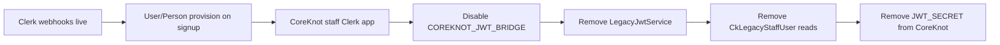

# Auth Cutover Plan (Agent 09)

> **Date:** 2026-06-15  
> **Constitution:** [../architecture/AUTH-ARCHITECTURE.md](../architecture/AUTH-ARCHITECTURE.md)

## Before state

| Component | Status |
|-----------|--------|
| **ClerkAuthGuard** | Primary — `verifyToken` + membership resolve |
| **StubAuthGuard** | Dev only — `TSC_AUTH_STUB` / placeholder Clerk key |
| **LegacyJwtService** | Bridge — opt-in via `COREKNOT_JWT_BRIDGE=true` (default **off**) |
| **Clerk webhooks** | **Not wired** — C4 blocker |
| **MembershipContextService** | Resolves org/community/artist from Postgres |
| **Platform admin** | Env allowlist `TSC_ADMIN_USER_IDS` |
| **CoreKnot server auth** | JWT + Mongo users — **Worker B scope** |

### Auth source matrix (Platform API)

| Source | Trigger | Sunset |
|--------|---------|--------|
| `clerk` | Valid Clerk JWT | Keep |
| `stub` | Dev stub credentials | Keep (dev) |
| `legacy-jwt` | CoreKnot session JWT when bridge enabled | Remove Q3 2026 |

## After state

| Action | Result |
|--------|--------|
| Stub prod guard verified | `isAuthStubEnabled()` returns `false` when `NODE_ENV=production` — **no code change required** |
| Stub guard documented | JSDoc on `stub-auth.guard.ts` clarifies prod disable |
| Legacy bridge default | Remains **off** — explicit opt-in preserved |
| `.env.example` | Already documents bridge as commented optional |

No breaking auth removals this wave — CoreKnot Clerk migration prerequisite not met.

## Target cutover sequence

### Phase 1 — Platform (P0, founder)

| Step | Owner | Fallback |
|------|-------|----------|
| Wire Clerk webhook → Platform API | Founder + Platform backend | Manual user seed via `seed-dev-user.ts` |
| Set real `CLERK_SECRET_KEY` on Railway | Founder | Stub disabled in prod anyway |
| Configure `TSC_ADMIN_USER_IDS` in prod | Founder | No platform admin routes |

### Phase 2 — Bridge wind-down (P1)

| Step | Condition | Fallback |
|------|-----------|----------|
| Set `COREKNOT_JWT_BRIDGE=true` in staging only | CoreKnot tokens needed for compat testing | Clerk tokens on staging |
| Remove bridge from prod env | CoreKnot client uses Clerk | Re-enable bridge flag 24h |

### Phase 3 — Code removal (P1)

| File | Remove when |
|------|-------------|
| `legacy-jwt.service.ts` | CoreKnot Clerk live 30+ days |
| `legacy-jwt-config.ts` | Same |
| `resolveFromLegacyMongoUserId()` | Same |
| `CkLegacyStaffUser` Prisma model | Postgres auth store + Clerk |

## Auth unification status

| Metric | Value |
|--------|-------|
| **Production IdP** | Clerk (Platform frontends + API) |
| **Legacy JWT bridge** | Disabled by default ✅ |
| **Stub in production** | Blocked by `NODE_ENV` ✅ |
| **Single identity graph** | ❌ — CoreKnot still JWT/Mongo |
| **Webhook provisioning** | ❌ — C4 open |
| **Unification complete** | **~40%** — Platform path ready; CoreKnot + webhooks remain |

## Risk

| Risk | Mitigation |
|------|------------|
| Remove bridge before CoreKnot Clerk | Keep bridge opt-in; document in runbook |
| Stub enabled in prod via mis-set NODE_ENV | Railway sets `NODE_ENV=production`; stub guard double-checks |
| Dual JWT secrets | Consolidate to Clerk only after cutover |

## Rollback

| Change | Rollback |
|--------|----------|
| Disable bridge | `COREKNOT_JWT_BRIDGE=true` + `COREKNOT_JWT_SECRET` |
| Re-enable stub (dev only) | `TSC_AUTH_STUB=true` |
| Clerk outage | No fallback in prod by design — Clerk SLA |
