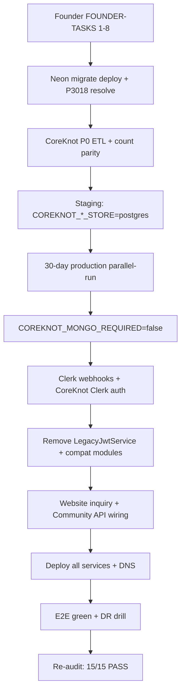

# Master Tech Debt Elimination Report (Agent 18)

> **Program date:** 2026-06-15  
> **Authority:** Production Readiness Authority — synthesizes Agents 01–17 (Workers A–D)  
> **Constitution:** [MASTER-PRODUCTION-ARCHITECTURE.md](../architecture/MASTER-PRODUCTION-ARCHITECTURE.md)  
> **Readiness cross-ref:** [MASTER-PRODUCTION-READINESS-REPORT.md](../readiness/MASTER-PRODUCTION-READINESS-REPORT.md)

---

## Executive summary

The Tech Debt Elimination Program (Workers A–D, Agents 01–17) **completed its documentation and safe-code mandate** but **did not achieve production launch**. The program materially improved architecture enforcement, security (C6 RBAC), CI hygiene, deploy clarity, and elimination traceability — while honestly leaving **Mongo runtime**, **founder infra**, **auth webhooks**, and **Community product wiring** as open blockers.

| Dimension | Result |
|-----------|--------|
| Agent reports delivered | **17/17** |
| Final Success State (15 readiness criteria) | **0/15 fully met** · 1 partial (⚠️ #3 relationships) |
| Program verdict | **PARTIAL SUCCESS** — debt classified, gated, and partially closed; production still blocked |
| Production readiness (Agent 25) | **[NOT READY](../readiness/MASTER-PRODUCTION-READINESS-REPORT.md)** |

**What changed:** Platform API boundaries are enforced in code (compat gated in prod, frontend URL guards), critical admin/audit/analytics RBAC gaps closed, CI deduplicated, Render deploy ambiguity removed, CoreKnot P1 repository import fixed, Prisma Task indexes added, and a canonical elimination certificate set published.

**What did not change:** CoreKnot still requires Mongo by default (~89+26 Mongoose models), founder FOUNDER-TASKS remain 0/8, Clerk webhooks un wired, Community still on mock data for key surfaces, and Platform API still hosts 16 transitional CoreKnot ops modules (intentionally retained for prod safety).

---

## Final Success State vs program outcome (15/15 required for production)

Source: [MASTER-PRODUCTION-READINESS-REPORT.md](../readiness/MASTER-PRODUCTION-READINESS-REPORT.md)

| # | Criterion | Pre-program | Post-program | Delta |
|---|-----------|-------------|--------------|-------|
| 1 | No Mongo dependency | ❌ | ❌ | Documented + P1 repo fix only |
| 2 | No orphan records (or migration path) | ❌ | ❌ | Auth cutover plan; webhook still open |
| 3 | No broken relationships | ⚠️ | ⚠️ | Task indexes added; Invoice↔Project gap remains |
| 4 | No ownership ambiguity | ❌ | ❌ | Dual-write documented; compat gated in prod |
| 5 | No API contract failures | ❌ | 🟡 | Compat 410 in prod; stubs remain |
| 6 | No auth boundary failures | ❌ | 🟡 | C6 RBAC fixed; CoreKnot JWT + bridge remain |
| 7 | No tenant isolation failures | ❌ | 🟡 | Admin/audit/analytics scoped; compat routes partial |
| 8 | No deployment blockers | ❌ | ❌ | Railway-only certified; services not live |
| 9 | No critical security findings | ❌ | 🟡 | C6 closed; webhooks + compat routes remain |
| 10 | CoreKnot domains validated | ❌ | ❌ | Reform roadmap; Mongo default unchanged |
| 11 | Community domains validated | ❌ | ❌ | Mock data documented; not wired |
| 12 | Database relationships certified | ❌ | 🟡 | Schema PASS conditional; Neon P3018 open |
| 13 | Disaster recovery documented | ❌ | ❌ | Out of elimination scope |
| 14 | Production deployment verified | ❌ | ❌ | Founder gate |
| 15 | Cross-system workflows validated | ❌ | ❌ | Website→CRM still broken |

**Score: 0/15 fully met** · ~5 criteria moved from hard ❌ toward 🟡 partial improvement.

---

## Per-agent verdict table (Agents 01–17)

| Agent | Report | Verdict | Summary |
|-------|--------|---------|---------|
| 01 | [ARCHITECTURE-COMPLIANCE-REPORT.md](./ARCHITECTURE-COMPLIANCE-REPORT.md) | **WARN** | Frontends compliant; Platform API transitional ops modules remain |
| 02 | [REPOSITORY-GOVERNANCE-REPORT.md](./REPOSITORY-GOVERNANCE-REPORT.md) | **WARN** | Target repo set certified; GitHub archive + extraction pending founder |
| 03 | [NAMING-CERTIFICATE.md](./NAMING-CERTIFICATE.md) | **PASS** | Product/deploy naming matrix certified; doc-only fixes |
| 04 | [MONGO-ERADICATION-PLAN.md](./MONGO-ERADICATION-PLAN.md) | **FAIL** | Runtime still Mongo-required; plan + P1 import fix only |
| 05 | [COREKNOT-REFORM-REPORT.md](./COREKNOT-REFORM-REPORT.md) | **FAIL** | Domain structure reformable; P0 store flags default mongo |
| 06 | [PLATFORM-DOMAIN-REPORT.md](./PLATFORM-DOMAIN-REPORT.md) | **WARN** | Platform domains validated; 16 CoreKnot ops modules retained |
| 07 | [SHARED-PACKAGE-ROADMAP.md](./SHARED-PACKAGE-ROADMAP.md) | **PASS** | All 15 packages classified; no unsafe deletions |
| 08 | [DATABASE-CERTIFICATION.md](./DATABASE-CERTIFICATION.md) | **WARN** | Schema sound; production migrate blocked on Neon P3018 |
| 09 | [AUTH-CUTOVER-PLAN.md](./AUTH-CUTOVER-PLAN.md) | **WARN** | Platform path ~40%; webhooks + CoreKnot JWT open |
| 10 | [API-BOUNDARY-CERTIFICATE.md](./API-BOUNDARY-CERTIFICATE.md) | **WARN** | Frontends certified; compat sunset conditional on Mongo |
| 11 | [DEPLOYMENT-CERTIFICATE.md](./DEPLOYMENT-CERTIFICATE.md) | **WARN** | Railway/Vercel canonical; Render archived; not live |
| 12 | [CI-CD-CERTIFICATE.md](./CI-CD-CERTIFICATE.md) | **PASS** | Duplicate workflows removed; single `ci.yml` |
| 13 | [OBSERVABILITY-PLAN.md](./OBSERVABILITY-PLAN.md) | **WARN** | Scaffold + env contract; Platform Sentry/PostHog P1 |
| 14 | [SECURITY-CERTIFICATE.md](./SECURITY-CERTIFICATE.md) | **WARN** | C6 RBAC **fixed**; full PASS needs compat sunset + webhooks |
| 15 | [SCALABILITY-CERTIFICATE.md](./SCALABILITY-CERTIFICATE.md) | **WARN** | Architecturally OK to ~10K; Mongo blocks beta scale |
| 16 | [DOCUMENTATION-CERTIFICATE.md](./DOCUMENTATION-CERTIFICATE.md) | **PASS** | Elimination index, archives, cross-links complete |
| 17 | [DEAD-CODE-ELIMINATION-REPORT.md](./DEAD-CODE-ELIMINATION-REPORT.md) | **PASS** | 4 CI workflows + Render config safely removed/archived |

**Totals:** PASS **5** · WARN **10** · FAIL **2**

---

## Consolidated blocker list (deduplicated)

### P0 — Before production launch

| ID | Blocker | Sources | Owner |
|----|---------|---------|-------|
| P0-1 | CoreKnot Mongo runtime — P0 ETL, parity, `COREKNOT_*_STORE=postgres`, 30-day parallel-run | Agents 04, 05, readiness | Backend + Founder |
| P0-2 | Founder infra incomplete (Clerk, DNS, Railway, Vercel, Neon, Redis) — FOUNDER-TASKS 0/8 | Agents 11, readiness, TECH-DEBT C3/C5 | Founder |
| P0-3 | Prisma migration drift on Neon (P3018) | Agent 08, TECH-DEBT C2 | Backend + Founder |
| P0-4 | Clerk webhook → User/Person provisioning | Agent 09, TECH-DEBT C4 | Backend + Founder |
| P0-5 | Disable `AUTH_STUB` + `COREKNOT_JWT_BRIDGE` in production env | Agent 09, readiness | DevOps |
| P0-6 | Platform/CoreKnot dual-write on CRM/Project/Task (6+ tables) | Agents 01, 06, readiness | Architecture — post Mongo sunset |
| P0-7 | Website contact → Inquiry/Lead pipeline | Readiness workflow audit | Full-stack |
| P0-8 | CoreKnot client prod deploy — `VITE_API_URL=https://api.coreknot.in/api` | Agent 10 | Founder + DevOps |
| P0-9 | Attendance, Calendar, Mail, Finance native Prisma + R2 (P1 domains blocking Mongo exit) | Agents 04, 05 | Backend |
| P0-10 | Configure prod `TSC_ADMIN_USER_IDS` | Agent 14 | Founder |

**P0 count: 10**

### P1 — Before first users

| ID | Blocker | Sources |
|----|---------|---------|
| P1-1 | Community mock data → Platform API (dashboard, opportunities, profile) | Agents 01, 06, TECH-DEBT H4 |
| P1-2 | CoreKnot Clerk auth (replace JWT) | Agents 09, TECH-DEBT H2 |
| P1-3 | Remove/sunset `CoreknotCompatModule` + 16 Platform ops modules | Agents 01, 06, 10 |
| P1-4 | E2E suite green (5/8 failing) | TECH-DEBT H3 |
| P1-5 | CoreKnot server in CI build | Agent 12 M2 |
| P1-6 | Platform API Sentry + PostHog server capture | Agent 13 |
| P1-7 | Neon restore drill documented + executed | Readiness DR cert |
| P1-8 | Rate limiting on public/authenticated API | Readiness, Agent 14 |
| P1-9 | Remove orphan `@tsc/projects`, `@tsc/tasks`, `@tsc/workspace` from API deps | Agent 07 |
| P1-10 | CoreKnot Vercel monorepo install path (H5) | TECH-DEBT |
| P1-11 | Implement Post/Feed modules beyond health stubs | Agent 06 |
| P1-12 | Task assign → notification automation | Readiness |

### P2 — Before scale (10K+)

| ID | Blocker | Sources |
|----|---------|---------|
| P2-1 | Typesense search production | Agent 07, TECH-DEBT M6 |
| P2-2 | R2 media CDN | TECH-DEBT M6 |
| P2-3 | Redis-backed rate limits + cache at scale | Agent 15 |
| P2-4 | Invoice↔Project FK or documented alternative | Readiness #3 |
| P2-5 | Archive 117 CoreKnot Mongo one-off scripts | Agents 04, 17 |
| P2-6 | Delete `@tsc/graph`, `@tsc/reputation` after consumer migration | Agent 07 |
| P2-7 | Community/Website PostHog + Sentry frontends | Agent 13 |
| P2-8 | Platform API horizontal scale (2–4 Railway replicas) | Agent 15 |

### P3 — Nice to have

| ID | Item | Sources |
|----|------|---------|
| P3-1 | GitHub branch protection → `CI` job name (post workflow consolidation) | Agent 12, 17 |
| P3-2 | Archive GitHub repos `tsc-api`, `tsc-community`, `tsc-web` | Agent 02 |
| P3-3 | Extract `apps/coreknot/` → `tsc-coreknot` repo | Agents 02, architecture |
| P3-4 | Extract `org-scaffold/tsc-infra` → `tsc-infra` | Agent 02 |
| P3-5 | Consolidate `POSTHOG_PROJECT_TOKEN` vs `POSTHOG_API_KEY` naming | Agent 17 |
| P3-6 | Update `.specify/MASTER.md` diagram (M7) | TECH-DEBT |
| P3-7 | BetterStack uptime heartbeats live | Agent 13, TECH-DEBT L3 |
| P3-8 | Publish `@tsc/shared` meta-package (Q1 2027) | Agent 07 |

---

## What was IMPLEMENTED (program commits)

| Commit | Worker | Scope |
|--------|--------|-------|
| [`1e1c6fc`](https://github.com/TheShaktiCollective/tsc-platform/commit/1e1c6fc) | A (01, 06, 10) | `PLATFORM_COREKNOT_COMPAT_ENABLED` + `CoreknotCompatGuard`; frontend `assertPlatformApiUrl()`; compat legacy controllers; elimination reports 01/06/10 |
| [`04bdf7f`](https://github.com/TheShaktiCollective/tsc-platform/commit/04bdf7f) | A | CoreKnot compat mappers + context service (support files for guard module) |
| [`85678e7`](https://github.com/TheShaktiCollective/tsc-platform/commit/85678e7) | B (04, 05) | Fix `createLegacyRepository` Prisma import; Mongo eradication + CoreKnot reform reports; orphan script deprecation |
| [`af7361f`](https://github.com/TheShaktiCollective/tsc-platform/commit/af7361f) | D (02, 03, 11–13, 15–17) | CI consolidation (delete 4 duplicate workflows); Render → archive; full `docs/architecture/` set; elimination certs; observability README; org-scaffold DEPRECATED stubs |
| [`38e6ea5`](https://github.com/TheShaktiCollective/tsc-platform/commit/38e6ea5) | C (07–09, 14) | C6 RBAC: admin/audit/analytics RolesGuard + org scope; Task Prisma indexes; auth cutover plan; database + security certificates |

### Implementation inventory by category

| Category | Delivered |
|----------|-----------|
| **Boundary enforcement** | Prod-gated CoreKnot compat; Website/Community CoreKnot URL rejection |
| **Security** | `/admin` SUPER_ADMIN; audit org-scoped list/record; analytics org-scoped queries |
| **Database** | `Task` indexes on `dueAt`, `[workspaceId, status]` |
| **CoreKnot** | P1 legacy repository load fix; Mongo sunset documentation |
| **CI/CD** | Single canonical `ci.yml`; path-scoped workflows retained |
| **Deploy** | Render blueprint archived; Railway-only authority |
| **Docs** | 17 agent reports + architecture canon + readiness audit trail |
| **Dead code** | 4 duplicate CI workflows removed; Render config archived |
| **Governance** | DEPRECATED stubs on split-repo scaffolds; founder runbook archived |

---

## What remains before production

Production launch requires **15/15** readiness criteria — current **0/15**. See full verdict:

**[MASTER-PRODUCTION-READINESS-REPORT.md — NOT READY FOR PRODUCTION](../readiness/MASTER-PRODUCTION-READINESS-REPORT.md)**

Critical path (ordered):

1. **Founder:** Complete [FOUNDER-TASKS.md](../../.specify/agents/execution/FOUNDER-TASKS.md) Steps 1–8 (Clerk, Neon, Redis, Railway, Vercel, Cloudflare, Typesense, monitoring)
2. **Database:** Resolve Neon P3018; `prisma migrate deploy`
3. **CoreKnot Mongo:** P0 ETL → parity → staging flag flip → 30-day parallel-run → `COREKNOT_MONGO_REQUIRED=false`
4. **Auth:** Clerk webhooks; prod admin allowlist; CoreKnot Clerk migration
5. **Security/env:** Confirm stub + JWT bridge disabled in prod Railway env
6. **Deploy:** Platform API + frontends live; CoreKnot API + client on correct domains
7. **Product:** Website inquiry pipeline; Community API wiring; remove mock-data prod paths
8. **Validation:** E2E green; Neon restore drill; re-run readiness audit (Agents 15–25)

---

## Ordered execution sequence (remaining work)

| Phase | Steps | Est. gate |
|-------|-------|-----------|
| **Phase 0 — Infra** | Founder tasks, Neon migrate, Railway/Vercel/DNS | Week 1–2 |
| **Phase 1 — Data** | CoreKnot P0 ETL, parity, staging flags | Week 2–4 |
| **Phase 2 — Parallel-run** | Postgres primary, Mongo shadow, founder sign-off | 30 days |
| **Phase 3 — Auth** | Webhooks, admin allowlist, CoreKnot Clerk | Overlap Phase 2 |
| **Phase 4 — Boundary cleanup** | Remove Platform ops modules, delete compat layer | Post Phase 2 |
| **Phase 5 — Product** | Community wiring, inquiry pipeline, feed/posts | Parallel |
| **Phase 6 — P1 domains** | Mail, finance R2, attendance Prisma schema | Post P0 cutover |
| **Phase 7 — Certification** | E2E, DR drill, readiness re-audit | Launch gate |

---

## Program before-state / after-state

### Before (pre–Tech Debt Elimination Program)

| Area | State |
|------|-------|
| Architecture docs | Fragmented; no single production constitution |
| API boundaries | Platform served CoreKnot routes without prod gate; frontends unvalidated |
| Security | `/admin`, `/audit`, `/analytics` exposed to any authenticated user (C6) |
| CI | 5 duplicate workflows on every push |
| Deploy | Render + Railway ambiguity for CoreKnot |
| Mongo | Broken P1 repository import; no formal eradication plan |
| Packages | Unclassified; orphan deps undocumented |
| Governance | Deprecated repo scaffolds without markers |
| Agent continuity | No elimination certificate index |

### After (post–Workers A–D + Agent 18)

| Area | State |
|------|-------|
| Architecture docs | **14 domain docs + MASTER** in `docs/architecture/` |
| API boundaries | **Prod-gated compat**; frontend CoreKnot URL guards |
| Security | **C6 closed** — RBAC on admin/audit/analytics |
| CI | **Single `ci.yml`** + path-scoped workflows |
| Deploy | **Railway-only**; Render archived |
| Mongo | **Documented exit plan**; P1 repo import fixed; runtime unchanged |
| Packages | **15-package classification** roadmap |
| Governance | **DEPRECATED.md** on split-repo scaffolds |
| Agent continuity | **17 certificates + this master report** in `docs/elimination/` |
| Production | **Still NOT READY** — Mongo, founder infra, webhooks, product gaps |

---

## Worker summary

| Worker | Agents | Primary outcome |
|--------|--------|-----------------|
| **A** | 01, 06, 10 | Platform API boundary enforcement + certificates |
| **B** | 04, 05 | Mongo eradication plan + CoreKnot reform + P1 import fix |
| **C** | 07, 08, 09, 14 | Package roadmap, DB indexes, auth plan, C6 RBAC |
| **D** | 02, 03, 11–13, 15–17 | CI consolidation, deploy cert, docs, dead code removal |
| **18** | — | This synthesis + program sign-off |

---

## Sign-off

| Role | Agent | Verdict |
|------|-------|---------|
| Architecture compliance | 01 | WARN |
| Repository governance | 02 | WARN |
| Naming | 03 | PASS |
| Mongo eradication | 04 | FAIL |
| CoreKnot reform | 05 | FAIL |
| Platform domains | 06 | WARN |
| Shared packages | 07 | PASS |
| Database | 08 | WARN |
| Auth cutover | 09 | WARN |
| API boundaries | 10 | WARN |
| Deployment | 11 | WARN |
| CI/CD | 12 | PASS |
| Observability | 13 | WARN |
| Security | 14 | WARN (C6 fixed) |
| Scalability | 15 | WARN |
| Documentation | 16 | PASS |
| Dead code | 17 | PASS |
| **Production Readiness Authority** | **18** | **PROGRAM PARTIAL SUCCESS · PRODUCTION NOT READY** |

---

## Related links

| Resource | Path |
|----------|------|
| Elimination index | [README.md](./README.md) |
| Architecture canon | [docs/architecture/](../architecture/) |
| Readiness audit | [docs/readiness/](../readiness/) |
| Tech debt tracker | [TECH-DEBT-ROADMAP.md](../architecture/TECH-DEBT-ROADMAP.md) |
| Founder tasks | [FOUNDER-TASKS.md](../../.specify/agents/execution/FOUNDER-TASKS.md) |
