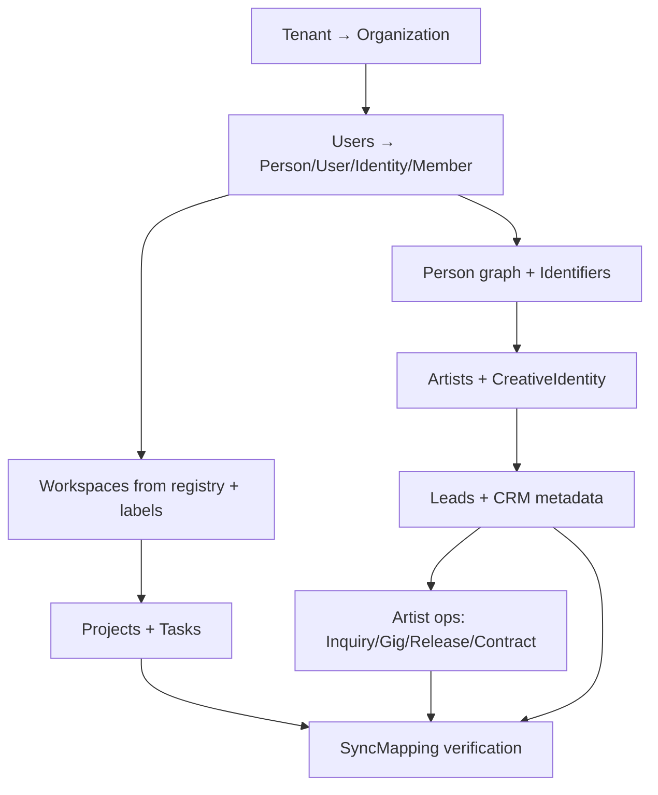

# CoreKnot Mongo → TSC Prisma Schema Mapping

**Agent 2 — Database Migration Architect**  
**Status:** Mapping only — no migration code  
**Sources audited:** `apps/coreknot/server/models/`, `apps/coreknot/server/domains/*/models/` (116 Mongoose models)  
**Target:** `packages/database/prisma/schema.prisma` (PostgreSQL via Prisma)

---

## Cross-cutting rules

| Concern | Legacy (Mongo) | Target (Prisma) | Transformation |
|---------|----------------|-----------------|----------------|
| **Primary keys** | `ObjectId` (`_id`, 24-char hex) | `cuid()` strings | Generate new IDs; preserve lineage in `SyncMapping` (`sourceSystem: coreknot`) |
| **Multi-tenancy** | `tenantId` on virtually all collections via `tenantPlugin` | `organizationId` on org-scoped models | Map `Tenant._id` → `Organization.id` (1:1 for cutover; single default tenant today) |
| **Staff auth** | `User` with `email` + `password` / `googleId` | `User.clerkUserId` + `Person` + `Identity` | Clerk import first; password hashes **not** migrated — users re-auth via Clerk |
| **Internal users** | `User._id` referenced everywhere | `Person.id` via `User.personId` | Every `ref: 'User'` FK becomes `personId` lookup through sync table |
| **CRM persons** | `Person` (canonical identity) + `PersonIndex` (search hub) | `Person` + `PersonIdentifier` + `Lead` | Merge duplicate person graphs; `PersonIndex` is denormalized — rebuild from sources |
| **Workspace naming** | String label on `Project.workspace` / `Task.workspace` (e.g. `"GENERAL"`) | `Workspace` entity with `slug` | Create one `Workspace` per distinct legacy label per org; not the same as legacy `Workspace` model |
| **Timestamps** | `createdAt` / `updatedAt` (mixed) | `DateTime` required on most models | Pass through; default missing `updatedAt` = `createdAt` |
| **Soft TTL** | `expires: '90d'` on `CRMAudit`, `TaskActivity`, `Log` | No TTL in Postgres | Migrate recent window only, or archive to cold storage |

### Identity split (staff `User`)

```
OLD: users (collection)
NEW: Person + User + Identity + OrganizationMember [+ PersonProfile + PersonIdentifier]

users._id           → SyncMapping.externalId (type: coreknot_user)
users._id           → Person.id (new cuid) via User.personId
users.email         → Person.email + PersonIdentifier(provider: email)
users.name          → Person.name, Identity.displayName
users.avatar        → Identity.avatarUrl
users.phone         → Person.phone + PersonIdentifier(provider: phone)
users.googleId      → Identity.metadata.googleId (Clerk owns OAuth post-cutover)
users.departmentId  → OrganizationMember.role derivation (see Department)
users.teams[]       → OrganizationTeamMember rows (team name → slug)
users.repId         → PersonIdentifier(provider: other, externalId: repId)
users.pagePermissions → OrganizationMember metadata or Identity.metadata.pagePermissions
users.password      → REMOVED (Clerk)
users.exp/level/dailyStreak → Identity.metadata.gamification (no Prisma gamification models)
users.pushSubscriptions     → Identity.metadata.pushSubscriptions (or future Notification channel table)
```

### Tenant → Organization

```
OLD: tenants
NEW: Organization

tenants._id         → Organization.id (via SyncMapping)
tenants.name        → Organization.name
tenants.domain      → Organization.metadata.customDomain
tenants.status      → Organization.metadata.tenantStatus (trial/active/suspended)
tenants.contactEmail → Organization.metadata.contactEmail
(tenants have no slug) → Organization.slug = slugify(name) or `tsc-default`
```

---

## 1. Identity & access

### 1.1 `users` → `Person` + `User` + `Identity` + `OrganizationMember`

| Old field | New model.field | Transform |
|-----------|-----------------|-----------|
| `_id` | `SyncMapping` + `Person.id` | New cuid; map old ObjectId |
| `name` | `Person.name`, `Identity.displayName` | Trim |
| `email` | `Person.email`, `PersonIdentifier` | Lowercase; unique per org scope |
| `phone` | `Person.phone` | Normalize E.164 where possible |
| `avatar` | `Identity.avatarUrl` | URL pass-through |
| `gender` | `Identity.metadata.gender` | Enum preserved |
| `dateOfBirth` | `Identity.metadata.dateOfBirth` | ISO date |
| `departmentId` | `OrganizationMember.role` | See Department mapping |
| `teams[]` | `OrganizationTeamMember` | String team name → team slug lookup |
| `pagePermissions[]` | `Identity.metadata.pagePermissions` | Array preserved |
| `repId` | `PersonIdentifier(provider: other)` | Sparse unique |
| `googleId` / `googleAccounts[]` | `IntegrationConnection` or `Identity.metadata` | Tokens → `IntegrationConnection.tokenStub` encrypted |
| `lastOnline` / `online` | `Identity.metadata.presence` | Operational, not core |
| `mustChangePassword` | — | **Removed** (Clerk lifecycle) |
| `password` / reset tokens | — | **Removed** |
| — | `User.clerkUserId` | **New** — from Clerk import API |
| — | `User.platformRole` | Derived from department preset (see below) |
| — | `OrganizationMember.organizationId` | From `tenantId` |
| — | `OrganizationMember.status` | Default `active` |

**Nullable changes:** `password` was optional (OAuth); `User` has no password field.  
**New fields:** `clerkUserId`, `platformRole`, `personId` (required FK).  
**Risk:** **HIGH** — auth cutover blocked on Clerk; all `ref: User` FKs must remap to `Person`.  
**Indexes:** `email` unique → `Person.email` index + `PersonIdentifier` unique `(provider, externalId)`.  
**Triggers:** None in Mongo; enforce `User.personId` uniqueness in app layer.

---

### 1.2 `departments` → `OrganizationTeam` + role metadata

| Old field | New model.field | Transform |
|-----------|-----------------|-----------|
| `_id` | `OrganizationTeam.id` | New cuid |
| `name` | `OrganizationTeam.name` | |
| `slug` | `OrganizationTeam.slug` | Unique per org |
| `permissionPreset` | `OrganizationMember.role` default | Map: `admin`→`SUPER_ADMIN`, `ops`/`operations`→`MANAGER`, `sales`→`MANAGER`, `artist-management`→`MANAGER`, `creative`→`TEAM_MEMBER`, `standard`→`TEAM_MEMBER` |
| `pagePermissions[]` | `OrganizationTeam` description or `Organization.metadata` | Team-level defaults |
| `signupAllowed` | `Organization.metadata.signupAllowed` | Per-dept flag in JSON |
| `color` / `sortOrder` | `OrganizationTeam.description` or metadata | UI-only |

**Risk:** **MEDIUM** — `permissionPreset` is not 1:1 with `PlatformRole` enum; edge cases need manual review.  
**Removed:** Department as first-class entity — folded into teams + member roles.

---

### 1.3 `teams` → `OrganizationTeam`

Legacy `Team` is a flat named group (uppercase unique name), distinct from `Department`.

| Old field | New model.field | Transform |
|-----------|-----------------|-----------|
| `name` | `OrganizationTeam.name` + `slug` | `slug = name.toLowerCase()` |
| `description` | `OrganizationTeam.description` | |
| `color` | metadata | UI |
| `createdBy` | metadata `createdByPersonId` | User→Person remap |

**Risk:** **LOW** — possible name collision with Department-derived teams; dedupe by slug.

---

### 1.4 `tenants` → `Organization`

See cross-cutting table above.

**Risk:** **HIGH** — every `tenantId`-scoped document needs `organizationId`.  
**Index:** `{ tenantId: 1, slug: 1 }` on departments → `{ organizationId, slug }` unique on `OrganizationTeam`.

---

## 2. Person graph (CRM / identity resolution)

### 2.1 `persons` → `Person`

Legacy CRM `Person` is a **deduplicated contact identity**, not a staff user.

| Old field | New model.field | Transform |
|-----------|-----------------|-----------|
| `_id` | `Person.id` | New cuid; SyncMapping |
| `canonicalName` | `Person.name` | |
| `nameKey` | `Person.metadata.nameKey` | Normalized search key |
| `city` | `PersonProfile.city` or `Person.metadata.city` | Prefer profile if staff-linked |
| `country` | `Person.metadata.country` | |
| `firstSeenAt` / `lastSeenAt` | `Person.createdAt` / `Person.metadata.lastSeenAt` | |
| `identityVersion` | `Person.metadata.identityVersion` | |

**Risk:** **HIGH** — name collision with staff `Person` rows created from `User`; merge strategy required (email/phone match).  
**Note:** TSC `Person` also holds fans/community — same table, different provenance via `PersonRole`.

---

### 2.2 `personidentifiers` → `PersonIdentifier`

| Old field | New model.field | Transform |
|-----------|-----------------|-----------|
| `personId` | `PersonIdentifier.personId` | Remap |
| `type` (`email`/`phone`) | `provider` | `email`→`email`, `phone`→`phone` |
| `valueNormalized` | `externalId` + `normalizedId` | Same value |
| `source` | `metadata.source` | |
| `verified` | `verified` | |

**Risk:** **MEDIUM** — unique `{ tenantId, type, valueNormalized }` → global `{ provider, externalId }`; cross-tenant duplicates become merge candidates.

---

### 2.3 `personindexes` (alias `contacts`) → `Person` + `Lead.metadata` + `SyncMapping`

Denormalized search index — **do not migrate as a table**. Rebuild logic:

| Old field | Target | Transform |
|-----------|--------|-----------|
| `name` / `email` / `phone` | `Person` + `PersonIdentifier` | Upsert person |
| `inCRM`, `inExly`, etc. flags | `Person.metadata.inletFlags` | Boolean map |
| `inlets[]` | `Person.metadata.inlets` | JSON array |
| `leadStatus` / `leadQuality` | Latest `Lead` row or metadata | |
| `emailStatus` / `bounceCount` / `unsubscribed` | `Lead.metadata` or `Person.metadata` | Mailer state |

**Risk:** **HIGH** — data loss if migrated as flat row without linking to `Lead`/`ExlyBooking` sources.  
**Index:** Text index on name/email/phone → Postgres `tsvector` or Typesense (P2).

---

### 2.4 `personsourcelinks` → `Person.metadata.sourceLinks` + `SyncMapping`

| Old field | New | Transform |
|-----------|-----|-----------|
| `personId` | `Person.id` | Remap |
| `sourceType` + `sourceId` | `SyncMapping` per source entity | `{ sourceSystem: coreknot, externalId: sourceId, tscEntityType, tscEntityId }` |
| `summary` | `SyncMapping.metadata` | |

**Risk:** **LOW** — junction table becomes sync + JSON metadata.

---

### 2.5 `personcommunicationprofiles` → `Person.metadata.communication`

All fields → `Person.metadata.communicationProfile` JSON. No dedicated Prisma model.

**Risk:** **LOW**

---

### 2.6 `personhubviews` → not migrated (UI state)

Per-user saved views — **defer** or `Identity.metadata.hubViews`.

**Risk:** **LOW** — UX-only.

---

## 3. Artists & roster

### 3.1 `artists` → `Artist` + `Person` (optional) + `CreativeIdentity`

| Old field | New model.field | Transform |
|-----------|-----------------|-----------|
| `_id` | `Artist.id` | New cuid + SyncMapping |
| `name` | `Artist.name` | |
| `slug` | `Artist.slug` | Lowercase unique |
| `bio` | `Artist.bio` | |
| `profileImage` | `Artist.photoUrl` | |
| `website` | `Artist.metadata.website` | |
| `socials.*` | `PersonIdentifier` (instagram, spotify, etc.) + `Artist.metadata.socials` | Provider enum mapping |
| `events[]` (embedded) | `Gig` rows or `Artist.metadata.legacyEvents` | Prefer normalized `Gig` where dates parseable |
| `discography[]` | `Release` / `ReleaseTrack` or metadata | Campaign-level → `Release` |
| `team[]` (User refs) | `ArtistMembership` → `OrganizationMember` / `PersonRole` | See 3.2 |
| `createdAt` | `Artist.createdAt` | |
| — | `Artist.personId` | Set if roster user linked |
| — | `CreativeIdentity` | `displayName=name`, `slug`, `avatarUrl=profileImage` for public passport |

**Risk:** **MEDIUM** — embedded `events`/`discography` may not map cleanly to `Gig`/`Release`.  
**Index:** `{ slug: 1 }` unique sparse → `Artist.slug` unique.

---

### 3.2 `artistmemberships` → `PersonRole` + `OrganizationMember` metadata

| Old field | New | Transform |
|-----------|-----|-----------|
| `artistId` | `PersonRole.entityId` (entityType: `Artist`) | |
| `userId` | `PersonRole.personId` | User→Person |
| `role` | `PersonRole.metadata.artistRole` | `artist-owner`→manager role type |
| `permissions` | `PersonRole.metadata.permissions` | Boolean map preserved |
| `inviteEmail` | `PersonRole.metadata.inviteEmail` | Pending invites |
| `status` | `PersonRole.status` | `pending`→`pending`, `accepted`→`active`, `revoked`→`inactive` |

**Risk:** **MEDIUM** — no exact `ArtistMembership` model in Prisma; capabilities live in JSON until domain module extends schema.

---

### 3.3 `artistauth` → `IntegrationConnection`

| Old field | New | Transform |
|-----------|-----|-----------|
| `artistId` | `IntegrationConnection` scoped to artist org | `organizationId` from tenant |
| `oauthCredentials.youtube/meta/spotify` | `IntegrationConnection.tokenStub` | Encrypt tokens; **never** log |
| `isSynced` | `IntegrationConnection.status` | `connected` / `disconnected` |

**Risk:** **HIGH** — OAuth token migration security; prefer re-link post-cutover.  
**Index:** `artistId` unique → one connection per provider per artist.

---

### 3.4 `artistmetrics` → `AnalyticsMetricSnapshot` + `Artist.metadata.metrics`

| Old field | New | Transform |
|-----------|-----|-----------|
| `analytics.*` | `AnalyticsMetricSnapshot` rows | One snapshot per platform per day |
| `analyticsHistory[]` | `AnalyticsMetricSnapshot` | `metricKey=platform`, `dimensions=metrics` |
| `trackedVideos[]` | `ContentAsset` or metadata | `assetType: video` |
| `history[]` | `AudienceHealthSnapshot` / metric snapshots | Time series |

**Risk:** **MEDIUM** — large nested documents; consider JSON blob in `Artist.metadata` for v1, normalize in P2.

---

### 3.5 `artistaudiencesnapshots` → `AudienceHealthSnapshot`

| Old field | New | Transform |
|-----------|-----|-----------|
| `artistId` | `AudienceHealthSnapshot.artistId` | |
| `platform` | `AudienceHealthSnapshot.metrics.platform` | |
| `capturedAt` | `snapshotDate` | Date only |
| `demographics` | `metrics.demographics` | JSON |
| `reach` / `followers` | `metrics` | |

**Risk:** **LOW**

---

### 3.6 `artistsocialprofiles` → `IntegrationConnection.metadata` + `PersonIdentifier`

Per-platform profile row → fold into `IntegrationConnection` for connected platforms; manual profiles → `Artist.metadata.socialProfiles[]`.

**Risk:** **LOW**

---

### 3.7 `artistconnections` → `Relationship` (graph)

| Old field | New | Transform |
|-----------|-----|-----------|
| Artist-to-artist links | `Relationship` | `relationshipType: COLLABORATED_WITH` or `WORKED_WITH` |
| `sourceEntityType` | `GraphEntityType.Artist` | |

**Risk:** **MEDIUM** — requires graph module population.

---

## 4. CRM & sales pipeline

### 4.1 `leads` → `Lead` (+ `Person` link)

Prisma `Lead` is intentionally **slimmer** than Mongo `Lead`. Rich CRM fields → `metadata` JSON.

| Old field | New model.field | Transform |
|-----------|-----------------|-----------|
| `_id` | `Lead.id` | cuid + SyncMapping |
| `tenantId` | `Lead.organizationId` | |
| `personId` | via `Lead.metadata.personId` | TSC Lead has no personId FK — store in metadata until schema extended |
| `name` | `Lead.name` | |
| `email` | `Lead.email` | |
| `phone` | `Lead.phone` | |
| `city` | `Lead.metadata.city` | |
| `source` | `Lead.source` | |
| `leadStatus` | `Lead.stage` | **Enum map** (below) |
| `assignedRepId` | `Lead.assignedPersonId` | User→Person |
| `notes[]` / `remarks` | `Lead.notes` | Concatenate or `metadata.notes[]` |
| `crmType` | `metadata.crmType` | `sales` / `artist` |
| `metadata` (mixed) | `Lead.metadata` | Merge with field-level overflow |
| All Exly/webinar/artist-profile fields | `Lead.metadata.*` | Preserved verbatim |
| `tags[]` | `metadata.tags` | |
| `emailStatus` / `unsubscribed` / `bounceCount` | `metadata` | |
| `lockedBy` / `lockedAt` | `metadata.lock` | Operational |
| `rowId` | `SyncMapping.externalId` alt | Legacy CSV key |

**`leadStatus` → `LeadPipelineStage` mapping:**

| Legacy `leadStatus` (canonical) | `Lead.stage` |
|-------------------------------|--------------|
| New, Fresh | `new` |
| Contacted, Connected, Busy, DNP | `contacted` |
| Warm, Hot, Interested, Qualified, In Progress | `qualified` |
| Proposal, Followup | `proposal` |
| Converted, Already Purchased, Token Received | `won` |
| Lost, Not Interested, Cold (stale) | `lost` |
| Unmapped values | `metadata.legacyLeadStatus` + default `new` |

**Nullable changes:** `phone` required for non-artist in Mongo; Prisma `Lead.phone` optional — keep validation in API.  
**Removed fields:** `meaningfulConnect`, `callStatus`, `leadQuality` → `metadata` only.  
**Risk:** **HIGH** — funnel semantics loss if enum map wrong; unique `{ tenantId, phone }` → per-org dedupe strategy.  
**Indexes:** Compound tenant indexes → `{ organizationId, stage }`, `{ assignedPersonId }`.  
**Triggers:** Mongo `auditPlugin` on Lead → `AuditLog` on write path.

---

### 4.2 `crmaudits` → `AuditLog`

| Old field | New | Transform |
|-----------|-----|-----------|
| `leadId` | `entityType: Lead`, `entityId` | |
| `userId` | `actorPersonId` | |
| `fieldChanged` | `changes.field` | |
| `oldValue` / `newValue` | `changes.from` / `changes.to` | |
| `timestamp` | `createdAt` | |
| TTL 90d | Migrate last 90d only | |

**Risk:** **LOW** — historical audits older than 90d already expired in Mongo.

---

### 4.3 `emis` → `Lead.metadata.emiInstallments[]`

No `EMI` Prisma model. Embed array on parent Lead.

| Old field | New | Transform |
|-----------|-----|-----------|
| `leadId` | parent `Lead.id` | |
| `installmentNo` / `dueDate` / `amount` / `status` | JSON array elements | `dueDate` string → ISO |

**Risk:** **MEDIUM** — payment tracking queries need JSON path or future `Invoice` linkage.

---

### 4.4 `crmimports` → `AuditLog` + `Lead.metadata.importProvenance`

| Old field | New | Transform |
|-----------|-----|-----------|
| `filename` / `leadCount` | `AuditLog` entry | `action: create` |
| `crmType` | metadata | |
| `createdBy` | `actorPersonId` | |

**Risk:** **LOW**

---

### 4.5 `crmconfigs` / `crmstatsnapshots` → `Organization.metadata.crm` + `AnalyticsMetricSnapshot`

Config document → `Organization.metadata.crmConfig`. Stats → `AnalyticsMetricSnapshot` with `metricKey: crm.*`.

**Risk:** **LOW**

---

### 4.6 `exlybookings` → `Lead` (won) + `FanPurchase` / `metadata`

| Old field | New | Transform |
|-----------|-----|-----------|
| Person fields | `Person` upsert + `Lead` | `stage: won` if purchased |
| `offeringTitle` / `offeringId` | `metadata.exly` | |
| `pricePaid` | `FanPurchase.amount` or metadata | Product type `experience` |
| `transactionId` | `SyncMapping` | |
| `bookedOn` | `metadata.purchasedAt` | |

**Risk:** **MEDIUM** — commerce model mismatch; Exly is operator CRM not fan commerce.

---

### 4.7 `exlyofferings` → `Opportunity` / `Organization.metadata.offerings`

| Old field | New | Transform |
|-----------|-----|-----------|
| Offering catalog | `Opportunity` with `category: workshop` or metadata catalog | |

**Risk:** **MEDIUM**

---

### 4.8 `bookedcalls` → `Lead` + `BookingRequest` (partial)

| Old field | New | Transform |
|-----------|-----|-----------|
| Person fields | `Person` + `Lead` | `source: booked_call` |
| `bookedAt` | `Lead.metadata.bookedAt` | |
| `callStatus` | `Lead.stage` or metadata | |

**Risk:** **LOW**

---

### 4.9 `outsourcedrecords` → `Lead.metadata` + `Person`

TSC outsourced data — map to `Lead` with `metadata.source: outsourced` or `Person.metadata`.

**Risk:** **LOW**

---

## 5. Artist operations (booking, finance, releases)

### 5.1 `artistinquiries` → `Inquiry`

| Old field | New model.field | Transform |
|-----------|-----------------|-----------|
| `_id` | `Inquiry.id` | |
| `artistId` | `Inquiry.artistId` | |
| `clientName` | `Inquiry.contactName` | |
| `email` / `phone` | `Inquiry.contactEmail` / metadata.phone | |
| `eventName` | `Inquiry.subject` | Prefix subject |
| `eventDate` | `metadata.eventDate` | |
| `expectedBudget` | `metadata.budget` | |
| `status` | `Inquiry.status` | Map below |
| `assignedManagerId` | `Inquiry.assignedPersonId` | |
| `leadId` | `metadata.leadId` | |
| `taskId` | `metadata.taskId` | |
| `deadReason` | `metadata.deadReason` | |

**Status map:**

| Legacy | `InquiryStatus` |
|--------|-----------------|
| new | `open` |
| contacted, negotiating | `in_progress` |
| verbal_confirmation, contract_sent, confirmed, completed, paid | `resolved` |
| blocked, dead | `closed` |

**Risk:** **MEDIUM** — finer-grained legacy statuses preserved in `metadata.legacyStatus`.

---

### 5.2 `artistgigs` → `Gig`

| Old field | New model.field | Transform |
|-----------|-----------------|-----------|
| `artistId` | `Gig.artistId` | |
| `name` | `Gig.title` | |
| `location` | `Gig.venue` + `Gig.city` | Split if comma-separated |
| `gigDate` | `Gig.startsAt` | |
| `rate` | `Gig.fee` | Decimal |
| `expense` | `Expense` row or `metadata.expense` | |
| `paymentStatus` | `metadata.paymentStatus` | pending/partial/paid |
| `contractId` | `metadata.contractId` | Remap to Prisma Contract |
| `inquiryId` | `metadata.inquiryId` | |

**Risk:** **LOW** — `GigStatus`: default `confirmed` if paid, else `tentative`.

---

### 5.3 `artistfinanceentries` → `Expense` + `RevenueTransaction` (via Deal) or metadata

| Old `type` | New | Transform |
|------------|-----|-----------|
| `expense` | `Expense` | `organizationId`, `amount`, `category`, `incurredAt=entryDate` |
| `revenue` | `Expense` negative? **No** — use `metadata.artistRevenue[]` or link to `Gig.fee` | |

**Category map:** Legacy categories → `Expense.category` string; unmapped → `metadata.category`.

**Risk:** **HIGH** — no per-artist `Expense` FK in Prisma; artist scope via `metadata.artistId` until schema adds `artistId` to `Expense`.

---

### 5.4 `artistcontentreleases` + `artistreleasecampaigns` → `Release` + `ReleaseTrack`

| Old field | New | Transform |
|-----------|-----|-----------|
| `title` | `Release.title` | |
| `releaseDate` | `Release.releaseDate` | |
| `releaseType` / `releaseType` | `Release.type` | |
| `spotifyStreams` etc. | `metadata.metrics` | |
| `dspLinks[]` | `Release.dspLinks` | JSON array |
| `upc` / `isrc` | `Release.upc` / track `isrc` | |
| `distributor` | `Release.distributor` | |
| `campaignNotes` | `Release.campaignNotes` | |
| `artistId` | `Release.artistId` | |
| `organizationId` | from tenant | |

Merge campaign + content release duplicates by `{ artistId, title, releaseDate }`.

**Risk:** **MEDIUM** — duplicate rows across two collections.

---

### 5.5 `artistcontracts` → `Contract`

| Old field | New | Transform |
|-----------|-----|-----------|
| `artistId` | `Contract.artistId` | |
| `gigId` | `metadata.gigId` | No `gigId` on Contract — use `bookingRequestId` if inquiry linked |
| `title` | `Contract.variables.title` or template | Requires `ContractTemplate` seed |
| `status` | `Contract.status` | draft/sent/signed map 1:1; `expired`→`cancelled` |
| `documentUrl` | `Contract.documentUrl` | |
| `signedAt` | `Contract.signedAt` | |

**Risk:** **MEDIUM** — `templateId` required in Prisma; seed default templates before migrate.

---

### 5.6 `artistrevenuesources` → `Royalty` + `metadata`

| Old field | New | Transform |
|-----------|-----|-----------|
| `type: royalty` | `Royalty` on parent `Release` | |
| `type: gig` | `Gig.fee` | |
| `type: brand` | `Deal` / metadata | |

**Risk:** **LOW**

---

### 5.7 `financedocuments` → `ContentAsset` + `Expense.metadata.attachments`

Folder hierarchy and UploadThing files — map to `ContentAsset` (`assetType: document`) with `metadata.folderPath`, or R2 storage keys post-cutover.

| Old field | New | Transform |
|-----------|-----|-----------|
| `project` | `metadata.projectId` | |
| `fileUrl` / `fileKey` | `ContentAsset.url` / `storageKey` | |
| `metadata.amount` etc. | `Expense` candidate | If invoice category |
| `approvalStatus` | `Expense.status` | pending→draft, approved→approved |

**Risk:** **HIGH** — nested folder model not in Prisma; tree flattened or JSON.

---

### 5.8 `subscriptions` (SaaS spend) → `Expense` (recurring)

| Old field | New | Transform |
|-----------|-----|-----------|
| `name` | `Expense.title` | |
| `amount` | `Expense.amount` | |
| `dueDate` | `Expense.incurredAt` | |
| `periodicity` | `metadata.periodicity` | |
| `usedBy[]` | `metadata.usedByPersonIds` | |

**Risk:** **LOW**

---

## 6. Workspace, projects & tasks

### 6.1 Legacy `workspaces` (label registry) → `Workspace` (TSC)

**Not** the same as `Project.workspace` string.

| Old field | New | Transform |
|-----------|-----|-----------|
| `name` (unique uppercase) | `Workspace.name` + `slug` | |
| `defaultMembers[]` | `WorkspaceMember` | User→Person |
| `color` / `order` | `Workspace.settings` | JSON |

Create **additional** `Workspace` rows for each distinct `Project.workspace` string not in registry.

**Risk:** **HIGH** — three concepts named "workspace" (registry, project label, TSC Workspace).

---

### 6.2 `projects` → `Workspace` + `Project`

| Old field | New model.field | Transform |
|-----------|-----------------|-----------|
| `_id` | `Project.id` | |
| `name` | `Project.name` | `formatProjectName` already applied |
| `description` | `Project.description` | |
| `outletId` | `metadata.outletId` | Legacy routing key |
| `owner` | `ProjectMember(role: owner)` | |
| `members` / `memberRoles` | `ProjectMember` | |
| `status` | `Project.status` | active→`active`, archived→`archived`, completed→`completed` |
| `workspace` (string) | `Project.workspaceId` | Lookup/create Workspace by slug |
| `tags` | `metadata.tags` | |
| `progress` / task counts | `metadata` or recompute | |
| `linkedCalendars` | `metadata.linkedCalendars` | |
| `color` / `starred` | `metadata` | |
| — | `Project.slug` | `slugify(name)` unique per workspace |
| — | `Project.type` | Default `general` |

**Risk:** **MEDIUM** — `outletId` has no Prisma equivalent.

---

### 6.3 `phases` → `Project.metadata.phases` or `Task.projectId` grouping

No `Phase` model in Prisma.

| Old field | New | Transform |
|-----------|-----|-----------|
| `projectId` | tasks retain `projectId` | |
| `name` / `dueDate` / `status` | `metadata.phases[]` on Project | Or `Task.metadata.phaseId` |
| `isExternal` | `metadata` | |

**Risk:** **MEDIUM** — phase-based Kanban needs app-layer or schema extension.

---

### 6.4 `projectgoals` / `projectgoalsnapshots` / `projectkras` → `Goal` + `GoalProgress`

| Old field | New | Transform |
|-----------|-----|-----------|
| `projectId` | `Goal.entityId` (entityType: derive from workspace) | Use `GoalEntityType.Organization` or extend enum |
| `targets.*` | `Goal.target` per metric | Multiple Goal rows |
| `sourceLinks` | `Goal.metadata` | |
| `metricOverrides` | `Goal.metadata` | |
| Snapshots | `GoalProgress` | |

**Risk:** **MEDIUM** — `GoalEntityType` has no `Project`; use `metadata` or extend schema.

---

### 6.5 `tasks` → `Task` + `TaskAssignee` + `TaskComment`

| Old field | New model.field | Transform |
|-----------|-----------------|-----------|
| `title` | `Task.title` | |
| `description` | `Task.description` | |
| `status` | `Task.status` | `todo`→`todo`, `in-progress`→`in_progress`, `in-review`→`in_progress`, `done`→`done` |
| `priority` | `Task.priority` | `critical`→`urgent` |
| `projectId` | `Task.projectId` | |
| `workspace` | `Task.workspaceId` | |
| `phaseId` | `Task.metadata.phaseId` | |
| `parentTaskId` | `Task.metadata.parentTaskId` | No parent FK in Prisma |
| `dueDate` | `Task.dueAt` | |
| `createdBy` | `Task.createdByPersonId` | |
| `plannedHours` / `actualHours` | `Task.metadata` | |
| `dependencies[]` | `Task.metadata.dependencies` | |
| `scheduleSlot` / `scheduleDate` | `metadata` | |
| `mentionAccessIds` | `metadata.mentionPersonIds` | |
| `type` | `metadata.taskType` | |

**Risk:** **MEDIUM** — status enum mismatch (`in-review`); parent task hierarchy in JSON only.

---

### 6.6 `taskassignments` → `TaskAssignee`

| Old field | New | Transform |
|-----------|-----|-----------|
| `taskId` | `TaskAssignee.taskId` | |
| `userId` | `TaskAssignee.personId` | |
| `assignedAt` | `TaskAssignee.assignedAt` | |
| `assignedBy` | metadata | |

**Risk:** **LOW**

---

### 6.7 `taskactivities` → `TaskComment` + `AuditLog`

| Old `type` | New | Transform |
|------------|-----|-----------|
| `message` | `TaskComment` | |
| `status_change` / `field_change` | `AuditLog` | TTL 90d — migrate window only |
| `assignment` | `AuditLog` | |

**Risk:** **LOW** — activity feed granularity reduced.

---

### 6.8 `tasktypes` → `Task.metadata.taskType` catalog in `Organization.metadata`

**Risk:** **LOW**

---

### 6.9 `orgaccounts` → `IntegrationConnection` + `Organization.metadata.accounts`

Shared credentials — `IntegrationConnection` with `provider: other` and encrypted `tokenStub`; never migrate `secret` plaintext.

**Risk:** **HIGH** — secrets must be re-encrypted or rotated.

---

## 7. Calendar, attendance & HR

### 7.1 `calendarevents` → `Event` (partial) + `Gig` + metadata

| Old `eventType` | New | Transform |
|-----------------|-----|-----------|
| `event`, `musical_day` | `Gig` or `Event` | |
| `meeting` | `metadata.calendarEvents` on org | No meeting model |
| `instagram_post` / `youtube_post` / `shoot_day` | `ContentItem` scheduled | |

| Old field | New | Transform |
|-----------|-----|-----------|
| `projectId` | metadata | |
| `visibility` | metadata | |
| `createdBy` | metadata `createdByPersonId` | |

**Risk:** **MEDIUM** — calendar is hybrid; full fidelity needs schema extension or calendar service.

---

### 7.2 `artistcalendarevents` → `Gig` / `Artist.metadata.calendar`

Same pattern as 7.1 scoped to artist.

**Risk:** **LOW**

---

### 7.3 `attendance` → not in Prisma (defer)

HR attendance — **no target model**. Options: `Organization.metadata.hr` archive, separate HR schema phase, or omit.

| Old field | Defer strategy |
|-----------|----------------|
| All fields | Export JSON per org; link `userId`→`Person` in export |

**Risk:** **HIGH** if HR features required day-one — blocks parity.

---

### 7.4 `leaverequests` → defer (same as attendance)

**Risk:** **HIGH** for HR parity.

---

## 8. Comms, mail & notifications

### 8.1 `notifications` → `Notification`

| Old field | New | Transform |
|-----------|-----|-----------|
| `recipient` | `recipientPersonId` | |
| `title` / `message` | `title` / `body` | |
| `type` | `type` | reminder/alert→`system` map |
| `category` | `metadata.category` | |
| `read` | `readAt` | false→null, true→`createdAt` |
| `relatedLeadId` etc. | `metadata` | |

**Risk:** **LOW** — collection marked deprecated for inbox; low row volume.

---

### 8.2 `mailcampaigns` / `campaigns` → no Prisma model (Resend/external)

Migrate to:

- `Lead.metadata.campaignHistory[]` for recipient status
- Or cold archive in object storage
- Future: marketing module

**Risk:** **HIGH** — bulk recipient arrays embedded in Mongo documents; size limits in Postgres JSON.

---

### 8.3 `mailtemplates` / `emailprofiles` / `emaillogs` / `mailevents` → `Organization.metadata.mail` + Resend

**Risk:** **MEDIUM** — operational mail config, not transactional TSC mail.

---

### 8.4 `newslettersubscribers` / `newsletterissues` / `newsletterarticles` → Community domain (out of CoreKnot P1)

Defer to Community `Post` / audience tables or archive.

**Risk:** **MEDIUM** — cross-product boundary.

---

## 9. Platform, sync & observability

### 9.1 `SyncMapping` usage (all entities)

Every migrated entity writes:

```
SyncMapping {
  sourceSystem: coreknot
  externalId: <mongo ObjectId string>
  tscEntityType: <Prisma model name>
  tscEntityId: <new cuid>
  eventType: migration_v1
  metadata: { tenantId, collection, migratedAt }
}
```

**Index:** Existing `@@unique([sourceSystem, externalId, tscEntityType])`.

---

### 9.2 `logs` / `systemlogs` → `AuditLog` + observability pipeline

| Old | New | Transform |
|-----|-----|-----------|
| Unified log schema | `AuditLog` for entity mutations | |
| QA / automation logs | Sentry / PostHog | Not Postgres |
| TTL 90d | Migrate window only | |

**Risk:** **LOW**

---

### 9.3 `tscdata` → `Person` + `Lead` + `SyncMapping`

Legacy TSC community data import bucket — route rows by `recordType` to appropriate Prisma models.

**Risk:** **MEDIUM** — mixed bag collection.

---

### 9.4 Preference / UI / gamification collections → `Identity.metadata` or omit

| Collection | Disposition |
|------------|-------------|
| `workspacepreferences` | `Identity.metadata` |
| `navbarpreferences` | `Identity.metadata` |
| `shortcutpreferences` | `Identity.metadata` |
| `dashboardpresets` | `Identity.metadata` |
| `usernotes` / `pinboardnotes` | `TaskComment` or metadata |
| `gamificationconfig` / `dailymissions` / `xpauditlogs` | Omit v1 — no Prisma gamification |
| `qatestruns` | Omit — QA tooling |
| `platformsettings` | `Organization.metadata` |
| `datahubsyncstates` | `IntegrationConnection.lastSyncAt` |
| `announcements` | `Notification` broadcast |
| `assets` / `officeassets` / `officecontacts` | `ContentAsset` / metadata |
| `masterclassreviews` | `metadata` or Community |
| `metadeletionrequests` | Compliance log archive |
| `artistactivitylogs` / `artistteamnotes` / `artistassets` | `Activity` / `ContentAsset` / metadata |

**Risk:** **LOW** for omit; UX re-setup acceptable for prefs.

---

## 10. Summary tables

### Entities mapped (major collections)

| # | Mongo collection | Prisma target(s) | Priority |
|---|------------------|-------------------|----------|
| 1 | tenants | Organization | P0 |
| 2 | users | Person, User, Identity, OrganizationMember | P0 |
| 3 | departments | OrganizationTeam, OrganizationMember.role | P0 |
| 4 | teams | OrganizationTeam | P1 |
| 5 | workspaces (registry) | Workspace, WorkspaceMember | P0 |
| 6 | persons | Person | P0 |
| 7 | personidentifiers | PersonIdentifier | P0 |
| 8 | personindexes | Person + Lead (rebuild) | P0 |
| 9 | personsourcelinks | SyncMapping + metadata | P1 |
| 10 | artists | Artist, CreativeIdentity | P0 |
| 11 | artistmemberships | PersonRole | P1 |
| 12 | artistauth | IntegrationConnection | P1 |
| 13 | artistmetrics | AnalyticsMetricSnapshot | P2 |
| 14 | artistaudiencesnapshots | AudienceHealthSnapshot | P2 |
| 15 | leads | Lead | P0 |
| 16 | crmaudits | AuditLog | P1 |
| 17 | emis | Lead.metadata | P1 |
| 18 | exlybookings | Lead + metadata | P1 |
| 19 | artistinquiries | Inquiry | P0 |
| 20 | artistgigs | Gig | P0 |
| 21 | artistfinanceentries | Expense + metadata | P1 |
| 22 | artistcontentreleases / artistreleasecampaigns | Release, ReleaseTrack | P1 |
| 23 | artistcontracts | Contract | P1 |
| 24 | financedocuments | ContentAsset + Expense | P1 |
| 25 | projects | Project, Workspace | P0 |
| 26 | phases | Project.metadata | P1 |
| 27 | projectgoals | Goal, GoalProgress | P2 |
| 28 | tasks | Task, TaskAssignee | P0 |
| 29 | taskassignments | TaskAssignee | P0 |
| 30 | taskactivities | TaskComment, AuditLog | P2 |
| 31 | calendarevents | Gig / Event / metadata | P2 |
| 32 | notifications | Notification | P1 |
| 33 | subscriptions | Expense | P2 |
| 34 | orgaccounts | IntegrationConnection | P2 |
| 35 | attendance / leaverequests | **Deferred** | P3 |
| 36 | mailcampaigns + mail stack | **Deferred / archive** | P3 |
| 37 | newsletter * | Community domain | P3 |
| 38 | UI prefs / gamification | metadata or omit | P3 |

**Total major entities mapped:** 38 (32 with Prisma targets, 6 deferred)

---

## High-risk items (escalate to parent)

| ID | Risk | Impact | Mitigation |
|----|------|--------|------------|
| H1 | **Clerk auth cutover** | All staff locked out if `clerkUserId` missing | Founder Task: Clerk prod app; bulk import users before DNS switch |
| H2 | **ObjectId → cuid remapping** | Broken FKs across 80+ collections | Mandatory `SyncMapping` for every entity; integration tests on sample tenant |
| H3 | **User vs CRM Person collision** | Duplicate persons, wrong lead assignment | Email/phone deterministic merge; manual review queue for conflicts |
| H4 | **Lead funnel enum compression** | Sales reporting drift | Preserve `metadata.legacyLeadStatus`; BI validates counts pre/post |
| H5 | **Workspace naming collision** | Projects attach to wrong workspace | Explicit migration script: registry first, then project labels |
| H6 | **Artist finance → Expense** | No `artistId` on Expense | P1 schema gap: add `artistId` optional FK or accept metadata-only v1 |
| H7 | **OAuth secrets (ArtistAuth, User Google)** | Token leak or invalidation | Prefer re-link flows; do not copy refresh tokens to logs |
| H8 | **HR attendance / leave** | No Prisma HR models | Product decision: defer HR or add Phase 4 tables |
| H9 | **Mail campaign embedded recipients** | Multi-MB documents | Archive to S3/R2; migrate aggregate stats only |
| H10 | **Finance document folder tree** | Flattened structure breaks UX | Tree encoded in `metadata.path` or postpone finance hub cutover |

---

## Recommended migration order



---

## Index / trigger notes

| Legacy pattern | Postgres equivalent |
|----------------|-------------------|
| `tenantPlugin` auto-filter | Row-level `organizationId` CHECK + API middleware (no RLS in P1) |
| `unique: { tenantId, phone }` on Lead | `@@index([organizationId])` + app-level unique constraint per org |
| Text indexes on name/email | GIN `tsvector` or Typesense sync job |
| `auditPlugin` on Lead | Application-level `AuditLog` writer in NestJS |
| `pre('remove')` cascade on Project | `onDelete: Cascade` on Prisma relations (Phase, Task) |
| TTL indexes | Scheduled purge job — not DB-native |
| `expires: 90d` collections | Migrate snapshot only |

---

## Document control

| Field | Value |
|-------|-------|
| Author | Agent 2 — Database Migration Architect |
| Created | 2026-06-14 |
| Prisma schema ref | `packages/database/prisma/schema.prisma` (CoreKnot P1–P5 models at L2609+) |
| Next agent | Agent 3 — ETL script author (uses this mapping + `SyncMapping` contract) |
