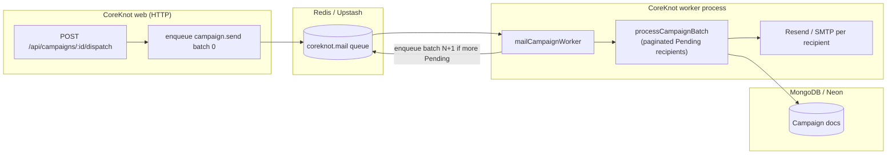

# CoreKnot mail campaign workers — deploy guide

Large mail campaigns must **not** send inside the HTTP process. CoreKnot enqueues `coreknot.mail` BullMQ jobs; a separate worker process sends in paginated batches via Resend/SMTP.

## Architecture



**Status flow:** `Queued` → `Sending` (first batch) → `Completed` | `Failed` | `Stopped`

**Idempotency:** BullMQ `jobId` = `coreknot:mail:{campaignId}:batch:{batchIndex}`

---

## Founder deploy checklist

Complete in order before sending production campaigns at scale.

### 1. Redis (Upstash or Railway)

1. Create a Redis instance (recommended: [Upstash](https://upstash.com) — `rediss://` URL, or Railway Key Value).
2. Copy the connection URL → `REDIS_URL` (must use TLS `rediss://` in prod when provider requires it).

### 2. Database

1. **MongoDB Atlas** (current CoreKnot primary): ensure `MONGODB_URI_PROD` on web + worker.
2. **Neon Postgres** (migration path): set `DATABASE_URL` when `COREKNOT_*_STORE=postgres` flags are enabled.

### 3. Mail provider

1. [Resend](https://resend.com) → API key → `RESEND_API_KEY` on **web and worker**.
2. Verify sending domain (`theshakticollective.in`) in Resend dashboard.

### 4. Railway — two services (recommended)

Create **two services** from the same repo (`apps/coreknot/server` root directory = `apps/coreknot/server` or monorepo root with custom start — match your existing CoreKnot API service):

| Service | Start command | `RUN_WORKERS` |
|---------|---------------|---------------|
| **coreknot-api** | `node server.js` | `false` (default) |
| **coreknot-worker** | `node workers/startWorkers.js` | `true` |

Shared env on **both** services:

- `REDIS_URL`
- `MONGODB_URI` / `MONGODB_URI_PROD`
- `RESEND_API_KEY`
- `JWT_SECRET`, `ENCRYPTION_KEY`
- `NODE_ENV=production`
- Optional: `MAIL_CAMPAIGN_BATCH_SIZE=100`, `MAIL_CAMPAIGN_SEND_DELAY_MS=150`

Worker-only: no public HTTP port required.

Reference: [`apps/coreknot/server/railway.toml`](../../apps/coreknot/server/railway.toml)

### 5. Render (if CoreKnot API still on Render)

1. **Web Service** — existing CoreKnot API (`node server.js`). Set `RUN_WORKERS=false`.
2. **Background Worker** — new service, same repo/build, start: `node workers/startWorkers.js`, `RUN_WORKERS=true`.
3. Attach the same **Key Value (Redis)** add-on to both; set `REDIS_URL` from dashboard.
4. Upgrade off **free tier** (services sleep after 15m → stuck campaigns + cold starts).

### 6. Verify

1. Web health: `GET /api/health` → 200.
2. Dispatch test campaign (small list) → HTTP **202**, campaign `status: Queued` then `Sending`.
3. Worker logs: `Processing campaign.send batch 0 for …`
4. Resend dashboard shows outbound messages.

### 7. Do not

- Run large sends with `REDIS_URL` unset in production (API returns error).
- Run only the web dyno without a worker when Redis is configured (jobs pile up, nothing sends).

---

## Local development

**Terminal 1 — API**

```powershell
pnpm infra:up          # Docker Redis :6379 + Postgres
pnpm dev:coreknot:server
```

**Terminal 2 — workers**

```powershell
cd apps/coreknot/server
# REDIS_URL=redis://127.0.0.1:6379 in .env
pnpm start:workers
```

Without Redis: API logs a warning and uses in-process batch fallback (dev only).

---

## Environment variables

| Variable | Default | Description |
|----------|---------|-------------|
| `REDIS_URL` | — | BullMQ backend; required in production |
| `RUN_WORKERS` | `false` | Set `true` only on worker service |
| `MAIL_CAMPAIGN_BATCH_SIZE` | `100` | Recipients per batch job |
| `MAIL_CAMPAIGN_SEND_DELAY_MS` | `150` | Pause between sends in a batch |
| `RESEND_API_KEY` | — | Resend API key (web + worker) |

See also [`apps/coreknot/server/.env.example`](../../apps/coreknot/server/.env.example) and [`ENVIRONMENT_GUIDE.md`](../../ENVIRONMENT_GUIDE.md).
