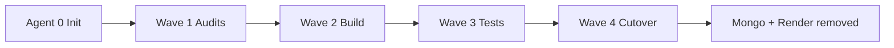

# CoreKnot Legacy → Domain-Driven Monorepo Migration Plan

> **Commander:** Agent 0 · **Last updated:** 2026-06-14  
> **Canonical tracker:** [migration-status.md](./migration-status.md)

## Objective

Migrate CoreKnot production workloads from the legacy Express + MongoDB stack (`apps/coreknot/server`, Render `taskmaster-jfw0.onrender.com`, database `taskmaster_production`) into the TSC Platform monorepo target (`apps/api` NestJS + Prisma Postgres + Clerk + Redis), **without breaking** the Vite client at `apps/coreknot/client`.

MongoDB and Render are **decommissioned only in Wave 4** after all success criteria in [migration-checklist.md](./migration-checklist.md) pass.

---

## System context

| Layer | Legacy (source) | Target (destination) |
|-------|-----------------|----------------------|
| API | `apps/coreknot/server` — Express, ~40 route domains | `apps/api` — NestJS, 60+ modules |
| Database | MongoDB `taskmaster_production` (Atlas) | Postgres via Prisma (`packages/database`) |
| Auth | JWT + session cookies + OAuth connect flows | Clerk (`ClerkAuthGuard`) + membership context |
| Queue / cache | BullMQ / Redis (legacy server) | BullMQ via `QueueRegistryService` |
| Hosting | Render `taskmaster-jfw0.onrender.com` | Railway `api.theshakticollective.in` |
| Frontend | `apps/coreknot/client` (Vite :3001) | **Unchanged** — compatibility layer required |
| File uploads | UploadThing (legacy) | R2 scaffold (P2 — Wave 2 decision) |

### Legacy API domain manifest (Express)

From `apps/coreknot/server/app/registerRoutes.js` — **37+ mounted domains**:

`auth`, `projects`, `tasks`, `users`, `logs`, `system-logs`, `teams`, `artists`, `gamification`, `gamification-admin`, `qa`, `customization`, `crm`, `assets`, `google`, `proxy`, `dashboard`, `calendar`, `departments`, `schedule`, `notifications`, `notes`, `search`, `pinboard`, `mail`, `ses`, `tsc`, `data-hub`, `artist-path`, `track`, `campaigns`, `analytics`, `webhooks`, `integrations`, `office-assets`, `subscriptions`, `org-accounts`, `contacts`, `exly`, `newsletter`, `finance`, `attendance`, `announcements`, `admin`, `uploadthing`

### Target API modules (NestJS) — partial overlap

Existing modules with CoreKnot relevance include: `workspace`, `task`, `project`, `crm`, `calendar`, `finance`, `notification`, `artist`, `booking`, `contract`, `payment`, `creative-identity`, `skills`, `passport`, `sync`, and alias controllers for legacy path shapes.

### Client API split (critical)

The Vite client is in **hybrid state**:

| Pattern | Example | Backend today |
|---------|---------|---------------|
| New NestJS paths | `/api/workspace/:slug/tasks` | `apps/api` (`task.controller.ts`) |
| Legacy Express paths | `/api/tasks`, `/api/crm/*`, `/api/mail/*`, `/api/auth/*` | `apps/coreknot/server` (production) |
| TSC domain paths | `/api/opportunities`, `/api/booking`, `/api/passport` | `apps/api` (partial / alias) |

**Decision:** Wave 2 Agent 5 builds a **compatibility adapter layer** in `apps/api` that preserves legacy path + response shapes until the client is fully migrated or proxied.

---

## Known conflicts — pause recommendation

Prior single-agent domain work exists and **must not proceed** until Wave 1 audits complete:

| Area | Conflict | Recommendation |
|------|----------|----------------|
| Workspace / tasks | Client `taskApi.js` uses NestJS paths; `navPrefetch.js` still hits `/api/tasks` | **Pause** new workspace route work until Agent 4 client contract audit |
| 19× `INTEGRATION.patch.md` | Unmerged routing patches across page domains | **Pause** App.jsx merges until Agent 4 maps required routes |
| `sync` module | Bidirectional sync between legacy and TSC already scaffolded | **Pause** sync outbound changes until Agent 2 schema + Agent 8 mapping done |
| Auth | Client uses JWT cookies + `/api/auth/realtime-token`; API uses Clerk | **Pause** auth refactors until Agent 6 design (Wave 2) |
| Prisma schema | Large schema exists; no versioned migrations in repo | Agent 2 must inventory Mongo → Prisma gaps before Agent 3 scripts |
| Build gate | `@tsc/community` invalid CoreKnot imports per [known-gaps.md](../../.specify/decisions/known-gaps.md) | Fix before Wave 3 test gate |

**Commander directive:** No application code changes to domain modules, client routing, or data scripts until Wave 1 deliverables are merged into `docs/migration/audits/`.

---

## Agent roster

| Agent | Role | Wave | Type |
|-------|------|------|------|
| **0** | Migration Commander | All | Coordination, docs, gates |
| **1** | Legacy Route Auditor | 1 | Audit — Express route inventory + auth tiers |
| **2** | Mongo Schema Auditor | 1 | Audit — collections, indexes, relationships |
| **4** | Client Contract Auditor | 1 | Audit — every `*Api.js` + axios call path |
| **8** | Target Domain Mapper | 1 | Audit — legacy domain → NestJS module + Prisma model map |
| **3** | Data Migration Engineer | 2 | Mongo → Postgres ETL scripts |
| **5** | API Compatibility Engineer | 2 | Legacy path adapters + response normalizers |
| **6** | Auth Bridge Engineer | 2 | JWT/session → Clerk migration + dual-auth window |
| **7** | Storage & Integrations Engineer | 2 | UploadThing, mail, webhooks, workers |
| **9** | Test & Validation Engineer | 3 | Contract tests, E2E, parity suite |
| **10** | Cutover Engineer | 4 | DNS, env, traffic switch, **Render/Mongo removal** |
| **11** | Documentation Engineer | 4 | Runbooks, ENV guide, operator docs |

---

## Wave schedule

### Wave 0 — Commander init ✅

- Create `docs/migration/` scaffold
- Seed status tracker, risks, checklist
- Issue pause directive for conflicting work

### Wave 1 — Audit & mapping (IN PROGRESS)

**Agents:** 1, 2, 4, 8 · **No application code**

| Deliverable | Owner | Output path |
|-------------|-------|-------------|
| Express route catalog (method, path, auth tier, handler) | Agent 1 | `docs/migration/audits/legacy-routes.md` |
| Mongo collection catalog (fields, indexes, counts prod snapshot) | Agent 2 | `docs/migration/audits/mongo-schema.md` |
| Client API call matrix (file → path → used-by pages) | Agent 4 | `docs/migration/audits/client-contracts.md` |
| Domain mapping matrix (legacy → NestJS module → Prisma model → gap) | Agent 8 | `docs/migration/audits/domain-map.md` |
| Cross-cutting gap summary | Agent 0 | Update [migration-risks.md](./migration-risks.md) |

**Exit gate:** Commander sign-off when all four audit files exist and domain-map gaps are prioritized (P0/P1/P2).

### Wave 2 — Scripts, adapters, auth, storage

**Agents:** 3, 5, 6, 7 · **Requires Wave 1 exit gate**

| Workstream | Owner | Scope |
|------------|-------|-------|
| ETL scripts | Agent 3 | Idempotent Mongo → Postgres; dry-run on `taskmaster_local` |
| Compatibility layer | Agent 5 | Legacy `/api/tasks`, `/api/crm`, etc. adapters in NestJS |
| Auth bridge | Agent 6 | Clerk primary; legacy JWT fallback during transition |
| Storage & workers | Agent 7 | Upload paths, mail tracking, BullMQ job parity |

**Exit gate:** Staging API serves 100% of client-critical paths (per Agent 4 matrix) with compat layer.

### Wave 3 — Tests

**Agent:** 9 · **Requires Wave 2 exit gate**

- Contract tests: legacy response shape ≡ adapter output
- Integration tests against Postgres seed from Agent 3 dry-run
- E2E smoke: login → dashboard → tasks → CRM → mail (top flows)
- Performance baseline vs Render (p95 latency budget)

**Exit gate:** All P0 paths green in CI; parity report signed by Agent 0.

### Wave 4 — Cutover & decommission

**Agents:** 10, 11 · **Requires Wave 3 exit gate + checklist 100%**

| Step | Owner | Notes |
|------|-------|-------|
| Production traffic switch | Agent 10 | Point CoreKnot client `VITE_API_URL` / proxy to Railway API |
| Mongo read-only window | Agent 10 | 72h rollback window; no writes to Mongo after cutover |
| Render service scale-down | Agent 10 | **Only after** checklist complete |
| Mongo Atlas cluster pause/archive | Agent 10 | **Only after** 30-day validated prod period |
| Operator runbooks | Agent 11 | ENV, rollback, on-call |

**Hard rule:** Mongo + Render removal is **never** Wave 1–3. Flagged explicitly in [migration-risks.md](./migration-risks.md).

---

## Priority tiers (initial — refined after Wave 1)

| Tier | Domains | Rationale |
|------|---------|-----------|
| **P0** | auth, tasks, projects, users, teams, notifications, dashboard | Daily operator flows |
| **P1** | crm, mail, campaigns, calendar, attendance, finance, notes | Business-critical |
| **P2** | gamification, data-hub, newsletter, analytics, exly, qa, admin scripts | Can lag with legacy proxy |
| **P3** | pinboard, office-assets, subscriptions, ses, track/webhooks (verify) | Evaluate retire vs migrate |

---

## Dependencies

| Blocker | Blocks | Owner |
|---------|--------|-------|
| Wave 1 audits incomplete | All Wave 2+ work | Agents 1, 2, 4, 8 |
| Founder Clerk prod keys | Auth cutover | Founder — [FOUNDER-TASKS.md](../../.specify/agents/execution/FOUNDER-TASKS.md) |
| Prisma migrations absent | Prod schema versioning | Agent 3 + Database agent |
| Railway prod deploy | Staging parity environment | Founder |
| R2 / Typesense scaffolds only | File upload + search parity | Agent 7 (Wave 2 scope decision) |

---

## Communication

- **Status updates:** Agent 0 updates [migration-status.md](./migration-status.md) at wave boundaries
- **Blockers:** Log in status file; escalate P0 to founder tasks if secrets/infra
- **Audit PRs:** Docs-only under `docs/migration/audits/` — no app code in Wave 1

---

## Related docs

- [migration-status.md](./migration-status.md) — live tracker
- [migration-risks.md](./migration-risks.md) — risk register
- [migration-checklist.md](./migration-checklist.md) — success criteria
- [.specify/apps/coreknot.md](../../.specify/apps/coreknot.md) — client architecture
- [known-gaps.md](../../.specify/decisions/known-gaps.md) — platform gaps
