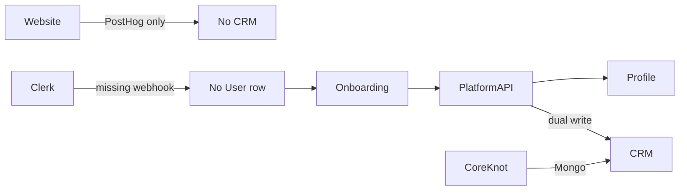

# Workflow Integrity Report (Agent 17)

> **Date:** 2026-06-15  
> **Verdict:** **FAIL** — 1 of 5 end-to-end flows fully implemented; 4 partial or broken.

Cross-reference: [API-BOUNDARY.md](../architecture/API-BOUNDARY.md) · [AUTH-ARCHITECTURE.md](../architecture/AUTH-ARCHITECTURE.md)

---

## Flow 1: Website Inquiry → Lead → CoreKnot CRM

| Step | Component | Status | Evidence |
|------|-----------|--------|----------|
| 1. Public form submit | Website | ⚠️ Partial | `apps/website/src/app/api/contact/route.ts` — validates with Zod, fires PostHog `website_contact_submitted` |
| 2. Persist inquiry | Platform API | ❌ Missing | No call to `/inquiries` or public webhook |
| 3. Create Lead | Platform/CoreKnot | ❌ Missing | No automation from PostHog → Lead |
| 4. Staff CRM view | CoreKnot | ✅ Exists | `apps/coreknot/server/domains/crm/` — Mongo primary unless `COREKNOT_CRM_STORE=postgres` |
| 5. Permissions | CoreKnot JWT | ⚠️ | Staff auth separate from Platform Clerk |

**Verdict: BROKEN** — inquiries never reach CRM. Website returns 503 if PostHog not configured.

**P0 fix path:** Website → Platform API public endpoint (API key) → `Inquiry` row → webhook/sync → CoreKnot Lead (server-to-server only).

---

## Flow 2: Artist Signup → Identity → Community Profile

| Step | Component | Status | Evidence |
|------|-----------|--------|----------|
| 1. Clerk signup | Community | ✅ | `apps/community/src/clerk-middleware.ts`, Clerk provider |
| 2. DB User/Person provision | Platform API | ❌ Missing | No Clerk webhook handler found; `MembershipContextService` expects existing rows |
| 3. Onboarding wizard | Community | ✅ Partial | `onboarding-wizard.tsx` → `client.updateMyProfile()` via `@tsc/community-sdk` |
| 4. Person/Identity/TscIdentity | Platform API | ⚠️ Partial | `IdentityModule`, `TscIdentityModule` exist; depend on provisioned `personId` |
| 5. Artist record | Platform API | ⚠️ Stub path | `Artist.personId` optional; may not link on first signup |
| 6. Community profile view | Community | ⚠️ Mock | `member-profile-view.tsx` + `mock-data.ts` for dashboard tiles |

**Verdict: PARTIAL** — UI onboarding works if person exists; **Clerk→DB provisioning gap** breaks cold signup.

---

## Flow 3: Project → Tasks → Assignees → Notifications

| Step | Component | Status | Evidence |
|------|-----------|--------|----------|
| 1. Workspace provision | Platform API | ✅ | `workspace-provision.service.ts`, slug-based access |
| 2. Create project | Platform API | ✅ | `project.service.ts` + org/workspace guards |
| 3. Create task | Platform API | ✅ | `task.service.ts` — records `task_created` activity |
| 4. Assign users | Platform API | ✅ | `replaceAssignees` in `task.repository.ts` |
| 5. Tenant isolation | Platform API | ✅ | `workspace-context.service.ts` → `requireMemberAccess` |
| 6. Notify assignees | Platform API | ❌ Missing | No `NotificationService.create` on assign; only Activity log |
| 7. CoreKnot parity | CoreKnot | ⚠️ Dual | Mongo task domain + optional Postgres via store flags |
| 8. Community UI | Community | ❌ N/A | Tasks not exposed in community frontend |

**Verdict: PARTIAL** — API path complete for Platform; notifications and CoreKnot sync incomplete.

---

## Flow 4: Membership Purchase → Reward → Community Access

| Step | Component | Status | Evidence |
|------|-----------|--------|----------|
| 1. List programs | Platform API | ✅ | `membership.controller.ts` |
| 2. Subscribe | Platform API | ⚠️ Track-only | `membership.service.ts` — `trackOnly: true` in activity metadata; **no payment provider** |
| 3. FanProfile ensure | Platform API | ✅ | `fanService.ensureFanProfileStub` |
| 4. Graph edges | Platform API | ✅ | `SUBSCRIBED` relationships to Community/Membership |
| 5. Credits earn | Platform API | ✅ | `creditsService.earnFromMembershipSubscribe` |
| 6. Reward redemption | Platform API | ✅ | `rewards.controller.ts` — credit-based, not membership-gated in schema |
| 7. Community access gate | Community | ❌ Missing | No middleware checking `MembershipSubscription` on routes |
| 8. Payment (Razorpay etc.) | Platform API | ⚠️ Stub | `PaymentModule` exists for deals/invoices, not wired to membership subscribe |

**Verdict: PARTIAL** — subscription is **free/track-only**; no paid purchase → reward → gated access chain.

---

## Flow 5: Invoice → Payment → Revenue Transaction

| Step | Component | Status | Evidence |
|------|-----------|--------|----------|
| 1. Create invoice | Platform API | ✅ | `invoices.service.ts` — artist-scoped |
| 2. Collect payment | Platform API | ✅ | `payment.service.ts` → `collectInvoice` via adapter |
| 3. Mark paid | Platform API | ✅ | `markInvoicePaid` |
| 4. RevenueTransaction | Platform API | ⚠️ Indirect | Created via `deal.service.ts`, linked to **Deal** not Invoice |
| 5. Finance summary | Platform API | ✅ | `finance.service.ts` aggregates expenses + revenue |
| 6. Project linkage | — | ❌ | No `Invoice.projectId` — cannot tie to project workflow |
| 7. CoreKnot finance | CoreKnot | ⚠️ Mongo | `financeRoutes.js` — Mongo/GridFS for attachments |
| 8. Notifications | Platform API | ❌ | No payment confirmation notification |

**Verdict: PARTIAL** — deal-centric revenue model works; invoice→project and CoreKnot finance paths incomplete.

---

## Cross-flow dependencies

---

## Certification

| Flow | Result |
|------|--------|
| Website → CRM | ❌ FAIL |
| Signup → Profile | ⚠️ PARTIAL |
| Project → Task → Notify | ⚠️ PARTIAL |
| Membership → Reward → Access | ⚠️ PARTIAL |
| Invoice → Payment → Revenue | ⚠️ PARTIAL |

**Agent 17 verdict: FAIL**
